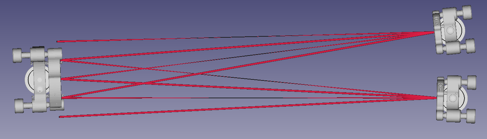
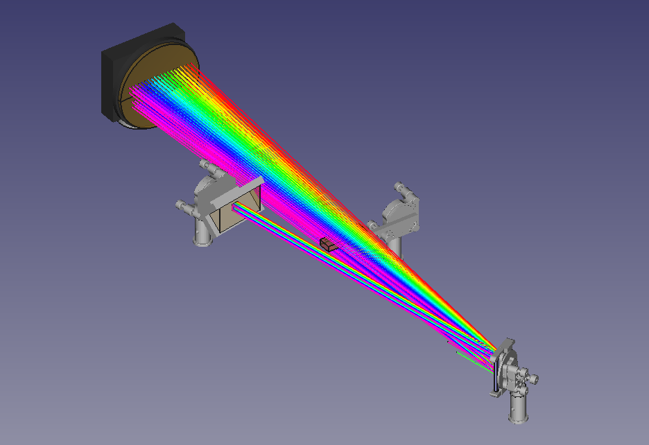

# LaserCAD
Authors: Clemens Anschütz clemens.anschuetz@uni-jena.de
Martin Beyer m.beyer@uni-jena.de
He Zhuang he.zhuang@uni-jena.de
Procrastination next level!

In short: LaserCAD helps you quickly prototyping and scripting your optical
setup with as few commands as possible in the language of geometric optics and
a ton of default values. It approximates the ray tracing and shows you a 3D
view of everything in FreeCAD.

The creed is:
1. Make the common case simple.
2. The user should be able to set everything in the script, but the default values should also be set so well that it is not necessary.
3. The code should be designed in such a way that you know where to reprogram something if necessary. (OK, let's see.)

# How to install LaserCAD:
- Install [FreeCAD](https://www.freecad.org/downloads.php)
- Install Python 3.*
- Download the repository to an arbitrary location
```
git clone https://github.com/klee-mens/LaserCAD.git    # or use the Github Desktop application
```
- open this folder in a python capable IDE, e.g. VisualStudioCode or Spyder
- Optional: open a Terminal in this folder, create a virtual environment:
```
python -m venv ./venv
```
- This will install a virtual environment in the "venv" folder
- Activate the virtual environment by running activate.bat
```
./venv/Scripts/activate      # on Windows
source ./venv/bin/activate   # on Linux
```
- install the required packages: (for Spyder: also install spyder-kernels)
```
python -m pip install -r ./requirements.txt
```
- Finally, we need to add the root folder to the system path
```
set PYTHONPATH=%CD%         # on Windows
export PYTHONPATH=$(pwd)    # on Linux
```
Now you can execute e.g. the /tutorial/0_Opening.py in your interpreter.
You should get some text output that ends with something like
```
The geometric object <Composed_Mount:unnamed> is drawn to the position[108.51854, 264.70476,  80.     ] with the direction [-0.95766,  0.2566 , -0.13053]
```
and many more lines. When you open the exact same file in FreeCAD and execute it as a macro by
pressing on the green arrow or F6 you get a new FreeCAD document with the 3D
model looks like this:


# How to uninstall LaserCAD:
- open a Terminal in the project's root folder
```
./venv/scripts/deactivate.bat     
```
- Then you can delete the "venv" and "LaserCAD.egg-info" folder


# Setting the FreeCAD paths
FreeCAD uses its own python libraries and will most likely have other sys 
search paths than your standard python interpreter.

## Add the path by a FreeCAD Macro
You can also leave the folder were it is (say /home/mens/projects/) and add it to FreeCAD manually. For Spyder you can do this
with Tools -> Preferences -> Python interpreter. (You may need to install the spyder-kernel as well in the environment.)
For FreeCAD you have to create yourself a short [macro](https://wiki.freecad.org/Macros), that does the trick.
Click on record and stop it, then you can edit it and insert the following lines
```python
import sys
sys.path.append('C:/*/LaserCAD/')
```
Of course you have to replace /*/ with the path to the LaserCAD clone folder. You can fix the macro to the toolbar with the according dialogue in FreeCAD (Macro -> add to toolbar).


# Some notes and tips

After that, you can continue executing the other tutorials and tests. Some may
take a few seconds, but most likely, the rendering time is less than a minute.
In the manual folder, you can find some more or less useful texts about the
program and the ideas behind it. Some other documents may follow.


# Some examples
Just to show some of the capabilities of LaserCAD you can see the following
examples in the manual under how-to-build-a-white-cell and
how-to-build-a-stretcher:





Have fun!