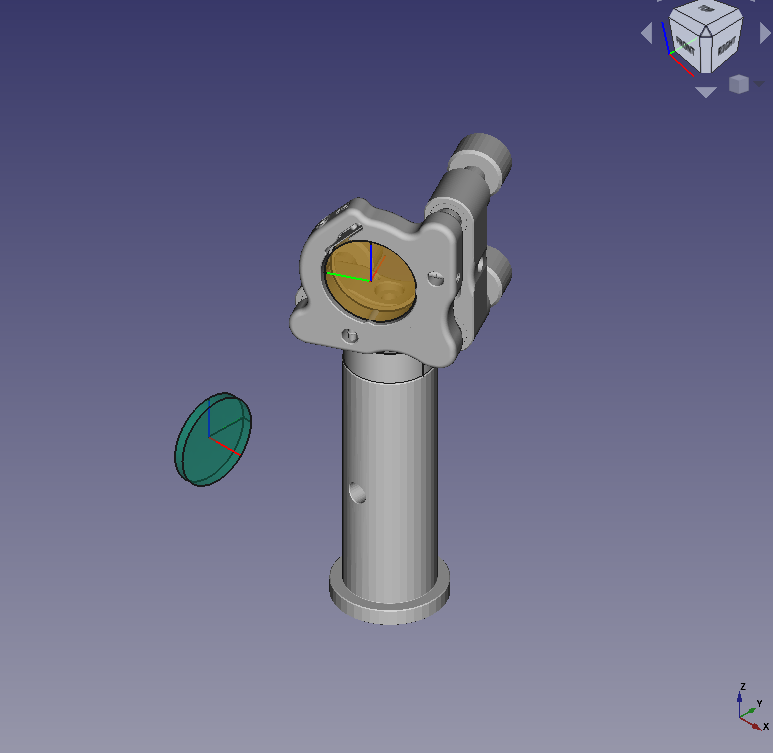
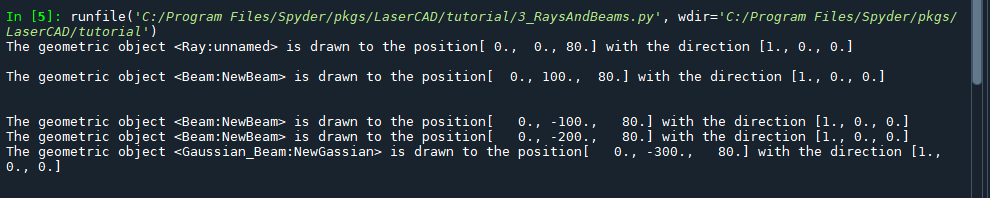

Alle Tutorials befinden sich im gleichnamigen Ordner. Im Folgenden werden Quellcode und zugehörige Ausgabe gezeigt.

# 1_ImportTest
```python
# =============================================================================
# Some useful imports that should be copied to ANY project
# =============================================================================

"""
The following code does nothing other than import some useful LaserCAD functions
The first block assures that the LaserCAD package location is added to the 
sys.path list so that it can be imported AS LONG AS THE EXECUTED SCRIPT IS IN
THE SMAE FOLDER AS LaserCAD OR ABOVE!

Unfortunately most Python environments don't have the same default package 
location as FreeCAD, so lines 22-29 are more or less mandatory in every project

The clear_doc function creates a new document in FreeCAD and or deletes all 
objects in it that you can start from blank any time, the set view function 
sets the view after drawing the elements
"""

import sys
pfad = __file__
pfad = pfad.replace("\\","/") #folder conventions windows linux stuff
pfad = pfad.lower()
ind = pfad.rfind("lasercad")
pfad = pfad[0:ind-1]
if not pfad in sys.path:
  sys.path.append(pfad)


from LaserCAD.basic_optics import Mirror
from LaserCAD.freecad_models import freecad_da, clear_doc, setview


if freecad_da:
  clear_doc()
  


if freecad_da:
  setview()
```


# 2_PositionAndAxes

```python
# =============================================================================
# some usefull imports that should be copied to ANY project
# =============================================================================
import sys
pfad = __file__
pfad = pfad.replace("\\","/") #folder conventions windows linux stuff
pfad = pfad.lower()
ind = pfad.rfind("lasercad")
pfad = pfad[0:ind-1]
if not pfad in sys.path:
  sys.path.append(pfad)

from LaserCAD.basic_optics import Mirror
from LaserCAD.freecad_models import freecad_da, clear_doc, setview


if freecad_da:
  clear_doc()
  
"""
The following code creates a Mirror and plays around with its geometrical 
properties position <pos> and <normal>. The default values are pos = (0,0,80)
meaning a beam height of 80 mm and a normal = (1,0,0) so that any object points 
in x-Direction.

Btw ALL LENGTHS, EVEN WAVELENGTHS, MUST BE GIVEN IN mm!

If executed in FreeCAD, the draw() function will construct and load the 
appropriate 3D files. If executed in a "normal" shell, the draw() function will 
print out some useful information about the object (which works with nearly any object).
Note that the coordinate system stays always orthonormal and right-handed. Also
note that the normal has always a norm of 1.
The draw_mount function in the end will draw the default mount and post of the
mirror and adjust them to the right position and direction.
"""

# =============================================================================
# Playground
# =============================================================================

mir1 = Mirror()
mir1.draw()

print()
print()
print("Position of mir1:", mir1.pos)
print("Normal of mir1:", mir1.normal)
print("Coordinate system of mir1\nx-Vector, y-Vector, z-Vector:", mir1.get_coordinate_system())


mir1.pos+= (10,50,30)

print()
print()
print("Position of mir1:", mir1.pos)
print("Normal of mir1:", mir1.normal)
print("Coordinate system of mir1\nx-Vector, y-Vector, z-Vector:", mir1.get_coordinate_system())


mir1.normal = (1,1,0)

print()
print()
print("Position of mir1:", mir1.pos)
print("Normal of mir1:", mir1.normal)
print("Coordinate system of mir1\nx-Vector, y-Vector, z-Vector:", mir1.get_coordinate_system())

print()
print()
mir1.draw()
mir1.draw_mount()

# =============================================================================
# Playground End
# =============================================================================
if freecad_da:
  setview()
```


# 3_RaysAndBeams
```python
# =============================================================================
# some usefull imports that should be copied to ANY project
# =============================================================================
import sys
pfad = __file__
pfad = pfad.replace("\\","/") #folder conventions windows linux stuff
pfad = pfad.lower()
ind = pfad.rfind("lasercad")
pfad = pfad[0:ind-1]
if not pfad in sys.path:
  sys.path.append(pfad)

from LaserCAD.basic_optics import Mirror, Curved_Mirror, Lens, Beam, Ray, Gaussian_Beam
from LaserCAD.freecad_models import freecad_da, clear_doc, setview

# =============================================================================
# about beams and rays
# =============================================================================

"""

Here, you can see the rays and beams setting.
The class 'Ray' is the basic class of light source. Without considering the 
radius of the light ray, the ray only considers the position and direction of 
propagation of the ray. The class 'Beam' is the most common light source.
Beam has three distributions: Cone, square, and circular. As for the 
cone distribution (default setting of a beam) shows some cylinders and cones 
to represent light beams. The square and circular distributions are some ray 
groups that have different shapes.

"""

if freecad_da:
  clear_doc()
  
r1 = Ray()
r1.draw()

print()

b1 = Beam()
b1.pos += (0,100,0)
b1.set_length = 300
b1.draw()

print()
print()

b2 = Beam()
b2.pos += (0,-100,0)
b2.make_square_distribution(10)
b2.draw()

b3 = Beam()
b3.pos += (0,-200,0)
b3.make_circular_distribution(5)
b3.draw()

b4 = Gaussian_Beam()
b4.pos += (0,-300,0)
b4.draw()

print()
print()
```



# 4_LensesAndMirrors
```python
# =============================================================================
# some usefull imports that should be copied to ANY project
# =============================================================================
import sys
pfad = __file__
pfad = pfad.replace("\\","/") #folder conventions windows linux stuff
pfad = pfad.lower()
ind = pfad.rfind("lasercad")
pfad = pfad[0:ind-1]
if not pfad in sys.path:
  sys.path.append(pfad)

from LaserCAD.basic_optics import Mirror, Curved_Mirror, Lens, Beam, Ray
from LaserCAD.basic_optics import Intersection_plane,Cylindrical_Mirror
from LaserCAD.freecad_models import freecad_da, clear_doc, setview

# =============================================================================
# about lenses and mirrors
# =============================================================================

"""

Here, you see some interaction of optical elements with Beams

Standard Beams (=cone distributed bemas with two rays, one inner and one outer)
are defined with a radius and an opening angle in radiant; 0 means collimated.

Lenses are defined directly by their focal length. Names are optional, 
they will appear in FreeCAD. 

Mirrors are defined with two deflection angles: phi gives the angle of 
deflection in the xy Plane, and theta the tilt in the z-direction. So, a normal Flip-
Mirror would have phi = +- 90, theta=0. Phi=180 is the default and means total
back reflection. You can use the formula phi = 180 - 2*AOI, where AOI is the
angle of incidence. All angles are in degrees. The combination phi=0, theta=0 
raises an error (grazing incidence). The Curved mirror is a special mirror 
that has all mirror values. Besides, the curved mirror has some different 
values, like radius, which describes the curvature of the mirror. Here are some 
examples of how curved mirrors can focus beams. Another class called 
'Intersection_plane' can set up a plane and is primarily used to show a spot 
diagram of the beam on that plane. Besides, an anisotropic mirror named as
'Cylindrical_Mirror' is a special mirror with a certain radius in one 
direction and a flat area in the other.

"""


if freecad_da:
  clear_doc()
  

le1 = Lens(f=200, name="Lens1")
le1.pos += (0,100,0)
le1.draw()

print()
print()

b1 = Beam(radius=4, angle=0)

le2 = Lens(f=250, name="lens2")
le2.pos += (42, 0, 0)
b2 = le2.next_beam(b1)


le2.draw()
b1.draw()
b2.draw()

print()
print()

b11 = Beam(radius=4, angle=0)
b11.pos += (0,-100,0)

mir1 = Mirror(phi=120, name="Flipper")
mir1.pos += (42, -100, 0)
b21 = mir1.next_beam(b11)

mir1.draw()
b11.draw()
b21.draw()

print()
print()

b12 = Beam(radius=2,angle=0)
b12.pos += (0,200,0)

mir2 = Curved_Mirror(radius=400,phi=90)
mir2.pos += (50,200,0)
b22 = mir2.next_beam(b12)

mir2.draw()
b12.draw()
b22.draw()

print()
print()

b13 = Beam(radius=3,angle=0,distribution="square")
b13.pos += (0,300,0)

mir3 = Curved_Mirror(radius=400,phi=90)
mir3.pos += (150,300,0)
b23 = mir3.next_beam(b13)

ip = Intersection_plane()
ip.pos = mir3.pos + (0,200,0)
ip.normal = (0,-1,0)
b33 = ip.next_beam(b23)

mir3.draw()
b13.draw()
b23.draw()
b33.draw()
ip.draw()
ip.spot_diagram(b33)

print()
print()

b14 = Beam(radius=5,distribution="circular")
b14.pos += (0,500,0)

mir4 = Cylindrical_Mirror(radius=200,phi=90)
mir4.pos += (200,500,0)
b24 = mir4.next_beam(b14)

mir4.draw()
b14.draw()
b24.draw()

print()
print()

# =============================================================================
# ToDo: Curved Mirror aND sPOT dIAGRAMS -> He 
# =============================================================================

if freecad_da:
  setview()
```


# 5_Composition
```python
# =============================================================================
# some usefull imports that should be copied to ANY project
# =============================================================================
import sys
pfad = __file__
pfad = pfad.replace("\\","/") #folder conventions windows linux stuff
pfad = pfad.lower()
ind = pfad.rfind("lasercad")
pfad = pfad[0:ind-1]
if not pfad in sys.path:
  sys.path.append(pfad)

from LaserCAD.basic_optics import Mirror, Lens, Beam, Composition
from LaserCAD.freecad_models import freecad_da, clear_doc, setview

# =============================================================================
# like LensesAndMirrors but with Compositions
# =============================================================================

"""
A quick intro to compositions. Output is exactly the same, but as in 
LensesAndMirrors positioning is easier


You create the composition and add alternating propagations and elements. All
elements will be automatically placed on the optical axes in the exact position. 
The draw() command is an abbreviation for draw_elements, draw_beams and draw_mounts

The whole output is grouped in a "Part-Feature" in FreeCAD; you can, for
example, blend mounts in and out.
"""


if freecad_da:
  clear_doc()
  

comp1 = Composition(name="FokusLens")
b1 = Beam(radius=4, angle=0)
comp1.set_light_source(b1)

comp1.propagate(42)

le2 = Lens(f=250, name="lens2")
comp1.add_on_axis(le2)

comp1.propagate(200)

comp1.draw_elements()
comp1.draw_beams()
comp1.draw_mounts()

print()
print()

comp2 = Composition(name="FlipMirror")
b2 = Beam(radius=4, angle=0)
comp2.set_light_source(b2)

comp2.propagate(42)
mir1 = Mirror(phi=120, name="Flipper")
comp2.add_on_axis(mir1)
comp2.propagate(123)

comp2.pos += (0,-100,0)
comp2.draw()


if freecad_da:
  setview()

```


# 6_LinearResonator
```python
import numpy as np
import sys

pfad = __file__
pfad = pfad.replace("\\","/") #folder conventions windows linux stuff
pfad = pfad.lower()
ind = pfad.rfind("lasercad")
pfad = pfad[0:ind-1]
if not pfad in sys.path:
  sys.path.append(pfad)
  
  
from LaserCAD.freecad_models import clear_doc, setview, freecad_da
from LaserCAD.basic_optics import Mirror, Beam, Composition, inch
from LaserCAD.basic_optics import Curved_Mirror, Ray, Component
from LaserCAD.basic_optics import LinearResonator, Lens
from LaserCAD.basic_optics import Crystal
from LaserCAD.non_interactings import Faraday_Isolator, Pockels_Cell, Lambda_Plate


if freecad_da:
  clear_doc()

# create a resonator, set position and wavelength
reso = LinearResonator()
reso.pos += (0,0,30)
reso.set_wavelength(1e-3)

# add the end mirror with certain aperture, propagate
mir1 = Mirror()
mir1.aperture = 2*inch
mir1.set_mount_to_default()
reso.add_on_axis(mir1)
reso.propagate(100)


# add a Lambda Plate (no influence, polarisation is not included), propagate
reso.add_on_axis(Lambda_Plate())
reso.propagate(100)

# add a flip mirror, propagate
reso.add_on_axis(Mirror(phi=90))
reso.propagate(450)


# add a flip mirror, propagate
reso.add_on_axis(Mirror(phi=90))
reso.propagate(150)

# add a Pockels Cell (no influence, polarisation is not included), propagate
# reso.add_on_axis(Pockels_Cell())
pc = Pockels_Cell()
pc.draw_dict["color"] = (0.3, 0.3, 0.4)
reso.add_on_axis(pc)
reso.propagate(250)

# Add a Curved End Mirror
reso.add_on_axis(Curved_Mirror(radius=2000))

# Draw ALL components and their mounts, compute the eigenmode (TEM00)
# and draws it aus gaussian beam (this may take some seconds)
reso.draw()


from LaserCAD.freecad_models.freecad_model_mirror import model_mirror


if freecad_da:
  setview()
```


# 7_FunnyLooks
