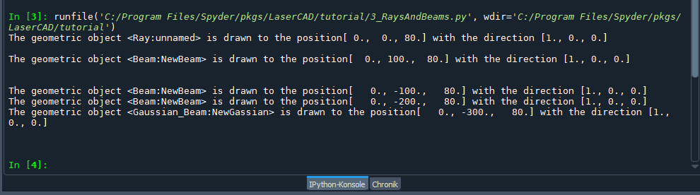
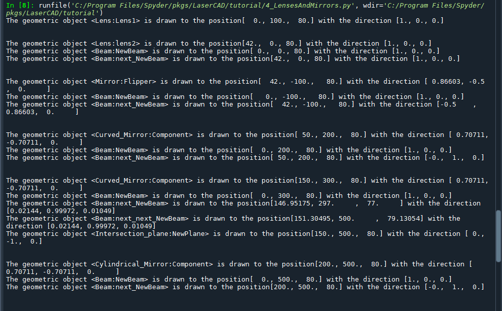
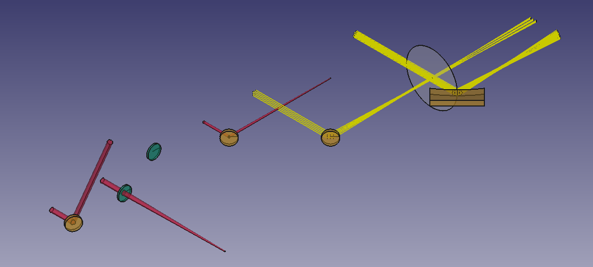
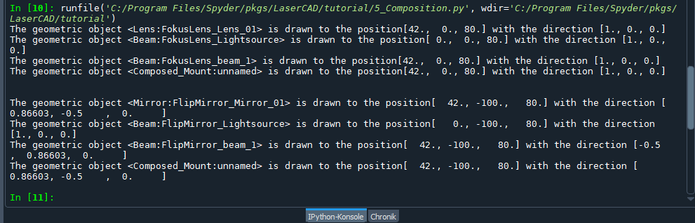
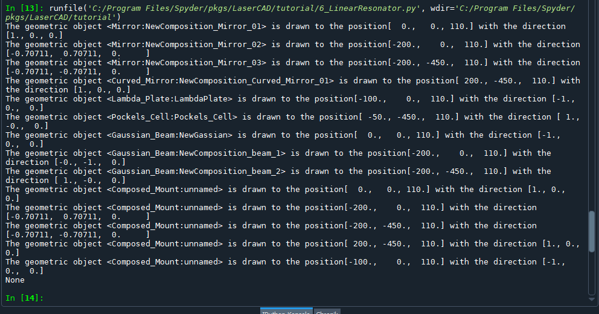

# The Tutorials

In the folder tutorials you can find 10 little excercises trying to describe
the most basic functions and objects. As always you can excecute the files in
an arbitrary pathon terminal or in FreeCAD.


## Opening

The 0_Opening.py script serves more as an quick presentation of a typical
LaserCAD project and its powers. The output is the same as you can see in the
README file.

The first code block imports the necessary moduls. For an explanation see
** ImportTest**.
```python
import sys
pfad = __file__
pfad = pfad.replace("\\","/") #folder conventions windows linux stuff
pfad = pfad.lower()
ind = pfad.rfind("lasercad")
pfad = pfad[0:ind-1]
if not pfad in sys.path:
  sys.path.append(pfad)


from LaserCAD.basic_optics import Mirror, Curved_Mirror, Lens, Beam
from LaserCAD.basic_optics import Composition, Composed_Mount
from LaserCAD.freecad_models import freecad_da, clear_doc, setview
```

In the follwoing we create a composition which serves as an container class
and positions the components on the optical axis (see section **Composition**).
We give it a light source, add several elements and draw the whole composition.
Feel free to play around with the values. If you change the position of the
compisition you change all the positions of the elements and beams as well.
In the end you will get the red beam path assembly from the picture underneath.

```python
if freecad_da:
  clear_doc()

firsttry = Composition(name="BeamLine1")
#firsttry.set_light_source(Beam(radius=2, angle=0.02))
firsttry.propagate(200)
firsttry.add_on_axis(Lens(f=150))
firsttry.propagate(400)
firsttry.add_on_axis(Lens(f=120))
firsttry.propagate(110)
firsttry.add_on_axis(Mirror(phi=110))
firsttry.propagate(90)
firsttry.add_on_axis(Mirror(phi=70))
firsttry.propagate(150)
firsttry.add_on_axis(Lens(f=200))
firsttry.propagate(400)
firsttry.add_on_axis(Mirror(phi=-90))
firsttry.propagate(60)

# firsttry.pos += (0,0,10)
firsttry.draw()
```

The second code block shows the assembly of an two mirror telescope which uses
the same angle of incident in the xy plane on first mirror as perpendicular to
it on the second one and thus corrects its astigamtism (which you can't really
see in LaserCAD because most beams will use only 2 rays for the raytracing).
Although the important part here is, that we can change quickly the color of
the beam in line 5 as well as the mount of one of the mirrors in line 13.
For more details see **FunnyLooks**.

```pyhton
mirteles = Composition(name="MirrorTelescope")
mirteles.pos += (0,200,0)

lightsource = Beam(radius=2)
lightsource.draw_dict["color"] = (1.0, 1.0, 0.0)

mirteles.set_light_source(lightsource)
mirteles.propagate(350)
mirteles.add_on_axis(Curved_Mirror(radius=250, phi=180-15))
mirteles.propagate(250)

next_mirror = Curved_Mirror(radius=250, phi=0, theta=180-15)
next_mirror.set_mount(Composed_Mount(unit_model_list=["KS1", "0.5inch_post"]))
mirteles.add_on_axis(next_mirror)

mirteles.propagate(350)

mirteles.draw()


if freecad_da:
  setview()
```


## 1_ImportTest
The following code does nothing other than import some useful LaserCAD functions
The first block assures that the LaserCAD package location is added to the
sys.path list so that it can be imported as long as the executed script is in
the same folder as LaserCAD or above!
A good way to achieve this is by copying the script and insert it in the work
directory as a start of every project.
Unfortunately most Python environments don't have the same default package
location as FreeCAD, so the first lines are more or less mandatory in every
project.
The clear_doc function creates a new document in FreeCAD and or deletes all
objects in it that you can start from blank any time, the set view function
sets the view after drawing the elements, so that the whole assembly is shown
in FreeCAD. Since this script does absolutely nothing besides importing stuff,
you will only see an empty new document.
```python
# =============================================================================
# Some useful imports that should be copied to ANY project
# =============================================================================


import sys
pfad = __file__
pfad = pfad.replace("\\","/") #folder conventions windows linux stuff
pfad = pfad.lower()
ind = pfad.rfind("lasercad")
pfad = pfad[0:ind-1]
if not pfad in sys.path:
  sys.path.append(pfad)


from LaserCAD.basic_optics import Mirror
from LaserCAD.freecad_models import freecad_da, clear_doc, setview


if freecad_da:
  clear_doc()


if freecad_da:
  setview()
```
Here you can see a screenshot of the output in Spyder.




## 2_PositionAndAxes
The following code creates a Lens and plays around with its geometrical
properties position pos and normal. The default values are pos = (0,0,80)
meaning a beam height of 80 mm and a normal = (1,0,0) so that any object points
in x-Direction.
Btw all lengths, even wavelengths, are always given in mm!
All LaserCAD Objects have a draw() function that will print out some usefull
information about their position *pos*, *normal* and type. The object is very
similar to the output of the print and reprint function.
Each oject also posesses an inner orthonormal, right handed coordiante system
namend *_axes* that can be accessed with get_axes() as a matrix or with
get_coordinate_system() as the 3 x-,y- and z-axes in a list.


```python
lens1 = Lens()
lens1.draw()

print()
print()
print("Position of lens1:", lens1.pos)
print("Normal of lens1:", lens1.normal)
print("Coordinate system of lens1\nx-Vector, y-Vector, z-Vector:", lens1.get_coordinate_system())
```
When executed in a normal pyhton shell, the output will look like this:
```
The geometric object <Lens:NewLens> is drawn to the position[ 0.,  0., 80.] with the direction [1., 0., 0.]


Position of lens1: [ 0.  0. 80.]
Normal of lens1: [1. 0. 0.]
Coordinate system of lens1
x-Vector, y-Vector, z-Vector: (array([1., 0., 0.]), array([0., 1., 0.]), array([0., 0., 1.]))
```
In LaserCAD we call the unity of *(pos, axes)* a *geom*. The GeomObject
containes all the logic for it. You can set any object to the same position and
orientation as an other object2 by useing the *set_geom()* and *get_geom()*
function.
```pyhton
print()
geobj1 = Geom_Object()
geobj1.set_geom(lens1.get_geom())
geobj1.draw()
```
In the picture at the end of this section you can see the FreeCAD output. The
GeomObject appears as a small coordiante system using the same colours as the
FreeCAD coordinate system.

The following code now generates a mirror and changes its position and normal,
prints the result and also sets a new GeomObject to be at the same position.
```python
mir1 = Mirror()
mir1.pos+= (10,50,30)

print()
print()
print("Position of mir1:", mir1.pos)
print("Normal of mir1:", mir1.normal)
print("Coordinate system of mir1\nx-Vector, y-Vector, z-Vector:", mir1.get_coordinate_system())


mir1.normal = (-1,2,0)

print()
print()
print("Position of mir1:", mir1.pos)
print("Normal of mir1:", mir1.normal)
print("Coordinate system of mir1\nx-Vector, y-Vector, z-Vector:", mir1.get_coordinate_system())


print()
print()
mir1.draw()
mir1.draw_mount()
print()
geobj2 = Geom_Object()
geobj2.set_geom(mir1.get_geom())
geobj2.draw()
```
In the output you can see, that a change in posiiton of course does not change
the axes, while a change of the normal does. If the normal is changed in the
xy-plane, the z-axis is not affected. Mounts and posts are adjusted
automatically.
```

The geometric object <Geom_Object:unnamed> is drawn to the position[ 0.,  0., 80.] with the direction [1., 0., 0.]


Position of mir1: [ 10.  50. 110.]
Normal of mir1: [1. 0. 0.]
Coordinate system of mir1
x-Vector, y-Vector, z-Vector: (array([1., 0., 0.]), array([0., 1., 0.]), array([0., 0., 1.]))


Position of mir1: [ 10.  50. 110.]
Normal of mir1: [-0.4472136   0.89442719  0.        ]
Coordinate system of mir1
x-Vector, y-Vector, z-Vector: (array([-0.4472136 ,  0.89442719,  0.        ]), array([-0.89442719, -0.4472136 ,  0.        ]), array([0., 0., 1.]))


The geometric object <Mirror:Component> is drawn to the position[ 10.,  50., 110.] with the direction [-0.44721,  0.89443,  0.     ]
The geometric object <Composed_Mount:unnamed> is drawn to the position[ 10.,  50., 110.] with the direction [-0.44721,  0.89443,  0.     ]

The geometric object <Geom_Object:unnamed> is drawn to the position[ 10.,  50., 110.] with the direction [-0.44721,  0.89443,  0.     ]
```
Here you can see the FreeCAD output. Note that the normal of the mirror in
LaserCAD is defined in such a way, that it points in the mirror and not out of
its surface, what may differ from some other ray tracing programs.


## 3_RaysAndBeams
Here, you can see a demonstration of the Ray and Beam class.
The class 'Ray' describes the one dimensional ray and only considers the
position and direction.
The class 'Beam' is the most common light source and describes 3D light bundles.
Beam has three distributions: Cone, square, and circular. As for the
cone distribution (default setting of a beam) shows some cylinders and cones
to represent light beams. The square and circular distributions are some ray
groups that have different shapes.
```python

from LaserCAD.basic_optics import Mirror, Curved_Mirror, Lens, Beam, Ray, Gaussian_Beam
from LaserCAD.freecad_models import freecad_da, clear_doc, setview

# =============================================================================
# about beams and rays
# =============================================================================

if freecad_da:
  clear_doc()

r1 = Ray()
r1.draw()
print()


b1 = Beam()
b1.pos += (0,100,0)
b1.set_length = 300
b1.draw()

print()
print()

b2 = Beam()
b2.pos += (0,-100,0)
b2.make_square_distribution(10)
b2.draw()

b3 = Beam()
b3.pos += (0,-200,0)
b3.make_circular_distribution(5)
b3.draw()

b4 = Gaussian_Beam()
b4.pos += (0,-300,0)
b4.draw()
```

Output:
```
The geometric object <Ray:unnamed> is drawn to the position[ 0.,  0., 80.] with the direction [1., 0., 0.]

The geometric object <Beam:NewBeam> is drawn to the position[  0., 100.,  80.] with the direction [1., 0., 0.]


The geometric object <Beam:NewBeam> is drawn to the position[   0., -100.,   80.] with the direction [1., 0., 0.]
The geometric object <Beam:NewBeam> is drawn to the position[   0., -200.,   80.] with the direction [1., 0., 0.]
The geometric object <Gaussian_Beam:NewGassian> is drawn to the position[   0., -300.,   80.] with the direction [1., 0., 0.]
```

Now let's have a look at the inner structure of the beam:

```python
b5 = Beam()
rays = b5.get_all_rays()
print("The standard beam has only", len(rays), "rays.")
print(b5.inner_ray())
print(b5.outer_rays())
```

Output:
```
The standard beam has only 2 rays.

Ray(name="NewBeam_inner_Ray", pos=[ 0.,  0., 80.], normal=[1., 0., 0.])
[Ray(name="NewBeam_outer_Ray0", pos=[ 0.,  0., 81.], normal=[1., 0., 0.])]
```

The standard beam has only 2 rays: One inner Ray for its position and
direction and one outer ray for its divergence and waist.
Inner ray is only one ray (element 0 of get all rays).
The outer rays are a list of rays, containing only one element in this case.

```python
b5.pos += (7,-4,20)
b5.normal = (1,1,0)
print(b5)
print(b5.get_all_rays())
```
Output:
```
Beam(radius=1.0, anlge=0.0, distribution='cone', ame="NewBeam", pos=[  7.,  -4., 100.], normal=[0.70711, 0.70711, 0.     ])
[Ray(name="NewBeam_inner_Ray", pos=[  7.,  -4., 100.], normal=[0.70711, 0.70711, 0.     ]), Ray(name="NewBeam_outer_Ray0", pos=[  7.,  -4., 101.], normal=[0.70711, 0.70711, 0.     ])]
```
As you see, any change in position and axes of the beam will transform its
rays accordingly.

Underneath you can see the output in the terminal and in FreeCAD. When you zoom
in in FreeCAD, you will notice, that the yellow distributions consists of 1D rays
(in FreeCAD called *edges*) while Gauss and standard beam are red and semi
transparent. The Gaussian_Beam has many segments that form the caustic, which
may take a while to be drawn.


## 4_LensesAndMirrors
Here, you see some interaction of optical elements with Beams.

Standard Beams (=cone distributed bemas with two rays, one inner and one outer)
are defined with a radius and an opening angle in radiant; 0 means collimated.

Lenses are defined directly by their focal length. Names are optional,
they will appear in FreeCAD.

Mirrors are defined with two deflection angles: phi gives the angle of
deflection in the xy Plane, and theta the tilt in the z-direction. So, a normal Flip-
Mirror would have phi = +- 90, theta=0. Phi=180 is the default and means total
back reflection. You can use the formula phi = 180 - 2*AOI, where AOI is the
angle of incidence. All angles are in degrees. The combination phi=0, theta=0
raises an error (grazing incidence). The Curved mirror is a special mirror
that has all mirror values. Besides, the curved mirror has some different
values, like radius, which describes the curvature of the mirror. Here are some
examples of how curved mirrors can focus beams. Another class called
'Intersection_plane' can set up a plane and is primarily used to show a spot
diagram of the beam on that plane. Besides, an anisotropic mirror named as
'Cylindrical_Mirror' is a special mirror with a certain radius in one
direction and a flat area in the other.

```python
# =============================================================================
# some usefull imports that should be copied to ANY project
# =============================================================================
import sys
pfad = __file__
pfad = pfad.replace("\\","/") #folder conventions windows linux stuff
pfad = pfad.lower()
ind = pfad.rfind("lasercad")
pfad = pfad[0:ind-1]
if not pfad in sys.path:
  sys.path.append(pfad)

from LaserCAD.basic_optics import Mirror, Curved_Mirror, Lens, Beam, Ray
from LaserCAD.basic_optics import Intersection_plane,Cylindrical_Mirror
from LaserCAD.freecad_models import freecad_da, clear_doc, setview

# =============================================================================
# about lenses and mirrors
# =============================================================================

if freecad_da:
  clear_doc()


le1 = Lens(f=200, name="Lens1")
le1.pos += (0,100,0)
le1.draw()

print()
print()

b1 = Beam(radius=4, angle=0)

le2 = Lens(f=250, name="lens2")
le2.pos += (42, 0, 0)
b2 = le2.next_beam(b1)


le2.draw()
b1.draw()
b2.draw()

print()
print()

b11 = Beam(radius=4, angle=0)
b11.pos += (0,-100,0)

mir1 = Mirror(phi=120, name="Flipper")
mir1.pos += (42, -100, 0)
b21 = mir1.next_beam(b11)

mir1.draw()
b11.draw()
b21.draw()

print()
print()

b12 = Beam(radius=2,angle=0)
b12.pos += (0,200,0)

mir2 = Curved_Mirror(radius=400,phi=90)
mir2.pos += (50,200,0)
b22 = mir2.next_beam(b12)

mir2.draw()
b12.draw()
b22.draw()

print()
print()

b13 = Beam(radius=3,angle=0,distribution="square")
b13.pos += (0,300,0)

mir3 = Curved_Mirror(radius=400,phi=90)
mir3.pos += (150,300,0)
b23 = mir3.next_beam(b13)

ip = Intersection_plane()
ip.pos = mir3.pos + (0,200,0)
ip.normal = (0,-1,0)
b33 = ip.next_beam(b23)

mir3.draw()
b13.draw()
b23.draw()
b33.draw()
ip.draw()
ip.spot_diagram(b33)

print()
print()

b14 = Beam(radius=5,distribution="circular")
b14.pos += (0,500,0)

mir4 = Cylindrical_Mirror(radius=200,phi=90)
mir4.pos += (200,500,0)
b24 = mir4.next_beam(b14)

mir4.draw()
b14.draw()
b24.draw()

print()
print()

# =============================================================================
# ToDo: Curved Mirror aND sPOT dIAGRAMS -> He
# =============================================================================

if freecad_da:
  setview()
```




## 5_Composition
"""
A quick intro to compositions. Output is exactly the same, but as in
LensesAndMirrors positioning is easier.

You create the composition and add alternating propagations and elements. All
elements will be automatically placed on the optical axes in the exact position.
The draw() command is an abbreviation for draw_elements, draw_beams and draw_mounts

The whole output is grouped in a "Part-Feature" in FreeCAD; you can, for
example, blend mounts in and out.
"""
```python
# =============================================================================
# some usefull imports that should be copied to ANY project
# =============================================================================
import sys
pfad = __file__
pfad = pfad.replace("\\","/") #folder conventions windows linux stuff
pfad = pfad.lower()
ind = pfad.rfind("lasercad")
pfad = pfad[0:ind-1]
if not pfad in sys.path:
  sys.path.append(pfad)

from LaserCAD.basic_optics import Mirror, Lens, Beam, Composition
from LaserCAD.freecad_models import freecad_da, clear_doc, setview

# =============================================================================
# like LensesAndMirrors but with Compositions
# =============================================================================


if freecad_da:
  clear_doc()


comp1 = Composition(name="FokusLens")
b1 = Beam(radius=4, angle=0)
comp1.set_light_source(b1)

comp1.propagate(42)

le2 = Lens(f=250, name="lens2")
comp1.add_on_axis(le2)

comp1.propagate(200)

comp1.draw_elements()
comp1.draw_beams()
comp1.draw_mounts()

print()
print()

comp2 = Composition(name="FlipMirror")
b2 = Beam(radius=4, angle=0)
comp2.set_light_source(b2)

comp2.propagate(42)
mir1 = Mirror(phi=120, name="Flipper")
comp2.add_on_axis(mir1)
comp2.propagate(123)

comp2.pos += (0,-100,0)
comp2.draw()


if freecad_da:
  setview()

```



## 6_LinearResonator
```python
import numpy as np
import sys

pfad = __file__
pfad = pfad.replace("\\","/") #folder conventions windows linux stuff
pfad = pfad.lower()
ind = pfad.rfind("lasercad")
pfad = pfad[0:ind-1]
if not pfad in sys.path:
  sys.path.append(pfad)


from LaserCAD.freecad_models import clear_doc, setview, freecad_da
from LaserCAD.basic_optics import Mirror, Beam, Composition, inch
from LaserCAD.basic_optics import Curved_Mirror, Ray, Component
from LaserCAD.basic_optics import LinearResonator, Lens
from LaserCAD.basic_optics import Crystal
from LaserCAD.non_interactings import Faraday_Isolator, Pockels_Cell, Lambda_Plate


if freecad_da:
  clear_doc()

```
The first block creates a resonator, set its position and the wavelength, which
is needed for the computation of the eigenmode.
```python
reso = LinearResonator()
reso.pos += (0,0,30)
reso.set_wavelength(1e-3)
```

The end mirror is added with a certain aperture afterwards we propagate 100 mm
on the optical axis.
```python
mir1 = Mirror()
mir1.aperture = 2*inch
mir1.set_mount_to_default()
reso.add_on_axis(mir1)
reso.propagate(100)
```

A Lambda plate from the non_interactings modul is inserted. Since LaserCAD has
no polarisation included yet, the component does not influence the beam line.
```python
reso.add_on_axis(Lambda_Plate())
reso.propagate(100)
```

Two flip mirrors will cause the beam to be turned by 180 degree.
```python
reso.add_on_axis(Mirror(phi=90))
reso.propagate(450)
reso.add_on_axis(Mirror(phi=90))
reso.propagate(150)
```

We can add a Pockels Cell from the non_interactings module that also will not
alter the light propagation, but makes the setup more realistically. Addtionally
we can change its color with RGB values.
```python
pc = Pockels_Cell()
pc.draw_dict["color"] = (0.3, 0.3, 0.4)
reso.add_on_axis(pc)
reso.propagate(250)
```

To get a stable resonator, we have to add at least one curved mirror at the end.
After that we draw all components and their mounts, compute the eigenmode from
the optical matrix of the system as a gaussian TEM00 mode and also show it.
This may take a few seconds, because the model for gaussian beams is rather
complex at the moment.
```python
reso.add_on_axis(Curved_Mirror(radius=2000))

reso.draw()

if freecad_da:
  setview()
```



