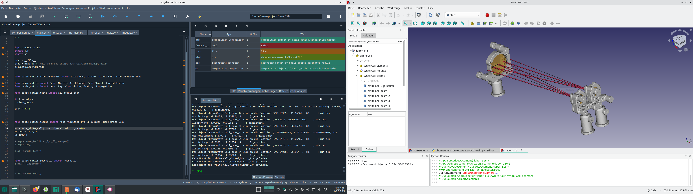
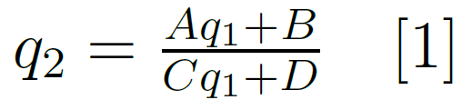
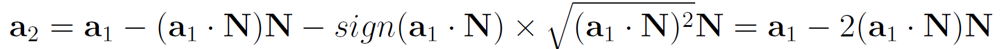
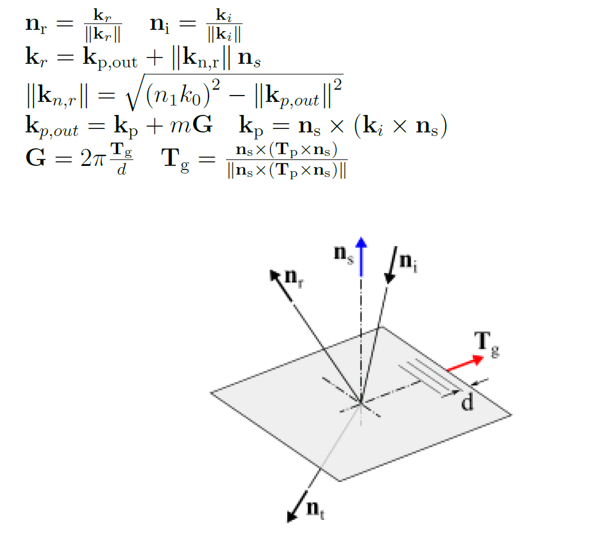
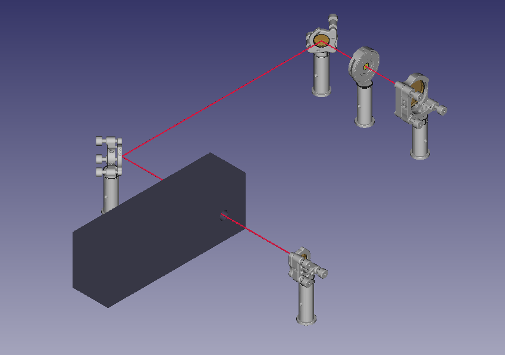

# Diskussion und Erklärung

## Warum LaserCAD?

Wie schon in Hes Berichten und in der Präsentation beschrieben, kann es ziemliche Vorteile mit sich bringen einen optischen Aufbau im Vorfeld einmal komplett in 3D am Computer darzustellen. Das erleichtert die Planung, Diskussionen mit Kollegen und Rückschläge und Kompromisse im Labor aufgrund von Platzproblemen und Klipping, wie sie fast immer zwangsläufig auftreten, wenn man von einer Bleistiftskizze zum realen Aufbau kommt. Speziell beim Aufbau von Lasersystemen, in denen verschachtelte Strahlengänge mit vielen Faltungen häufig vorkommen und grundsätzlich mit jeder Apertur gegeizt wird, stellt man immer wieder beim Experiment Probleme fest, die sich durch eine vorherige 3D Skizze bereits in der Planung hätten vermeiden lassen.
Die meisten Software Pakete hierfür wie Zeemax und Co haben nun das Problem zwar super exakte Raytracing Berechnungen anzubieten, die man im Fall von paraxialen Laserstrahlen meist nicht braucht, im Gegenzug dafür aber aber eben auch Unmengen von unnötigen Informationen einzufordern und das meist mit einem sehr unflexiblen und nicht modularen Interface. Die hohen Kosten und Lizenzhürden kommen dann auch noch dazu. Außerdem sind die meisten Softwarepakte nicht in der Lage auf einfache Weise mechanische Peripherie wie Spiegelhalter, Pockelszellengehäuse, Posts und Ähnliches einzubinden, die aber meist genau die Objekte sind, die bei der Realisierung des Aufbaus Probleme berieten.
Kurzum, das Ziel ist eine einfach zu handhabende, skriptbasierte, modulare Sofware zu entwickeln, die mit wenigen Zeilen Code einen Aufbau möglichst realistisch in 3D ausgeben soll, mit der Möglichkeit der manuellen Nachbearbeitung und des Exportierens. Die Grundsätze lauten:
1. Make the common case simple.
2. Der Nutzer sollte alles im Skript einstellen können, die Default Werte aber auch so gut gesetzt sein, dass man es nicht muss.
3. Der Code sollte so nachvollziehbar gestaltet sein, dass man notfalls weiß, an welcher Stelle man etwas im Bedarfsfall umprogrammieren muss.

Installation und Import

Das Projekt kann direkt von github an eine beliebige Stelle importiert werden, für die Entwicklung in einer IDE wie Spyder würde sich aber ein Ort im Standardverzeichnis (z.B. '/usr/lib/python3.11/site-packages/‘) empfehlen. Der Clone Befehl kann im Terminal mit

git clone https://github.com/klee-mens/LaserCAD

ausgeführt werden. Der vorgesehene Workflow beinhaltet eine IDE zum skripten des optischen Aufbaus und testen auf Bugs um anschließend das entstandene Python Skript in FreeCAD auszuführen, siehe unten stehende Abbildung.




Leider hat FreeCAD seine eigenen Paketquellen und Standardverzeichnisse, wodurch es keine allzu triviale Lösung für das beidseitige Nutzen und importieren von LaserCAD gibt. Die Standardlösungen ist alle Projekte im Paket LaserCAD oder Unterordnern zu beginnen und folgende Zeilen aus dem Tutorial 1_ImportTest.py einzufügen:

```python
import sys
pfad = __file__
pfad = pfad.replace("\\","/") #folder conventions windows linux stuff
pfad = pfad.lower()
ind = pfad.rfind("lasercad")
pfad = pfad[0:ind-1]
if not pfad in sys.path:
  sys.path.append(pfad)

from LaserCAD.basic_optics import Mirror
from LaserCAD.freecad_models import freecad_da, clear_doc, setview

if freecad_da:
  clear_doc()

if freecad_da:
  setview()
```

# Aufbau und Objektstruktur

LaserCAD basiert auf einem Zusammenspiel eines Umfangreichen Python Programms zum Definieren und Berechnen aller notwendiger Objekte sowie einem Interface um FreeCAD als Ausgabeprogramm zur Visualisierung in 3D zu verwenden.
Im Folgenden werden die Objekte vorgestellt und erläutert:


## Constants

Das Modul constants beinhaltet alle für LaserCAD wichtigen Konstanten.
```python
import numpy as np

c = 3e8
h = 6e-34
inch = 25.4 # Grundeinheit für Optikdurchmesser
NAME0="unnamed"
POS0 = np.array((0,0,80)) #Strahlhöhe 80 mm
NORM0 = np.array((1,0,0)) #Strahl startet in x-Richtung
TOLERANCE = 1e-9 #Wert ab dem zwei Größen (meist Winkel) als gleich angenommen werden
```

TOLERANCE beschreibt den Wert, ab dem eine Größe als gleich null angenommen wird. Beispielsweise werden zwei Vektoren als parallel angenommen, wenn der Betrag ihres Kreuzproduktes kleiner als TOLERANCE ist.


## Geom_Object

Alle grundlegenden Objekte befinden sich im Ordner „basic_optics“ auch wenn er streng genommen sehr viel mehr als Optiken beeinhaltet. Das Urobjekt von dem alle anderen erben heißt Geom_Object und erbt seinerseits von object (Standard Python Objekt).
Die Kernaufgabe dieser Datenstruktur ist das speichern und bearbeiten der Position „pos“ und Ausrichtung „axes“ und „normal“ im 3D Raum.

```python
class Geom_Object(object):
  """
  speichert die elementaren Informationen über Position <pos>, Ausrichtung
  <normal> und Namen <name>,
  Definiert die Defaults für alle folgenden Objekte, passt bei Änderung der
  <normal> automatisch das innere Koordiantwensystem <_axes> an und ruft dann
  die Hilfsfunktionen <_pos_changed> und <_axes_changed> auf

  führt zur Darstellung das <draw_dict> mit allen wichtigen keyword arguments
  ein, kann beliebig erweitert werden, wird an die draw_fc Routinen weiter
  gegeben

  stores the elementary information about position <pos>, alignment
  <normal> and name <name>,
  defines the defaults for all subsequent objects, automatically adjusts the
  <normal> automatically adjusts the inner coordinate system <_axes>, and then
  calls the auxiliary functions <_pos_changed> and <_axes_changed>.

  introduces the <draw_dict> with all important keyword arguments for the
  display can be extended arbitrarily, is passed to the draw_fc routines given

  siehe tests()
  """
  def __init__(self, name=NAME0, **kwargs):
    self.name = name
    self._pos = POS0
    self._axes = np.eye(3)
    # das eigene Kordinatensystem, die erste Spalte ist immer die Normale
    self.draw_dict = {"name": self.name, "geom":self.get_geom()}

  @property
  def pos(self):
    """
    beschreibt die Position des GeomObject als 3D-numpy-float-array
    stellt über Setter und Getter sicher, dass nur Kopien übergeben werden und
    das _pos_changed aufgrufen wird

    describes the position of the GeomObject as 3D-numpy-float-array
    uses setters and getters to make sure that only copies are passed and that
    the _pos_changed is called

    """
    return np.array(self._pos) * 1.0

  @pos.setter
  def pos(self, x):
    old_pos = self._pos
    self._pos = np.array(x) * 1.0
    self._pos_changed(old_pos, x)

  def _pos_changed(self, old_pos, new_pos):
    """
    wird aufgerufen, wen die Position von <self> verändert wird, kann nützlich
    sein für abgeleitete, zusammengesetzte Objekte wie beam oder composition

    is called when the position of <self> is changed, can be useful for derived
    for derived, composite objects like beam or composition
    """
    pass

  def _rearange_subobjects_pos(self, old_pos, new_pos, objs):
    """
    wichtig für beam und Composition
    wenn eigene <old_pos> auf <new_pos> geändert wird, soll die pos aller
    Subobjekte entsprechend geändert werden, d.h. relative Ausrichtung und
    Drehung soll beibehalten werden
    ...LinAlg Kram halt

    important for beam and composition
    if custom <old_pos> is changed to <new_pos>, the pos of all
    subobjects should be changed accordingly, i.e. relative orientation and
    rotation should be kept
    ...LinAlg stuff halt
    """
    delta_pos = new_pos - old_pos
    for obj in objs:
      obj.pos += delta_pos
```


Setzen und lesen der Position funktioniert mit:
obj.pos = (1,2,3)
print(obj.pos)
Für Containerobjekte wie Composition, Beam und Composed_Mount wird die  _rearange_subobjects_pos Funktion benötigt.

```python

  @property
  def normal(self):
    """
    Beschreibt die Ausrichtung (= interne x-Achse) des GeomObject als 3D-numpy-
    float-array mit Betrag 1
    stellt über Setter und Getter sicher, dass nur Kopien übergeben werden, der
    Vektor stehts normiert wird und das die _axes aktualisiert wird

    Describes the orientation (= internal x-axis) of the GeomObject as a 3D-
    numpy-float-array with amount 1
    ensures via setter and getter that only copies are passed, that the vector
    is vector is always normalized and the _axes is updated.

    """
    return np.array(self._axes[:,0])

  @normal.setter
  def normal(self, x):
    old_normal = self.normal
    new_normal = x / np.linalg.norm(x)
    self.set_axes(self._updated_axes(new_normal, old_normal))

  def _updated_axes(self, new_normal, old_normal):
    """
    old_normal : 3D-array
    berechnet das neue Koordinatensystem durch Drehmatrix zwischen
    (neu-) normal und old_normal (setzt es aber nicht)

    old_normal : 3D-array
    calculates the new coordinate system by rotation matrix between
    (new-) normal and old_normal (but does not set it)
    """
    rotvec = np.cross(new_normal, old_normal) # Drehvektor
    v_abs = np.linalg.norm(rotvec)
    skalarP = np.sum(new_normal * old_normal)
    if v_abs < TOLERANCE:
      if skalarP >= 0:
        # phi kleiner als 1e-8
        return self._axes
      else:
        a,b,c = self.get_coordinate_system()
        a = new_normal #just in case
        b*=-1
        x=np.array([a[0],b[0],c[0]])
        y=np.array([a[1],b[1],c[1]])
        z=np.array([a[2],b[2],c[2]])
        # return np.vstack((x,y,z))
        return np.vstack((x,y,z))
    else:
      rot_mat = rotation_matrix_from_vectors(old_normal, new_normal)
      return np.matmul(rot_mat, self._axes)

  def _axes_changed(self, old_axes, new_axes):
    """
    wird aufgerufen, wen das Koordinatensystem >_axes> von <self> verändert
    wird,kann nützlich sein für abgeleitete, zusammengesetzte Objekte wie beam
    oder composition

    is called when the coordinate system >_axes> of <self> is changed.
    can be useful for derived composite objects like beam
    or composition
    """
    pass

  def _rearange_subobjects_axes(self, old_axes, new_axes, objs):
    """
    wichtig für beam und Composition
    wenn eigene <old_axes> auf <new_axes> geändert wird, soll die _axes
    aller Subobjekte entsprechend geändert werden, d.h. relative Ausrichtung
    und Drehung soll beibehalten werden
    ...LinAlg Kram halt

    important for beam and composition
    if custom <old_axes> is changed to <new_axes>, the _axes
    of all subobjects should be changed accordingly, i.e. relative orientation
    and rotation should be kept
    ...LinAlg stuff halt
    """
    RotM = np.matmul(new_axes, np.linalg.inv(old_axes) )
    p0 = self.pos
    for obj in objs:
      qvec = obj.pos - p0 # relativer Orstvector innnerhalb der Einheit
      new_qvec = np.matmul(RotM, qvec)
      obj.pos = new_qvec + p0
      obj.set_axes( np.matmul( RotM, obj.get_axes() ) )

  def get_axes(self):
    """
    gibt das eigene Kooridnatensystem _axes als 3x3 Matrix zurück
    indem die x,y,z-Vektoren als Spaltenvektoren stehen

    returns the own coordinate system _axes as 3x3 matrix
    where the x,y,z-vectors are column vectors
    """
    return np.array(self._axes)

  def get_coordinate_system(self):
    """
    gibt normal (x), senkrecht1 (y) und senkrecht2 (z) als 3 Vektoren zurück
    (transponiert zu self.get_axes)

    returns normal (x), perpendicular1 (y) and perpendicular2 (z) as 3 vectors
    (transposed to self.get_axes)
    """
    mat = np.array(self._axes)
    return mat[:,0], mat[:,1], mat[:,2]

  def set_axes(self, new_axes):
    """
    setzt das eigene Koordinatensystem auf <new_axes> und ruft
    _axes_changed auf

    new_axes : reelle, orthogonale 3x3 numpy float Matrix mit Determinante +1

    sets the own coordinate system to <new_axes> and calls
    _axes_changed

    new_axes: real, orthogonal 3x3 numpy float matrix with determinant +1
    """
    old_axes = self.get_axes()
    self._axes = np.array(new_axes)
    self._axes_changed(old_axes, new_axes)

  def get_geom(self):
    """
    gibt das so genannte geom = (pos, axes) zurück, einfach nur ein Tupel aus
    <pos> und <axes>, wichtig zur geometrischen Definition der meisten Objekte

    returns the so-called geom, simply a tuple of <pos> and
    <axes>, important for the geometric definition of most objects
    """
    return (self.pos, self.get_axes())

Jedes von Geom_Object abgeleitete Objekt (und damit so ziemlich jedes Objekt in LaserCAD) besitzt ein rechtshändiges, orthonormales Koordinatensystem, das über get_axes() ausgegeben werden kann und über set_axes gesetzt. Am häufigsten wird jedoch nur die Normale normal eines Objektes vom Nutzer explizit gesetzt, sie entspricht immer der x-Achse und kann beispielsweise über obj.normal = (1,1,0) gesetzt werden. Der setter normiert den Vektor automatisch, anschließend wird das innere Koordinatensystem angepasst und für Containerobjekte die entsprechende _rearange_subobjects_axes Funktion aufgerufen.

  def set_geom(self, geom):
    """
    setzt (pos, axes) auf geom indem es die entsprechenden setter Funktionen
    aufruft

    Parameters
    ----------
    geom : 2-dim Tupel aus 3-D float arrays
      (pos, axes)
    """
    self.pos = np.array(geom[0])
    self.set_axes(geom[1])

In den meisten Fällen jedoch werden Objekte über get_ und set_geom angepasst in der Regel von übergeordneten Strukturen wie Composition.add_on_axis(obj).
Als „geom“ wird hier und im Folgenden das Tupel (pos, axes) also ein 3D Vektor und eine 3x3 Matrix bezeichnet.

  def angle_to(self, obj):
    """
    computes the angle to the normal of an other GeomObj <obj> with
    correct sign

    """
    vec = obj.normal
    c = np.cross(self.normal, vec)
    abs_c = np.linalg.norm(c)
    if abs_c > 1: #because you know rounding errors and stuff
      abs_c = 1
    elif abs_c < -1:
      abs_c = -1
    sign = 1 if np.sum(c * self._axes[:,1]) >= 0 else -1
    return np.arcsin(abs_c)*sign

  def rotate(self, vec, phi):
    """
    rotiert das Objekt in Bezug auf vec um den Winkel phi
    Parameters
    ----------
    vec : 3D-Vector
      Raumrichtung um die gedreht wird, muss nicht normiert sein
    phi : Winkel im Bogenmaß

    Bsp: element.rotate((0,1,0), 0.7854)
    entspricht Drehung um y-Achse um 45°

    rotates the object with respect to vec by the angle phi
    Parameters
    ----------
    vec : 3D vector
      Space direction around which is rotated, must not be normalized
    phi : angle in radians

    Ex: element.rotate((0,1,0), 0.7854)
    corresponds to rotation around y-axis by 45°.

    """
    rot_mat = rotation_matrix(vec, phi)
    new_ax = np.matmul(rot_mat, self._axes)
    self.set_axes(new_ax)
```

Hilfsfunktionen zum Positionieren und Drehen, könnten auch noch beliebig erweitert werden, z.B. um Eulerwinkel, etc. .
```python

  def __repr__(self):
    txt = self.class_name()+ '(name="' + self.name
    txt += '", pos='+vec2str(self.pos)
    txt += ", normal="+vec2str(self.normal)+")"
    return txt

  def __str__(self):
    return ">>> " + repr(self)

  def class_name(cls):
    return str(type(cls)).split(".")[-1].split("'")[0]

Funktionen für die Ausgabe im Terminal. In der Regel soll der Ausdruck x = eval(repr(y)) ein Objekt x erzeugen, dass y ähnlich ist. Aufgrund immenser bösartiger Bugs und Schleifen in den komplexeren Objekten wurde auf Beschluss das explizite setzten von pos und normal im Konstruktor (der __init__ Funktion) untersagt, weswegen diese Eigenschaft dann nachträglich geändert werden muss. Grundsätzlich gilt: Jedes Objekt in LaserCAD wird an der Defaultstelle POS0 = (0,0,80) mit der Normale = NORM0 = (1,0,0) in x-Richtung erzeugt und lässt sich erst nach vollständiger Initialisierung bewegen.

  def update_draw_dict(self):
    """
    wird meist for den draw_routinen aufgerufen und kann die wichtigesten
    key word arguments des <draw_dict> aktualisieren, falls sie genändert
    wurden (z.B. self.radius von Curved_Mirror)

    is usually called for the draw_routines and can update the most important
    key word arguments of <draw_dict> if they have been changed (e.g.
    self.radius of have been changed (e.g. self.radius of Curved_Mirror).
    """
    self.draw_dict["name"]=self.name
    self.draw_dict["geom"]=self.get_geom()

  def draw(self):
    """
    Funktion zur Darstellung des Objekts
    prüft nach, ob freecad als Backend verfügbar ist und ruft dann die
    entsprechende draw-Funktion auf

    function to display the object
    checks whether freecad is available as backend and then calls the
    corresponding draw function
    """
    if freecad_da:
      return self.draw_freecad()
    else:
      txt = self.draw_text()
      print(txt)
      return txt

  def draw_freecad(self):
    """
    ruft falls FreeCAD vorhanden ist die entsprechende Zeichenfunktion aus
    freecad_models auf, gibt im Normalfall eine Referenz auf das entsprechende
    FreeCAD-Objekt zurück

    if FreeCAD is present, calls the corresponding drawing function from
    freecad_models, normally returns a reference to the corresponding
    FreeCAD object
    """
    self.update_draw_dict()
    return self.freecad_model(**self.draw_dict)

  def freecad_model(self, **kwargs):
    # ToDo: fürs Debugging hier einfachch einen Zylinder mit norm uns k zeichnen
    return None

  def draw_text(self):
    """
    falls FreeCAD nicht zur Verfügung steht, wird das Objekt in die Konsole
    "gezeichnet", d.h. alle relevanten Parameter aus dem <draw_dict> werden
    per Text ausgegeben, gibt den Text als str zurück

    if FreeCAD is not available, the object will be "drawn" into the console.
    "drawn", i.e. all relevant parameters from the <draw_dict> will be
    by text, returns the text as str
    """
    self.update_draw_dict()
    txt = "The geometric object <" + self.class_name() + ":" + self.name
    txt += "> is drawn to the position"
    txt += vec2str(self.pos) + " with the direction " + vec2str(self.normal)
    return txt
```


Jedes Objekt verfügt über eine draw-Funktion. Diese prüft als erstes, ob das Pythonskript in einem Standardterminal oder in FreeCAD ausgeführt wird, anhand der boolschen Variable freecad_da. Entsprechend des Ergebnisses ruft diese dann entweder draw_txt als Textausgabe oder draw_freecad auf. Letzteres zeichnet dann das Objekt und gibt einen Link darauf zurück, um dieses später in einer übergeordneten Struktur wie Composition speichern zu können. Im Prinzip basieren alle draw_freecad Funktionen auf dem gleichen Ablauf: zuerst wird das draw_dict des Objekts aktualisiert mit update_draw_dict, dann das entsprechende freecad_model mit allen Argumenten aus dem draw_dict aufgerufen. Das draw_dict besteht wie erwartet aus einem Dictionary als Datentyp, welches alle relevanten Parameter für die Zeichnung enthält, also für eine Linse beispielsweise die beiden Krümmungsradien, die Dicke, die Apertur und natürlich die Position und Ausrichtung als Geom. Den Kredo aus dem Anfang des Kapitels folgend, kann so ziemlich jede Funktion und damit auch z.B. die model_lens Funktion aus dem Ordner freecad_models ohne jegliche Argumente aufgerufen werden, da alle Werte in der Funktion bereits als Default gesetzt sind und zusätzliche keyword Argumente über die klassische **kwargs Variable abgefangen werden. Umgekehrt ist es aber auch möglich, zusätzliche keyword Argumente mit ins draw_dict zu speichern. So nimmt z.B. nahezu jede model Funkion auch das Schlüsselwort color = (R/255, G/255, B/255) an, wobei RGB 8bit integer Werte zwischen 0 und 255 angeben und in bekannter Weise die Farbe von dem Objekt beschreiben können. Siehe hierzu auch das Tutorial 2_PositionAndAxes.


## Ray

Der Ray ist die Klasse für eindimensionale Strahlen, der Code ist hier aufgelistet:

```python

class Ray(Geom_Object):
  """
  Klasse für Strahlen
  erbt von Geom_Object
  besitzt neben pos und normal auch length zum zeichnen
  neue Methoden:
    endpoint()
    intersection_with(element)
    h_alpha_to(element)
    h_alpha_theta_to(element)
    from_h_alpha_theta
  """
  def __init__(self, **kwargs):
    super().__init__(**kwargs)
    self.length = DEFAULT_LENGTH #willkürlich, muss immer neu berechnet werden
    self.wavelength = 660e-6 #Wellenlänge in mm; Default: 660nm
    self.update_draw_dict()
    self.freecad_model = model_ray_1D
    # self.draw_dict.update({"length":self.length})

  def endpoint(self):
    return self.pos + self.length * self.normal

  def intersection(self, element):
    """
    ermittelt den Schnittpunkt vom Strahl mit der ebene eines opt Elements

    Parameters
    ----------
    element : Geom_Object
      Element mit dessen Ebene der Schnittpunkt berechnet wird

    Returns
    -------
    endpoint

    """
    delta_p = element.pos - self.pos
    s = np.sum(delta_p*element.normal) / np.sum(self.normal * element.normal)
    return self.pos + s * self.normal

  def intersect_with(self, element):
    """
    ermittelt den Schnittpunkt vom Strahl mit der ebene eines opt Elements
    und setzt seine Länge auf den Abstand self.pos--element.pos (bedenken!)

    Parameters
    ----------
    element : Geom_Object
      Element mit dessen Ebene der Schnittpunkt berechnet wird

    Returns
    -------
    endpoint

    """
    delta_p = element.pos - self.pos
    s = np.sum(delta_p*element.normal) / np.sum(self.normal * element.normal)
    self.length = s
    return self.endpoint()

  def intersect_with_sphere(self, center, radius):
    """
    ermittelt den Schnittpunkt vom Strahl mit einer Spähre, die durch
    <center> € R^3 und <radius> € R definiert ist
    und setzt seine Länge auf den Abstand self.pos--element.pos (bedenken!)
    siehe Springer Handbook of Lasers and Optics Seite 66 f

    Parameters
    ----------
    center : TYPE 3D-array
      Mittelpunkt der Sphäre

    radius : TYPE float
      Radius der Sphäre; >0 für konkave Spiegel (Fokus), <0 für konvexe

    Returns
    -------
    endpoint : TYPE 3D-array
    """
    diffvec = center - self.pos
    k = np.sum( diffvec * self.normal )
    w = np.sqrt(k**2 - np.sum(diffvec**2) + radius**2)
    s1 = k + w
    s2 = k - w
    #Fallunterscheidung
    if radius < 0 and s2 > 0:
      dist = s2
    else:
      dist = s1
    self.length = dist
    endpoint = self.endpoint()
    return endpoint

  def sphere_intersection(self, center, radius):
    """
    ermittelt den Schnittpunkt vom Strahl mit einer Spähre, die durch
    <center> € R^3 und <radius> € R definiert ist
    und setzt seine Länge auf den Abstand self.pos--element.pos (bedenken!)
    siehe Springer Handbook of Lasers and Optics Seite 66 f

    Parameters
    ----------
    center : TYPE 3D-array
      Mittelpunkt der Sphäre

    radius : TYPE float
      Radius der Sphäre; >0 für konkave Spiegel (Fokus), <0 für konvexe

    Returns
    -------
    endpoint : TYPE 3D-array
    """
    diffvec = center - self.pos
    k = np.sum( diffvec * self.normal )
    w = np.sqrt(k**2 - np.sum(diffvec**2) + radius**2)
    s1 = k + w
    s2 = k - w
    #Fallunterscheidung
    if radius < 0 and s2 > 0:
      dist = s2
    else:
      dist = s1
    # self.length = dist
    endpoint = self.pos + dist * self.normal
    return endpoint

  def h_alpha_to(self, element):
    """
    ermittelt die Parameter (h, alpha) der geometrischen Optik, wenn Ray()
    auf ein Element trifft (verwendet intersection)
    """
    p = self.intersection(element)
    h = np.linalg.norm(p - element.pos)
    v = element.normal
    return np.array((h, self.angle_to(v)))

  def h_alpha_theta_to(self, element):
    """
    ermittelt die Parameter (h, alpha) der geometrischen Optik, wenn Ray()
    auf ein Element trifft, sowie den Winkel <theta> unter dem die ray.normal zur
    z-Achse des elements steht (verwendet intersection)
    """
    h, alpha = self.h_alpha_to(element)
    ep = self.endpoint()
    v = ep - element.pos
    vabs = np.linalg.norm(v)
    if vabs < TOLERANCE:
       theta = 0 # kein Winkel bestimmbar, default=0
    else:
       v = v / vabs
       xa, ya, za = element.get_axes()
       c = np.cross(za, v) #Winkel mit z-Achse
       sign = 1 if np.sum(c * xa) >= 0 else -1
       theta = np.arcsin(np.linalg.norm(c))*sign
    return (h, alpha, theta)

  def from_h_alpha_theta(self, h, alpha, theta, element):
    """
    setzt das ray geom so, dass er in Bezug auf <element> die geometrischen
    Parameter <h, alpha, theta> hat

    Parameters
    ----------
    h : float
    alpha : float - Winkel im Bogenmaß
    theta : float - Winkel im Bogenmaß
    element : geom_object
    """
    self.set_geom(element.get_geom())
    # pos, norm = element.get_geom()
    # pos = element.pos
    # norm = element.normal
    xa, ya, za = element.get_coordinate_system()
    vec_in_eb = za*np.cos(theta) - ya*np.sin(theta)
    self.pos += vec_in_eb*h
    rotation_vec = np.cross(vec_in_eb, xa)
    self.rotate(rotation_vec, -alpha)

  def update_draw_dict(self):
    super().update_draw_dict()
    self.draw_dict["length"] = self.length
```

Er weißt als zusätzliche Eigenschaften wavelength (die nur für Gitter und manchmal zur Darstellung gebraucht wird) und length auf. Aus letzterer kann der endpoint berechnet werden. Die Funkionen intersection und intersect_with berechnen den Schnittpunkt mit einer undendlich ausgedehnten Ebene die durch ein element mithilfe dessen pos und normal dargestellt wird. Der einzige Unterschied der Funktionen ist, dass letztere auch die Länge des Strahls auf den errechneten Endpunkt setzt. Beide Funktionen geben den Schnittpunkt zurück. Analog dazu sind die sphere_intersection Funkionen definiert. Die Funktion h_alpha_to gibt die beiden wichtigen Größen r,alpha aus dem ABCD-Matrix Formalismus zurück, die der Ray bezüglich eines elements (also dessen pos und normal) hätte. Das FreeCAD Model für den Ray ist die model_ray_1D Funktion.

## Beam

Beam stellt die Klasse für ausgedehnte, 3 dimensionale Strahlen dar und besteht im Grunde aus einer Liste an Rays, und einigen Hilfsfunktionen. Der Standard ist ein Kegelstrahl (model=“cone“), der im Konstruktor über radius und angle also r und alpha aus der Matrixoptik definiert wird. Er beinhaltet als Standardwert genau 2 Strahlen, den inner_ray, der die Lage, Richtung und Länge des Beam bestimmt und einen Ray, der auf der Mantelfläche liegt und damit radius_angle definiert, wie sie aus der Matrizenoptik bekannt sind. Verschiedene Verteilungsfunktionen wie make_square_distribution können für abweichende Strahlformen verwendet werden. Die Methode get_all_rays liefert alle Strahlen, aus denen der Beam besteht, die Funktion override_rays überschreibt sie.
Im draw_dict stehen mehrere Modelle zur Verfügung wie z.B. der halb durchsichtige Kegel (cone) oder die einfache Ansammlung von Strahlen (ray_group, bzw. auch als fall back Methode, wenn das model nicht erkannt wird).
```python

class Beam(Geom_Object):
  """
  Base class for a group of rays (you don't say!)
  special funcitoins: make_square_distribution(radius=1, ray_count=5)
  make_circular_distribution(radius=1, ray_count=5)
  average_divegence = ?

  """
  def __init__(self, radius=1, angle=0, name="NewBeam",wavelength=1030E-6, distribution="cone", **kwargs):
    super().__init__(name=name, **kwargs)
    self._ray_count = 2
    self._rays = [Ray() for n in range(self._ray_count)]
    self._angle = angle
    self._radius = radius
    self._distribution = distribution
    self._Bwavelength = wavelength
    if distribution == "cone":
      self.make_cone_distribution()
      self.draw_dict["model"] = "cone"
    elif distribution == "square":
      self.make_square_distribution()
      self.draw_dict["model"] = "ray_group"
    elif distribution == "circular":
      self.make_circular_distribution()
      self.draw_dict["model"] = "ray_group"
    elif distribution == "Gaussian":
      z0 = wavelength/(np.pi*np.tan(angle)*np.tan(angle))
      w0 = wavelength/(np.pi*np.tan(angle))
      if w0>radius:
        print("Woring: Wrong Radius!")
      z = z0*pow((radius*radius)/(w0*w0)-1,0.5)
      if angle<0:
        z = -z
      q_para = complex(z,z0)
      self.wavelength = wavelength
      self.q_para = q_para
      self.make_Gaussian_distribution()
      self.draw_dict["model"] = "Gaussian"
    else:
      # Abortion
      print("Distribution tpye not know. Beam not valid.")
      print("Allowed distribution types are: 'cone', 'square', 'circular', 'Gaussian'")
      self = -1
      return None

  def make_cone_distribution(self, ray_count=2):
    self._ray_count = ray_count
    self._rays = [Ray() for n in range(self._ray_count)]
    self._distribution = "cone"
    self.draw_dict["model"] = "cone"
    mr = self._rays[0]
    mr.set_geom(self.get_geom())
    mr.name = self.name + "_inner_Ray"
    mr.wavelength = self._Bwavelength
    thetas = np.linspace(0, 2*np.pi, self._ray_count)
    for n in range(self._ray_count-1):
      our = self._rays[n+1]
      our.from_h_alpha_theta(self._radius, self._angle, thetas[n], self)
      our.name = self.name + "_outer_Ray" + str(n)
      our.wavelength = self._Bwavelength

  def make_Gaussian_distribution(self, ray_count=2):
    self._ray_count = 1
    self._distribution = "Gaussian"
    self.draw_dict["model"] = "Gaussian"
    mr = self._rays[0]
    mr.set_geom(self.get_geom())
    mr.name = self.name + "_inner_Ray"


  def make_square_distribution(self, ray_in_line=3):
    """
    Let the group of rays follow the square distribution
    The width of square equals 2*radius of ray group
    Parameters
    ----------
    ray_in_line : int(>0)
      rays in a line.That is going to determine the density of ray.

    Returns
    -------
    None.

    """
    self._rays = [Ray() for n in range((ray_in_line)**2)]                     #calculate the number of rays,set the rays group
    ray_counting=0
    radius=self._radius
    for n in np.arange(-radius,radius+radius/(ray_in_line-1),
                       2*radius/(ray_in_line-1)):                              #n repersents y coordinates of the ray
      for m in np.arange(-radius,radius+radius/(ray_in_line-1),
                         2*radius/(ray_in_line-1)):                            #m repersents z coordinates of the ray
        self._rays[ray_counting].set_geom(self.get_geom())
        self._rays[ray_counting].pos=self._rays[ray_counting].pos+(0,n,m)     #change the position of the ray
        self._rays[ray_counting].name=self.name+str(ray_counting)
        self._rays[ray_counting].wavelength = self._Bwavelength
        ray_counting+=1
    # print(ray_counting) # ray_counting is the number of the rays.
    self._ray_count = ray_counting
    self._distribution = "square"
    self.draw_dict["model"] = "ray_group"

  def make_circular_distribution(self, ring_number=2):
    """
    Let the group of rays follow the circular distribution
    The radius of circle equals the radius of ray group
    Parameters
    ----------
    ring_number : int(>0).
      The number of the rings around the center. That is going to
     determine the density of ray.

    Returns
    -------
    None.

    """

    self._rays = [Ray() for n in range(3*ring_number*(ring_number+1)+1)]      #calculate the number of rays,set the rays group
    ray_counting=0
    radius=self._radius
    for r in np.arange(0,radius+radius/ring_number/2,radius/ring_number):        #r repersents the height of the ray

      if r!=0:                                                                 #if the ray is not in the center
        thetas = np.linspace(0, 2*np.pi, int(r*ring_number/radius)*6+1)        #thetas repersents the rotation angle of the ray
        for n in range(int(r*ring_number/radius)*6):
          our=self._rays[ray_counting]
          # self._rays[ray_counting].wavelength = self._Bwavelength
          our.from_h_alpha_theta(r, self._angle, thetas[n], self)            # rotate the ray which is not in the center
          our.name=self.name + "_circular_distribution_Ray" +str(ray_counting)
          ray_counting+=1
      else:
        # self._rays[ray_counting].wavelength = self._Bwavelength
        mr=self._rays[ray_counting]
        mr.set_geom(self.get_geom())
        mr.name = self.name + "_inner_Ray"
        ray_counting+=1
    # print(ray_counting) # ray_counting is the number of the rays.
    self._ray_count = ray_counting
    # print(ray_counting)
    for r in range(0,self._ray_count):
      self._rays[r].wavelength = self._Bwavelength
    self._distribution = "circular"
    self.draw_dict["model"] = "ray_group"

  def override_rays(self, rays):
    """
    setzt die rays neu, muss man eventuell aufpassen, mal sehen

    resets the rays, you may have to watch out, let's see

    Parameters
    ----------
    rays : list of rays
    """
    rc = len(rays)
    self._ray_count = rc
    self._rays = rays
    self._axes = rays[0].get_axes()
    self._pos = rays[0].pos
    for n in range(len(rays)):
      rays[n].name = self.name + "_ray" + str(n)
    rays[0].name = self.name + "_middle_ray"

  def __repr__(self):
    radius, angle = self.radius_angle()
    txt = 'Beam(radius=' + repr(radius)
    txt += ', anlge=' + repr(angle)
    txt += ', distribution=' + repr(self._distribution)
    if self._distribution == "Gaussian":
       txt = 'Gaussian_Beam(q_para=' + repr(self.q_para)
    txt += ', ' + super().__repr__()[6::]
    return txt

  def radius_angle(self):
    """
    berechnet aus 2 Strahlen inn und outer den zugehörigen beam Kegel mit
    radius r und öffnungswinkel alpha und zwar von hinten durch die Brust
    ins Auge
    """
    inner = self._rays[0]
    outer = self._rays[1]
    v0 = inner.normal
    v1 = outer.normal
    poi = outer.intersection(inner) #Punkt in der Kegelgrundfläche, in dem outer schneidet
    ovec = poi - inner.pos
    novec = np.linalg.norm(ovec)
    if novec < TOLERANCE:
      #beide rays im gleichen Punkt, h = 0, alpha>0
      return novec, np.arccos(np.sum(v0 * v1))
    else:
      ovec /= novec #normieren
      a = np.sum(v1 * ovec)
      b = np.sum(v0 * v1)
    return novec, np.arctan(a/b)

  def get_all_rays(self, by_reference=False):
    if by_reference:
      return self._rays
    else:
      return deepcopy(self._rays)

  def inner_ray(self):
    return deepcopy(self._rays[0])

  def outer_rays(self):
    return deepcopy(self._rays[1::])

  def focal_length(self):
    r, alph = self.radius_angle()
    if alph == 0:
      return 0
    else:
       return - r/np.tan(alph)

  def length(self):
    return self.inner_ray().length

  def set_length(self, x):
    for ray in self._rays:
      ray.length = x


  def _pos_changed(self, old_pos, new_pos):
    """
    wird aufgerufen, wen die Position von <self> verändert wird
    ändert die Position aller __rays mit

    is called when the position of <self> is changed
    changes the position of all __rays with
    """
    super()._pos_changed(old_pos, new_pos)
    self._rearange_subobjects_pos(old_pos, new_pos, self._rays)


  def _axes_changed(self, old_axes, new_axes):
    """
    wird aufgerufen, wen das KooSys <_axes> von <self> verändert wird
    dreht die KooSys aller __rays mit

    dreht außerdem das eigene Koordiantensystem

    is called when the KooSys <_axes> is changed from <self>.
    rotates the KooSys of all __rays as well

    also rotates the own coordiante system
    """
    super()._axes_changed(old_axes, new_axes)
    self._rearange_subobjects_axes(old_axes, new_axes, self._rays)


  def draw_freecad(self):
    if self.draw_dict["model"] == "Gaussian":
      return model_Gaussian_beam(name=self.name, q_para=self.q_para,
                                 wavelength=self.wavelength,
                                 prop=self.get_all_rays()[0].length,
                                 geom_info=self.get_geom())
    elif self.draw_dict["model"] == "cone":
      radius, angle = self.radius_angle()
      # return model_beam(name=self.name, dia=2*radius, prop=self.length(),
           # f=self.focal_length(), geom_info=self.get_geom(), **self.draw_dict)
      # return model_beam(dia=2*radius, prop=self.length(), f=self.focal_length(),
      #                   geom_info=self.get_geom(), **self.draw_dict)
      return model_beam_new(radius=radius, length=self.length(),  angle=angle,
                            geom_info=self.get_geom(),**self.draw_dict)
      # return model_Gaussian_beam(name=self.name, dia=2*radius, prop=self.length(),
      #      f=self.focal_length(), geom_info=self.get_geom())
    else:
      part = initialize_composition_old(name="ray group")
      container = []
      for nn in range(self._ray_count):
        our=self._rays[nn]
        obj = our.draw_freecad()
        container.append(obj)
      add_to_composition(part, container)
      return part
```


Darüber hinaus wurde beschreibt die Klasse Gaussian_Beam Gaußtrahlen und erbt von Ray. Der Konstruktor nimmt die gleichen Argumente radius und angle an, zusätzlich jedoch auch die wavelength. Aus diesem wird der q-Parameter berechnet und alle anderen charakteristischen Größen abgeleitet.
Die draw_freecad Funktion gibt eine Ansammlung von zusammengefügten Kegelschnitten zurück, welche die Form der Kaustik nachvollziehen, jedoch in FreeCAD längere Rechenzeit benötigen als die Standardstrahlen. Dies ist der Code:

```python
class Gaussian_Beam(Ray):
  def __init__(self, radius=10, angle=0.02, wavelength=1030E-6, name="NewGassian",  **kwargs):
    super().__init__(name=name, **kwargs)
    z0 = wavelength/(np.pi*np.tan(angle)*np.tan(angle))
    w0 = wavelength/(np.pi*np.tan(angle))
    if w0>radius:
      print("Woring: Wrong Radius!")
    z = z0*pow((radius*radius)/(w0*w0)-1,0.5)
    if angle<0:
      z = -z
    q_para = complex(z,z0)
    self.wavelength = wavelength
    self.q_para = q_para
    self._distribution = "Gaussian"
    self.draw_dict["model"] = "Gaussian"

  def set_length(self, length):
    # needed for consitency in next_beam function
    self.length = length

  def waist(self):
    return np.sqrt( self.wavelength / np.pi * np.imag(self.q_para) )

  def __repr__(self):
    # radius, angle = self.radius_angle()
    n = len(self.class_name())
    txt = 'Gaussian_Beam(q_para=' + repr(self.q_para)
    txt += ', ' + super().__repr__()[n+1::]
    return txt

  def draw_freecad(self):
    if self.draw_dict["model"] == "Gaussian":
      return model_Gaussian_beam(name=self.name, q_para=self.q_para,
                                 wavelength=self.wavelength,prop=self.length,
                                 geom_info=self.get_geom())
    if self.draw_dict["model"] == "cone":
      # quicker method with nearly the same look in most cases
      radius = self.radius()
      focal_length = - radius / self.divergence()
      col = (244/255, 22/255, 112/255)
      return model_beam(dia=2*radius, prop=self.length, f=focal_length,
                        geom_info=self.get_geom(), color=col, **self.draw_dict)
    else:
      return -1

  def radius(self):
    z = np.real(self.q_para)
    zr = np.imag(self.q_para)
    return self.waist() * np.sqrt(1 + (z/zr)**2)

  def divergence(self):
    z = np.real(self.q_para)
    zr = np.imag(self.q_para)
    return np.sign(z) * self.waist() / zr

  def transform_to_cone_beam(self):
    cone = Beam(name=self.name, radius=self.radius(), angle=self.divergence())
    cone.set_geom(self.get_geom())
    cone.set_length(self.length)
    return cone

  def get_all_rays(self):
    ray = Ray()
    ray.set_geom(self.get_geom())
    ray.wavelength = self.wavelength
    ray.length = self.length
    return [ray]
```
Alle Arten von Strahlen werden im Tutorial 3_RaysAndBeams dargestellt.


## Component

Bevor die eigentliche Klasse der optischen Elemente (Opt_Element), welche auf die Beam Parameter zugreifen und diese verändern können eingegangen wird, muss die übergeordnete Klasse Component vorgestellt werden. Sie erbt von Geom_Object und führt neben den für Zeichnung und Berechnung wichtigen Größen aperture und thickness vor allem das Mount ein, welches im Kapitel da unten weiter beschrieben wird. Ãœber _pos_changed und _axes_changed wird sicher gestellt, dass alle Verschiebungen auch auf das Mount angewendet werden.
```python
from .geom_object import Geom_Object
from .constants import inch
from .mount import Unit_Mount, get_mount_by_aperture_and_element
from .. freecad_models import freecad_da

class Component(Geom_Object):
  """
  class for shaped components with mounts, posts and bases
  developes into Optical_Element and many non interactings
  """
  def __init__(self, name="Component", **kwargs):
    super().__init__(name, **kwargs)
    self.aperture = 1*inch # Aperture in mm for drawing, Mount and clipping (not yet implemented)
    self.thickness = 5 # Thickness in mm, importent for mount placing and drawing
    self.set_mount_to_default()

  def set_mount_to_default(self):
    self.Mount = get_mount_by_aperture_and_element(self.aperture,
                                                   self.class_name(),
                                                   self.thickness)
    self.Mount.set_geom(self.get_geom())


  def update_draw_dict(self):
    super().update_draw_dict()
    self.draw_dict["dia"]=self.aperture
    self.draw_dict["thickness"] = self.thickness

  def draw_mount(self):
    # self.update_mount()
    return (self.Mount.draw())

  def _pos_changed(self, old_pos, new_pos):
    self._rearange_subobjects_pos( old_pos, new_pos, [self.Mount])

  def _axes_changed(self, old_axes, new_axes):
    self._rearange_subobjects_axes( old_axes, new_axes, [self.Mount])
```


## Opt_Element

Die Basisklasse für alle konkreten optischen Elemente wie Lens und Mirror erbt von Component. Die Methode matrix() liefert die ABCD Matrix des Elements zurück, für komplexere Objekte muss diese berechnet werden, der Standard ist die Einheitsmatrix. Des weiteren wird die Methoden next_ray(ray) definiert, welche den ausfallenden Strahl berechnet. Als Standard werden 3 verschiedene Methoden angeboten:
just_pass_throug : Erzeugt einen neuen Strahl hinter dem Element mit gleicher Ausrichtung wie der einfallende Strahl.
- Relfection: Erzeugt den an der Oberfläche reflektierten Strahl gemäße des vektoriellen Reflektionsgesetzes (siehe Springer S.300???). Es sei vermerkt, dass die Normale der meisten reflektierenden Elemente zumeist dem einfallenden Strahl nicht entgegen sondern in dessen Richtung zeigt. Z.b. ist der default Ray in x-Richtung, wie auch der default Spiegel (und alle anderen Elemente, siehe Geom_Obj), wodurch der Strahl um 180° zurück reflektiert wird. Man könnte das Verhalten als Reflektion auf der Rückseite definieren, was aber bei einem unendlich dünnen Objekt (length=0) keine Rolle spielt.
- Refraction: Brechung des Strahls anhand des auf 3 Dimensionen erweiterten ABCD Gesetztes. Der Einfallende Strahlvektor wird zunächst in 3 Komponenten zerlegt: Eine entlang der optischen Achse, gleichbedeutend mit dem Anteil parallel zur Normalen des Elements, eine entlang der Verbindungslinie zwischen Schnittpunkt und Elementmittelpunkt (=Element.pos), welche den meridional Anteil beschreibt und eine letzte senkrecht zu den anderen beiden, welche die Sagitalkomponente kennzeichnet. Letztere bleibt konstant, während aus den ersten beiden Komponenten Radius und Winkel berechnet werden und anschließend entsprechend der Matrixmultiplikation transformiert werden. Die Ergebnisse werden auf analogem Weg zurück in einen 3 dimensionalen Vektor umgewandelt und dem neuem Ray aufgeprägt.
```python
from .geom_object import Geom_Object, TOLERANCE
from .component import Component
from .ray import Ray
from .beam import Beam, Gaussian_Beam
from .constants import inch
import numpy as np
from copy import deepcopy
from .. freecad_models import freecad_da


class Opt_Element(Component):
  """
  Basisklasse aller "dünnen" optischen Elemente wie z.B. Linse
  "dünn" heißt, nur der Winkel (normal) vom Strahl wird geändert, nicht seine
  Höhe (pos)
  die Oberfläche wird als ebene im R3 angenommen
  erbt von Geom_Obj
  führt neben pos, normal auch Matrix für geometrische Optik ein
  neue Methoden:
    next_ray(ray)
    reflection(ray)
    refraction(ray)
    diffraction(ray) ?

  """
  def __init__(self, **kwargs):
    super().__init__(**kwargs)
    self._matrix = np.eye(2)
    self.length = 0 #Länge in mm, die meisten opt Elemente sind 2D, also 0

  def matrix(self):
    return np.array(self._matrix)

  def next_ray(self, ray):
    """
    erzeugt den durch das opt Elem veränderten Strahl und gibt ihn zurück
    Parameters
    ----------
    ray : Ray
      Eingangsstrahl
    Returns
    -------
    ray2 : Ray
      Ausgangsstrahl
    """
    return self.just_pass_through(ray)

  def just_pass_through(self, ray):
    ray2 = deepcopy(ray)
    ray2.pos = ray.intersect_with(self) #dadruch wird ray.length verändert(!)
    return ray2

  def reflection(self, ray):
    """
    erzeugt den nächsten Strahl aus <Ray> mit Hilfe des Reflexionsgesetzes
    (man beachte die umgedrehte <normal> im Gegensatz zur Konvention in z.B.
    Springer Handbook of Optics and Lasers S. 68)

    Parameters
    ----------
    ray : Ray()
      incident ray

    Returns
    -------
    reflected ray
    """
    ray2 = deepcopy(ray)
    ray2.pos = ray.intersect_with(self) #dadruch wird ray.length verändert(!)
    k = ray2.normal
    km = -self.normal
    scpr = np.sum(km*k)
    newk = k-2*scpr*km
    ray2.normal = newk
    # print("REFL", k, km, scpr, newk, ray2.normal)
    return ray2

  def refraction(self, ray):
    ray2 = deepcopy(ray)
    ray2.pos = ray.intersect_with(self) #dadruch wird ray.length verändert(!)
    norm = ray2.normal
    radial_vec = ray2.pos - self.pos
    radius = np.linalg.norm(radial_vec) #Radius im sinne der parax Optik
    ea = self.normal #Einheitsvec in Richtung der optischen Achse oA
    if np.sum(ea * norm) < 0:
      ea *= -1 #gibt sonst hässliche Ergebnisse, wenn die Linse falsch rum steht
    if radius > TOLERANCE:
      # kein Mittelpunktsstrahl
      er = radial_vec / radius #radialer Einheitsvektor (meridional)
      es = np.cross(er, ea) #Einheitsvektor in sagitaler Richtung
      es = es / np.linalg.norm(es) #eigentlich automatisch, aber man weiß ja nie
      cr = np.sum(er * norm)
      ca = np.sum(ea * norm)
      cs = np.sum(es * norm)
      alpha = np.arctan(cr/ca)
      vm = np.sqrt(cr**2 + ca**2) #length of the raz.normal projected in the meridional plane
      parax1 = np.array((radius, alpha)) #classic matrix optics
      rad2, alpha2 = np.matmul(self._matrix, parax1) #classic matrix optics
      pos2 = self.pos + er * rad2 #neue position
      norm2 = vm*np.cos(alpha2)*ea + vm*np.sin(alpha2)*er + cs*es # neue normale
      ray2.pos = pos2
      ray2.normal = norm2
      return ray2

    #else: Mittelpunktsstrahl
    ca = np.sum(ea * norm)
    em = norm - ca * ea #meridionaler Einheitsvektor
    m = np.linalg.norm(em)
    if m < TOLERANCE:
      # s = (0,0) -> (0,0) Mittelpunkstrahl ohne Winkel
      return ray2
    em *= 1/m
    alpha = np.arctan(m/ca)
    rad2 = self._matrix[0,1] * alpha #r2 = B*alpha
    alpha2 = self._matrix[1,1] * alpha #alpha2 = D*alpha
    pos2 = self.pos + rad2 * em
    norm2 = np.cos(alpha2)*ea + np.sin(alpha2)*em
    ray2.pos = pos2
    ray2.normal = norm2

    return ray2
```

Die Methode next_beam berechnet den nächsten Beam einfach durch Iteration über die inneren rays und Anwendung der next_ray Funkion. Next_gauss berechnet aus einem einfallenden Gaußtrahl den ausgehenden Gaußtrahl anhand des ABCD-Matrix Gesetzes von Kogelnik (siehe irgend eine passende Quelle).

Theorie:
ABCD Gesetz von Gaußtrahlen:
Siehe Report He 1




Wobei q1 der 1-Parameter des einfallenden und q2 der Parameter des ausfallenden Strahls ist. Siehe
J. P. Tach´e. Derivation of ABCD law for Laguerre-Gaussian beams.
Optical Society of America, 1987.
Reflektionsgesetz:



Wobei a2 der Vektor des ausfallenden Strahls, a1 der des einfallenden und N die Speigelnormale darstellt. Siehe Prof. Dr. Frank Träger. Springer Handbook of Lasers and Optics.
Springer Dordrecht Heidelberg London New York, 2012. S.64 ff


```python
  def next_beam(self, beam):
    """
    erzeugt den durch das opt Elem veränderten Beam und gibt ihn zurück
    und zwar ultra lazy
    Parameters
    ----------
    beam : Beam()

    Returns
    -------
    next Beam()
    """
    if type(beam) == type(Gaussian_Beam()):
      return self.next_gauss(beam)
    newb = deepcopy(beam)
    newb.name = "next_" + beam.name
    rays = beam.get_all_rays(by_reference=True)
    newrays = []
    for ray in rays:
      nr = self.next_ray(ray)
      if not nr:
        return False #Für Elemente die nicht mit Strahlen interagieren wird -1 als beam zurück gegeben
      newrays.append(nr)
    newb.override_rays(newrays)
    return newb

  def next_gauss(self,gaussian):
      next_gaussian = deepcopy(gaussian)
      next_middle = self.next_ray(gaussian) #change the length of Gaussian
      next_gaussian.set_geom(next_middle.get_geom())
      [[A,B],[C,D]] = self._matrix
      q_parameter = deepcopy(gaussian.q_para)
      q_parameter += gaussian.length
      next_gaussian.q_para = (A*q_parameter+B)/(C*q_parameter+D)
      # print(next_gaussian.q_para)
      return next_gaussian
```


## Lens

Mit den Definitionen aus Opt_Element kann nun ziemlich straight foreward die Klasse Lens implementiert werden, welche natürlich von Opt_Element erbt. Im Konstruktor wird die zusätzliche Eigenschaft f oder focal_length in mm eingeführt. Ãœber getter und setter wird ermöglicht, dass die Matrix immer angepasst wird, wenn ihr Wert verändert wird. Die Berechnung des ausfallenden Strahls erfolgt über die eigen Matrix und die Methode refraction aus Opt_Element. Zum zeichnen wird das freecad_model model_lens verwendet, dass sie wie alle freecad_models im Paket freecad_models befindet, schien mir zumindest logisch so. Es folgt der Code:
```python
from ..freecad_models import model_lens, lens_mount
from .optical_element import Opt_Element


class Lens(Opt_Element):
  def __init__(self, f=100, name="NewLens", **kwargs):
    super().__init__(name=name, **kwargs)
    self.focal_length = f
    self.thickness = 3
    self.freecad_model = model_lens

  @property
  def focal_length(self):
    return self.__f
  @focal_length.setter
  def focal_length(self, x):
    self.__f = x
    if x == 0:
      self._matrix[1,0] = 0
    else:
      self._matrix[1,0] = -1/x

  def next_ray(self, ray):
    return self.refraction(ray)

  def update_draw_dict(self):
    super().update_draw_dict()
    self.draw_dict["Radius1"] = 300
    self.draw_dict["Radius2"] = 0

  def __repr__(self):
    n = len(self.class_name())
    txt = 'Lens(f=' + repr(self.focal_length)
    txt += ', ' + super().__repr__()[n+1::]
    return txt
```


## Mirror

Die Klasse Mirror als dem Modul mirror.py erbt natürlich ebenfalls vom Opt_Element. Während das Raytracing ähnlich einfach wie oben beschrieben über die Funktion reflection abläuft, wird der größte Teil des Codes auf die korrekte Ausrichtung des Spiegels mittels seiner definierenden Winkel phi und theta aufgewendet. Im Konstruktor können die beiden Winkel mitgegeben werden. Phi beschreibt die Drehung des ausfallenden Strahls gegenüber dem einfallenden in der xy-Ebene. Beispiel: Phi=180 beschreibt einen Spiegel mit Einfallswinkel = 0, phi = 90 einen 45° Spiegel, der einen Strahl aus x-Richtung in einen Strahl in y-Richtung dreht, phi=-90 entsprechend in -90° Richtung. Theta bezeichnet analog den Anteil der Richtungsänderung in z-Richtung also aus der xy-Ebene heraus. Z.B. wird ein Strahl in x-Richtung durch einen phi=0, theta=90° Spiegel in z-Richtung gedreht.
Bei der Erzeugung des Spiegels wird dieser immer so ausgerichtet, dass er den Standardstrahl aus x-Richtung genau um den angegebenen Betrag drehen würde. Eine Ãœberschreibung der set_geom Routine ermöglicht dass der Spiegel so ausgerichtet wird, dass ein aus Strahlt mit einem beliebigen geom entsprechend der Winkel transformiert würde. Das heißt, dass eine Spiegel nach set_geom(Geom2) in den meisten Fällen nicht (!) die Ausrichtung von Geom2 aufweist.
Es ist darüber hinaus natürlich auch möglich den Spiegel über seine normal neu auszurichten, die Winkel phi und theta haben dann keine Bedeutung mehr.
Eine weitere mögliche Art die Richtung des Spiegels zu definieren besteht über die Funkion set_normal_with_2_points. Hier ist der Code:
```python
from .geom_object import TOLERANCE, NORM0
from .ray import Ray
from .optical_element import Opt_Element
from .mount import Stripe_Mirror_Mount, Rooftop_Mirror_Mount
from ..freecad_models import model_mirror, model_stripe_mirror, model_rooftop_mirror
import numpy as np
from copy import deepcopy

class Mirror(Opt_Element):
  """
  Spiegelklasse, erbit von <Opt_Element>, nimmt einen ray und transformiert
  ihn entsprechend des Reflexionsgesetzes
  Anwendung wie folgt:

  m = Mirror(phi=90)
  r = Ray()
  m.set_geom(r.get_geom())
  nr = m.next_ray(r)

  dreht <r> in der xy-Ebene um den Winkel <phi> €[-180,180] und dreht um
  <theta> € [-90,90] aus der xy-Ebene heraus, wenn man die normale voher mit
  set_geom() einstellt
  """
  def __init__(self, phi=180, theta=0, **kwargs):
    super().__init__(**kwargs)
    self.__incident_normal = np.array(NORM0) # default von Strahl von x
    self.__theta = theta
    self.__phi = phi
    self.update_normal()
    self.freecad_model = model_mirror

  def update_normal(self):
    """
    aktualisiert die Normale des Mirrors entsprechend der __incident_normal,
    phi und theta
    """
    phi = self.__phi/180*np.pi
    theta = self.__theta/180*np.pi
    if phi == 0 and theta == 0:
      print("Warnung, Spiegel unbestimmt und sinnlos, beide Winkel 0")
      self.normal = (0,1,0)
      return -1

    rho = self.__incident_normal[0:2]
    rho_abs = np.linalg.norm(rho)
    z = self.__incident_normal[2]
    rho2_abs = rho_abs * np.cos(theta) - z * np.sin(theta)
    z2 = rho_abs * np.sin(theta) + z * np.cos(theta)
    if rho_abs == 0:
      x = rho2_abs
      y = 0
    else:
      x = rho[0] * rho2_abs/rho_abs
      y = rho[1] * rho2_abs/rho_abs
    x2 = x * np.cos(phi) - y * np.sin(phi)
    y2 = x * np.sin(phi) + y * np.cos(phi)
    self.normal = self.__incident_normal - (x2, y2, z2)

  def set_geom(self, geom):
    """
    setzt <pos> und __incident_normal auf <geom> und akturalisiert dann die
    eigene <normal> entsprechend <phi> und <theta>

    Parameters
    ----------
    geom : 2-dim Tupel aus 3-D float arrays
      (pos, normal)
    """
    # print("GEOM-MIRROR:", geom)
    self.pos = geom[0]
    axes = geom[1]
    self.__incident_normal = axes[:,0]
    self.update_normal()

  @property
  def phi(self):
    """
    beschreibt den Winkel <phi> um den der Mirror einen Strahl in
    <__incident_normal> Richtung in der xy-Ebene durch Reflexion weiter dreht
    (mathematisch positive Drehrichtung)
    stellt über Setter sicher, dass die normale entsprechend aktualisiert wird
    """
    return self.__phi
  @phi.setter
  def phi(self, x):

    self.__phi = x
    self.update_normal()

  @property
  def theta(self):
    """
    beschreibt den Winkel <theta> um den der Mirror einen Strahl in
    <__incident_normal> Richtung aus der xy-Ebene durch Reflexion weiter dreht
    (mathematisch positive Drehrichtung)
    stellt über Setter sicher, dass die normale entsprechend aktualisiert wird
    """
    return self.__theta
  @theta.setter
  def theta(self, x):
    self.__theta = x
    self.update_normal()

  def next_ray(self, ray):
    return self.reflection(ray)

  def set_incident_normal(self, vec):
    """
    setzt neue <__incident_normal> und berechnet daraus mit <phi> und <theta>
    die neue <normal>
    """
    vec = vec / np.linalg.norm(vec)
    self.__incident_normal = np.array((1.0,1.0,1.0)) * vec
    self.update_normal()

  def recompute_angles(self):
    """
    berechnet die Winkel neu aus <__incident_normal> und <normal>
    """
    vec1 = self.__incident_normal
    dummy = Ray()
    dummy.normal=vec1
    #nur um next_ray und reflectino zu nutzen
    reflected_dummy = self.next_ray(dummy)
    vec2 = reflected_dummy.normal
    xy1 = vec1[0:2]
    xy2 = vec2[0:2]
    teiler = np.linalg.norm(xy1) * np.linalg.norm(xy2)
    if teiler < TOLERANCE:
      #wenn die Komponenten verschwinden, kann kein Winkel bestimmt werden
      phi = 0
    else:
      phi0 = np.arcsin( (xy1[0]*xy2[1]-xy1[1]*xy2[0]) /teiler) * 180/np.pi
      scalar = np.sum(xy1*xy2)
      if scalar >= 0:
        phi = phi0
      else:
        phi = -180 - phi0 if (phi0 < 0) else 180 - phi0
    v3 = np.array((np.linalg.norm(xy1), vec1[2]))
    v4 = np.array((np.linalg.norm(xy2), vec2[2]))
    teiler = np.linalg.norm(v3) * np.linalg.norm(v4)
    if teiler < TOLERANCE:
      #wenn die Komponenten verschwinden, kann kein Winkel bestimmt werden
      theta = 0
    else:
      theta = np.arcsin( (v3[0]*v4[1]-v3[1]*v4[0]) /teiler) * 180/np.pi
    return phi, theta

  def set_normal_with_2_points(self, p0, p1):
    """
    setzt die Normale neu, sodass der mirror einen Strahl reflektiert, der von
    p0 kommt, den Spiegel in self.pos trifft und dann zu p1 reflektiert wird
    berechnet anschließend die Winkel neu
    """
    inc = self.pos - p0
    refl = p1 - self.pos
    inc *= 1/np.linalg.norm(inc)
    refl *= 1/np.linalg.norm(refl)
    # print("nextnormal", (inc - refl)/np.linalg.norm(inc - refl))
    self.normal = inc - refl
    self.__phi, self.__theta =  self.recompute_angles()

  def __repr__(self):
    n = len(self.class_name())
    txt = self.class_name() + '(phi=' + repr(self.phi)
    txt += ", theta=" + repr(self.theta)
    txt += ', ' + super().__repr__()[n+1::]
    return txt

  def update_draw_dict(self):
    super().update_draw_dict()
    self.draw_dict["dia"]=self.aperture
    self.draw_dict["Radius"] = 0
```


## Curved_Mirror
Die Klasse für sphärisch gekrümmte Spiegel erbt von Mirror. Im Konstruktor kann ein Radius mitgegeben werden, der ähnlich der focal_length der Linse auch immer die Matrix ändert. Die Raytracing Methode könnte über die nacheinander folgende Ausführung von refraction und reflection laufen, jedoch hat sich gezeigt, dass die vektorielle Berechnung mittels Schnittpunktsberechnung mit der Sphäre und anschließende Bildung der Normalen und Reflektion einfacher und exakter abläuft, weswegen keine ABCD Matrix verwendet werden muss. Siehe
Siehe Prof. Dr. Frank Träger. Springer Handbook of Lasers and Optics.
Springer Dordrecht Heidelberg London New York, 2012. S.66

```python
class Curved_Mirror(Mirror):
  def __init__(self, radius=200, **kwargs):
    super().__init__(**kwargs)
    self.radius = radius

  @property
  def radius(self):
    return self.__radius
  @radius.setter
  def radius(self, x):
    self.__radius = x
    if x == 0:
      self._matrix[1,0] = 0
    else:
      self._matrix[1,0] = -2/x

  def focal_length(self):
    return self.radius/2

  def next_ray(self, ray):
    # r1 = self.refraction(ray)
    # r2 = self.reflection(r1)
    r2 = self.next_ray_trace(ray)
    return r2

  def __repr__(self):
    n = len(self.class_name())
    txt = self.class_name() + '(radius=' + repr(self.radius)
    txt += ', ' + super().__repr__()[n+1::]
    return txt

  def update_draw_dict(self):
    super().update_draw_dict()
    self.draw_dict["Radius"] = self.radius
    self.draw_dict["dia"]=self.aperture
    # self.draw_dict["Radius1"] = self.radius

  def next_ray_trace(self, ray):
    """
    erzeugt den nächsten Ray auf Basis der analytischen Berechung von Schnitt-
    punkt von Sphere mit ray und dem vektoriellen Reflexionsgesetz
    siehe S Hb o LaO S 66 f

    Parameters
    ----------
    ray : TYPE Ray
      input ray

    Returns
    -------
    ray2 : TYPE Ray
      output ray

    """
    ray2 = deepcopy(ray)
    ray2.name = "next_" + ray.name

    center = self.pos - self.radius * self.normal
    p0 = ray.intersect_with_sphere(center, self.radius) #Auftreffpunkt p0
    surface_norm = p0 - center #Normale auf Spiegeloberfläche in p0
    surface_norm *= 1/np.linalg.norm(surface_norm) #normieren
    ray2.normal = ray.normal - 2*np.sum(ray.normal*surface_norm)*surface_norm
    ray2.pos = p0
    return ray2
```

Die Funktionsweise wird des weiteren im Tutorial 4_LensesAndMirrors gezeigt.


## Grating

Die Klasse Grating stellt ein weiteres Tochterobjekt von Opt_Element dar und simuliert optische Reflektionsgitter. Im Konstruktor werden als zusätzliche Größen die Gitterkonstante grat_const und die Beugungsordnung mitgegeben. Die Standardwerte liegen bei 0.005 mm und erste Ordnung. Die Methode next_ray berechnet den am Gitter gebeugten Strahl in der entsprechenden Ordnung (zB. 1 oder -1). Als optionales Argument kann eine beliebige Ordnung als ganze Zahl mitgegeben werden, die temporär die Gitterordnung überschreibt. Theorie und Gleichung finden sich auf Thorlabs, Springer ? QUELLE.
Im Konstruktor werden zusätzlich die für Zeichnung und Mountpositionierung wichtigen geometrischen Abmessungen als width, height und thickness definiert. Als Mount wird das dediziert erstellt und angepasste Grating_Mount importiert, dass freecad_model ist model_grating. Hier der Code:
```python
import numpy as np
from copy import deepcopy
from .optical_element import Opt_Element
from .ray import Ray
from ..freecad_models import model_grating
from .mount import Grating_Mount


class Grating(Opt_Element):
  """
  Klasse für Gitter
  """
  def __init__(self, grat_const=0.005, order=1, **kwargs):
    self.height = 60
    self.thickness = 8
    super().__init__(**kwargs)
    self.grating_constant = grat_const
    self.width = 50
    self.diffraction_order = order
    self.update_draw_dict()
    self.freecad_model = model_grating
    self.set_mount_to_default()

  def next_ray(self, ray, order=None):
    """
    Beugung entsprechend des Gittergesetzes g(sinA + sinB) = m*lam
    m = order
    """
    if order == None:
      order = self.diffraction_order
    norm, gratAx, sagit = self.get_coordinate_system() # Normale, Gitterachse, Sagitalvector
    norm *= -1 #selbe Konvention wie beim Spiegel, 1,0,0 heißt Reflektion von 1,0,0
    gratAx *= -1 #selbe Konvention wie beim Spiegel, 1,0,0 heißt Reflektion von 1,0,0
    r1 = ray.normal #einfallender Strahl
    pos = ray.intersect_with(self)
    sagital_component = np.sum(r1 * sagit)
    sinA = np.sum( sagit * np.cross(r1, norm) )
    sinB = order * ray.wavelength/ self.grating_constant - sinA
    ray2 = deepcopy(ray)
    ray2.name = "next_" + ray.name
    ray2.pos = pos
    ray2.normal = (np.sqrt(1-sinB**2) * norm + sinB * gratAx) * np.sqrt(1-sagital_component**2) + sagital_component * sagit
    k_prop = np.cross(norm,np.cross(ray.normal*2*np.pi/ray.wavelength,norm))
    k_p_out = k_prop+order*2*np.pi/self.grating_constant*gratAx
    k_r = k_p_out + abs(np.sqrt((2*np.pi/ray.wavelength)**2-np.linalg.norm(k_p_out)**2))*norm
    n_r = k_r/np.linalg.norm(k_r)
    ray2.normal = n_r
    return ray2

  def update_draw_dict(self):
    super().update_draw_dict()
    self.draw_dict["dimensions"] = (self.width, self.height, self.thickness)

  def set_mount_to_default(self):
    smm = Grating_Mount(height=self.height,thickness=self.thickness)
    smm.set_geom(self.get_geom())
    self.Mount = smm
```

Theorie:


In der obigen Gleichung und Abbildung ist Tg ein Einheitsvektor in senkrecht zu den Gitterlinien, ni der Vektor des einfallenden Strahls, nr der Vektor des reflektierten und ns ist der Normalenvektor der Gitterfläche. Die Wellenvektoren k sind mit analogen Indizes gekennzeichnet. Der Gittervektor G ergibt sich aus der inversen Gitterkonstanten d (dem Abstand zwischen zwei Linien). Der Einheitsvektor Tp zeigt in Richtung der Gitterlinien. Der einfallende Wellenvektor ki wird in parallele und normale Komponente zerlegt (kp, kn) anschließend wird die parallele Komponente mit dem m fachen Gittervektor addiert, wobei m als ganze Zahl die Beugungsordnung angibt. Der ausfallende Wellenvektor ergibt sich aus der neuen Parallelkomponente und der Normalkomponente reduziert um einen Faktor so dass der Betrag von einfallenden und ausfallenden Wellenvektor gleich sind. Quelle :  https://doc.comsol.com/5.5/doc/com.comsol.help.roptics/roptics_ug_optics.6.58.html


## Composition

Diese Klasse dient als Containerklasse für alle optischen Aufbauten. Ihr Zweck ist das permanente Berechnen der optischen Achse, das korrekte Einfügen, Benennen und Positionieren der optischen Elemente, die Berechnung der Gesamtmatrix des optischen Systems und die Darstellung aller Komponenten mit zusammenfassenden Funktionen.
Bei Verschiebung und Drehung im Raum werden die Unterelemente wie üblich über Funktionen wie _pos_changed und _rearang_subobjects mit transformiert.
Die Reihenfolge in der die Elemente vom Strahl getroffen werden und diesen verändern wird mit der Indexliste _sequence festgelegt. Durch doppelte Indizes ist die Berechnung von Multipass Systemen möglich.
Propagate verschiebt den nächsten Bezugspunkt (last_geom) auf der optischen Achse. Add_on_axis wird benutzt um ein optischen Element auf eben diesen Punkt zu setzen, add_fixed_element um ein Element einzufügen ohne dessen Position und Ausrichtung anzupassen. Statt Elementen kann man auch kleinere Compositionen über add_subcomposition nach dem gleichen Prinzip einfügen.
Die Lightsource definiert den Anfangsstrahl und ist in der Regel ein Beam (also eine Ansammlung von Rays). Sie kann über set_lightsource eingefügt und verändert werden. Die inner_ray des Beams stellt den Anfang der optischen Achse dar, weswegen bei Aufbauten mit Gitter die korrekte Wellenlänge bei der Lightsource beachtet werden sollte.
Die Funktion draw() fasst alle Zeichenfunktionen zusammen und zeichnet somit alle Elemente, deren Mounts und die Strahlen (Beams). Im Folgenden ist der Code zu sehen:
```python
from .ray import Ray
from .beam import Beam
from .geom_object import Geom_Object
from ..freecad_models import warning, freecad_da, initialize_composition, add_to_composition
import numpy as np
from copy import deepcopy


class Composition(Geom_Object):
  """
  Komposition von Elementen, besitzt optical Axis die mit jedem Element und
  jedem .propagate erweitert wird und sequence, die die Reihenfolge der
  Elemente angibt (meist trivial außer bei multipass)
  """
  def __init__(self, name="NewComposition", **kwargs):
    super().__init__(name=name,**kwargs)
    oA = Ray(name=self.name+"__oA_0")
    oA.pos = self.pos
    oA.normal = self.normal
    oA.length = 0
    self._optical_axis = [oA]
    self._elements = []
    self._sequence = []
    self._last_prop = 0 #für den Fall, dass eine letzte Propagation nach einem Element noch erwünscht ist

    self._lightsource = Beam(radius=1, angle=0)
    self._lightsource.set_geom(self.get_geom())
    self._lightsource.name = self.name + "_Lighsource"
    self._beams = [self._lightsource]
    self._catalogue = {}
    self._drawing_part = -1
    self.non_opticals = []


  def propagate(self, x):
    """
    propagiert das System um x mm vorwärts, updated damit opt_axis,
    self._matrix, ersetzt früheres add(Propagation)

    Parameters
    ----------
    x : float
      Länge um die propagiert wird
    """
    end_of_axis = self._optical_axis[-1]
    end_of_axis.length += x
    self._last_prop = end_of_axis.length #endet mit Propagation

  def last_geom(self):
    end_of_axis = self._optical_axis[-1]
    return (end_of_axis.endpoint(), end_of_axis.get_axes())

  def __add_raw(self, item):
    # #checken ob Elm schon mal eingefügt
    self.__no_double_integration_check(item)
    # # Namen ändern, geom setzen, hinzufügen
    item.name = self.new_catalogue_entry(item)
    self._elements.append(item)
    self._sequence.append(len(self._elements)-1) #neues <item> am Ende der seq
    self._last_prop = 0 #endet mit Element

  def add_on_axis(self, item):
    """
    fügt <item> an der Stelle _last_geom (und damit) auf der optAx ein,
    checkt ob nicht ausversehen doppelt eingefügt, ändert namen, geom

    updatet _matrix, opt_axis
    """
    item.set_geom(self.last_geom())
    if hasattr(item, "next_ray"):
      self.__add_raw(item)
      newoA = item.next_ray(self._optical_axis[-1])
      newoA.length = 0
      self._optical_axis.append(newoA)
    # ignore non-optical Elm, e.g. Geom_Obj, cosmetics
    else:
      self.non_opticals.append(item)

  def add_fixed_elm(self, item):
    """
    fügt <item> genau an der Stelle <item.get_geom()> ein

    updated entsprechend add_on_axis
    """
    if hasattr(item, "next_ray"):
      self.__add_raw(item)
    else:
      self.non_opticals.append(item)

  def add_supcomposition_on_axis(self, subcomp):
    subcomp.set_geom(self.last_geom())
    self.add_supcomposition_fixed(subcomp)

  def add_supcomposition_fixed(self, subcomp):
    for element in subcomp._elements:
      self.add_fixed_elm(element)
    for nonopt in subcomp.non_opticals:
      self.add_fixed_elm(nonopt)

  def redefine_optical_axis(self, ray):
    # zB wenn die wavelength angepasst werden muss
    # print("sollte nur gemacht werden, wenn absolut noch kein Element eingefügt wurde")
    # print("should only be done if absolutely no element has been inserted yet")
    self.set_geom(ray.get_geom())
    oA = deepcopy(ray)
    oA.name = self.name +"__oA_0"
    self._optical_axis = [oA]
    self.recompute_optical_axis()

  def recompute_optical_axis(self):
    self._optical_axis = [self._optical_axis[0]]
    counter = 0

    for ind in self._sequence:
      elm = self._elements[ind]
      # print("-----", elm)
      newoA = elm.next_ray(self._optical_axis[-1])
      counter += 1
      newoA.name = self.name + "__oA_" + str(counter)
      self._optical_axis.append(newoA)
    self._optical_axis[-1].length = self._last_prop


  def matrix(self):
    """
    computes the optical matrix of the system
    each iteration consists of a propagation given by the length of the nth
    ray of the optical_axis followed by the matrix multiplication with the
    seq[n] element

    Returns the ABCD-matrix
    """
    self._matrix = np.eye(2)
    self.recompute_optical_axis()
    counter = -1
    for ind in self._sequence:
      counter += 1
      B = self._optical_axis[counter].length
      M = self._elements[ind]._matrix
      self._matrix = np.matmul(np.array([[1,B], [0,1]]), self._matrix )
      self._matrix = np.matmul(M, self._matrix )
    self._matrix = np.matmul(np.array([[1,self._last_prop], [0,1]]), self._matrix ) #last propagation

    return np.array(self._matrix)

  def get_sequence(self):
    return list(self._sequence)

  def set_sequence(self, seq):
    self._sequence = list(seq)

  def compute_beams(self, external_source=None):
    beamcount = 0
    if external_source:
      beamlist = [external_source]
    else:
      beamlist = [self._lightsource]
    for n in self._sequence:
      elm = self._elements[n]
      beam = elm.next_beam(beamlist[-1])
      if beam:
        # manche Elemente wie Prop geben keine validen beams zurück
        beamcount += 1
        beam.name = self.name + "_beam_" + str(beamcount)
        beamlist.append(beam)
    beamlist[-1].set_length(self._last_prop)
    if not external_source:
      self._beams = beamlist
    return beamlist


  def draw_elements(self):
    self.__init_parts()
    container = []
    for elm in self._elements:
      obj = elm.draw()
      container.append(obj)
    for elm in self.non_opticals:
      obj = elm.draw()
      container.append(obj)
    return self.__container_to_part(self._elements_part, container)

  def draw_beams(self):
    self.__init_parts()
    self.compute_beams()
    container = []
    for beam in self._beams:
      obj = beam.draw()
      container.append(obj)
    return self.__container_to_part(self._beams_part, container)

  def draw_mounts(self):
    self.__init_parts()
    container = []
    for elm in self._elements:
      obj = elm.draw_mount()
      container.append(obj)
    for elm in self.non_opticals:
      obj = elm.draw_mount()
      container.append(obj)
    return self.__container_to_part(self._mounts_part, container)

  def draw(self):
    self.draw_elements()
    self.draw_beams()
    self.draw_mounts()

  def __container_to_part(self, part, container):
    if freecad_da:
      part = add_to_composition(part, container)
    else:
      for x in container:
        part.append(x)
    return part

  def __init_parts(self):
    if self._drawing_part == -1:
      if freecad_da:
        d,e,m,b = initialize_composition(self.name)
        self._drawing_part = d
        self._elements_part = e
        self._mounts_part = m
        self._beams_part = b
      else:
        self._elements_part = []
        self._mounts_part = []
        self._beams_part = []
        self._drawing_part = [self._elements_part, self._mounts_part, self._beams_part]


  def set_light_source(self, ls):
    """
    setzt neue Lightsource (meistens ein Beam) für die Composition und passt
    deren Geom und Namen an
    danach werden _beams[] und raygroups[] neu initialisiert
    """
    self._lightsource = ls
    ls.set_geom(self.get_geom())
    ls.name = self.name + "_Lightsource"
    self._beams = [self._lightsource]
    group_ls = self._lightsource.get_all_rays()
    counter = 0
    for ray in group_ls:
      ray.name = self._lightsource.name + "_" + str(counter)
      counter += 1

  def new_catalogue_entry(self, item):
    #gibt jedem neuen Element einen Namen entsprechend seiner Klasse
    key = item.class_name()
    if key in self._catalogue:
         anz, names = self._catalogue[key]
         anz += 1
         itname = next_name(names[-1])
         names.append(itname)
    else:
         itname = self.name + "_" + item.class_name() + "_01"
         anz = 1
    self._catalogue[key] = [anz, [itname]]
    return itname

  def __no_double_integration_check(self, item):
    #checken ob Elm schon mal eingefügt
    if item in self._elements:
      warning("Das Element -" + str(item) + "- wurde bereits in <" +
            self.name + "> eingefügt.")


  def _pos_changed(self, old_pos, new_pos):
    """
    wird aufgerufen, wen die Position von <self> verändert wird
    ändert die Position aller __rays mit
    """
    super()._pos_changed(old_pos, new_pos)
    self._rearange_subobjects_pos(old_pos, new_pos, self._elements)
    self._rearange_subobjects_pos(old_pos, new_pos, [self._lightsource]) #sonst wird ls doppelt geshifted
    self._rearange_subobjects_pos(old_pos, new_pos, self._beams[1::])
    self._rearange_subobjects_pos(old_pos, new_pos, self._optical_axis)
    self._rearange_subobjects_pos(old_pos, new_pos, self.non_opticals)

  def _axes_changed(self, old_axes, new_axes):
    """
    wird aufgerufen, wen die axese von <self> verändert wird
    dreht die axese aller __rays mit

    dreht außerdem das eigene Koordiantensystem
    """
    super()._axes_changed(old_axes, new_axes)
    self._rearange_subobjects_axes(old_axes, new_axes, [self._lightsource]) #sonst wird ls doppelt geshifted
    self._rearange_subobjects_axes(old_axes, new_axes, self._elements)
    self._rearange_subobjects_axes(old_axes, new_axes, self._beams[1::])
    self._rearange_subobjects_axes(old_axes, new_axes, self._optical_axis)
    self._rearange_subobjects_axes(old_axes, new_axes, self.non_opticals)
```


Zwei gute Beispiele für den Umgang mit Kompositionen sind in Hes Arbeit als Teleskop und in moduls unter WhiteCell oder Typ2Amplifier zu finden. LINKS kommen noch ???
Auch ein schönes Beispiel ist das Tutorial 5_Composition.


Der gedachte Workflow von LaserCAD ist für jedes Model des geplanten Aufbaus eine Komposition zu erstellen und in diese dann mit add_on_axis die gewünschten Komponenten einzufügen.


## LinearResonator

Die Klasse LinearResonator erbt von Composition und stellt die Klasse für Laserresonatoren und regenerative Verstärker dar. Das Einfügen von Elementen und Propagationen erfolgt analog zur Composition. Nachdem alle Elemente eingefügt wurden, kann über compute_eigenmode die Eigenmode als Gaußtrahl aus der optischen Matrix des Systems berechnet werden. Dafür wird unter anderem auch auf die wavelength des Resonators zurückgegriffen.
Die beiden Funktionen add_output_coupler und set_output_coupler_index können zum definieren des Ausgangskopplers verwendet werden, also jenem Element, an dem der Laserstrahl den Resonator verlassen kann. Für regenerative Verstärker kann analog ein Eingangskoppler über  set_input_coupler_index definiert werden, an welchen dann im Anschluss das Geom der Gruppe angehängt wird. Hier wieder etwas Code:
```python
from .composition import Composition
from .mirror import Mirror
from .beam import Gaussian_Beam
import numpy as np

class LinearResonator(Composition):
  """
  class for laser resonators
  inherits from composition
  geometry_type: linear / ring(?)
  this alters the sequence for eigenmode() and compute_beams()
  add_outputcoupler / set_outputcoupler: sets  the OC (type=Mirror)
  """
  def __init__(self, **kwargs):
    super().__init__(**kwargs)
    self._output_coupler_index = 0
    self._input_coupler_index = 0
    self.wavelength = 1030e-6 #Yb in mm
    self.draw_dict["beam_model"] = "Gaussian"

  def add_output_coupler(self, item):
    if type(item) == type(Mirror()):
      self.add_on_axis(item)
      self._out_putcoupler_index = len(self._elements)-1
    else:
      print("Outputcoupler must be a mirror")
      return -1

  def set_output_coupler_index(self, index):
    if type(self._elements[index]) == type(Mirror()):
      self._output_coupler_index = index
    else:
      print("Outputcoupler must be a mirror")
      return -1

  def set_input_coupler_index(self, index, forward=True):
    """
    sets the index for the input coupler if the resonator is used as an regen-
    erative amplifier.
    (Should best be used after all elements have been inserted)
    The optical Element[index] becomes the input coupler meaning that the next
    beams geom will be GEOM0 if forward is true. If not, than the beam before
    will be the input beam with inverted geom.
    All other elements will be turned accordingly and afterwards the geom of
    the whole resonator is reseted to GEOM0


    Parameters
    ----------
    index : integer in the range [0, len(self._elments)-1]
      DESCRIPTION.
    forward : bool, optional
      DESCRIPTION. The default is True.

    Returns
    -------
    None.

    """
    self._input_coupler_index = index
    self.compute_beams()
    if forward:
      direction = self._beams[index].get_axes()
    else:
      helper = Gaussian_Beam()
      helper.normal = - self._beams[index-1].normal
      direction = helper.get_axes()
    rot_mat = np.linalg.inv(direction)
    self.set_axes(rot_mat)
    old_pos = self._elements[index].pos
    self.pos += -old_pos
    # reset to GEOM0
    self._pos = np.zeros(3)
    self._axes = np.eye(3)

  def output_beam(self):
    self.compute_beams()
    return self._beams[self._output_coupler_index-1]


  def set_wavelength(self, wavelength):
    """
    sets the own wavelength and thus the one of the lightsource and eigenmode
    PARAMETER: wavelength in mm
    """
    self.wavelength = wavelength
    self._lightsource.wavelength = wavelength

  def compute_eigenmode(self, start_index=0):
    """
    computes the gaussian TEM00 eigenmode from the matrix law

    Returns
    -------
    q : TYPE complex number
      the q parameter

    """
    #claculate the matrix with the correct sequence
    noe = len(self._elements)
    seq = [x for x in range(noe)]
    seq.extend([x for x in range(noe-2, 0, -1)])
    prop = np.linalg.norm(self._elements[0].pos-self._elements[1].pos)
    self._last_prop = prop
    self.set_sequence(seq)
    matrix = self.matrix()
    A = matrix[0,0]
    B = matrix[0,1]
    C = matrix[1,0]
    D = matrix[1,1]
    z = (A-D)/(2*C)
    E = -B/C - z**2
    if E < 0:
      print("Resonator is unstable")
      return -1
    ### set Lightsource accordingly
    z0 = np.sqrt(E)
    q_para = (z +1j*z0)
    gb00 = Gaussian_Beam(wavelength=self.wavelength) #der -1 strahl
    # gb00 = Beam(wavelength=self.wavelength, distribution="Gaussian") #der -1 strahl
    gb00.q_para = q_para
    gb00.set_geom(self._elements[0].get_geom())
    lsgb = self._elements[0].next_beam(gb00)
    self._lightsource = lsgb
    # set sequence for compute beams
    # self.set_sequence([x for x in range(1, noe)])
    prop = np.linalg.norm(self._elements[-1].pos-self._elements[-2].pos)
    self._last_prop = prop
    return q_para

  def compute_beams(self, external_source=None):
    self.compute_eigenmode()
    self.set_sequence([x for x in range(1, len(self._elements)-1)])
    super().compute_beams(external_source)
    for beam in self._beams:
      beam.draw_dict["model"] = self.draw_dict["beam_model"]


  def transform_gauss_to_cone_beams(self):
    self.compute_beams()
    cones = []
    for gb in self._beams:
      cones.append( gb.transform_to_cone_beam() )
    return cones
```


Als Anwendungsbeispiel sei auf das Tutorial 6_LinearResonator verwiesen.




## MOUNTS

Eine der groߟen Stärken von LaserCAD ist das automatische Einfügen, Anpassen und Positionieren von Optomechanik in den Aufbau. Die Algorithmen hierfür befinden sich im Modul mount.py . Die Idee ist folgende:

### Unit_Mount

Die kleinste Einheit ist das Unit_Mount. Dieses erbt von Geom_Object und hat 2 wichtige Eigenschaften: das model (z.B. „POLRAIS-K1“, was gleichbedeutend mit dem Dateipfad einer stl Datei (Standard 3D Datenformat, auch Stereolithographie genannt) ist und die Gestalt in FreeCAD gibt, sowie ein sogenanntes docking_obj, was ebenfalls ein Geom_Object ist und angibt an welcher Stelle im Raum sich relativ zum eigenen Geom des Unit_Mount die Andockstelle der Optomechanik befindet (also z.B. das M4 Schraubenloch in einem Standard 1Zoll Spiegelhalter). Demnach wird ein Unit_Mount abstrahiert als ein Objekt, dass zwei Punkte im Raum in Zusammenhang setzt. Das docking_obj wird natürlich analog zu allen anderen Subobjekten wieder über die _rearrange_subobjects Routinen angepasst.
Im Konstruktor können alle Unit_Mounts über das keyword argument model aus einer Liste von Standardmounts vor defienert werden. Der default ist „dont_draw“ was ein Unit_Mount ohne stl-Datei erzeugt, das folglich nicht gezeichnet wird (bzw. automatisch bei den draw-Routinen übersprungen) und dessen docking_obj identisch mit dem eigenen Geom ist.  Ãœber die Funktion get_mount_by_aperture_and_element wird in den meisten Fällen jedoch jedem von Component abgeleiteten Element bei der Initilisierung ein anderes Mount mitgegeben. Um ganz konkret zu sein wird an dieser Stelle ein Composed_Mount erstellt, was weiter unten beschrieben ist, aber im wesentlichen aus einer Liste an Unit_Mounts besteht. Wird ein entsprechender model-String, der sich in einer der 3 Listen MIRROR_LIST, LENS_LIST, SPECIAL_LIST befindet als Argument dem Konstruktor von Unit_Mount übergeben, sucht dieses über die Funktion set_by_table die Eigenschaften des Mounts automatisch aus einer csv-Datei heraus, die sich z.B. in dem Ordnern freecad_models/mount_meshes/mirror befindet. Innerhalb dieses Ordners befinden sich außerdem noch die ausgerichteten stl-Dateien. Ausgerichtet bedeutet, dass das Model (auch als Mesh bezeichnet) in einem Programm (z.B. FreeCAD) so ausgerichtet und abgespeichert wurde, dass es ein entsprechendes Element fassen könnten welches sich an der Stelle (0,0,0) mit Normale (1,0,0)  befindet. Aus der csv werden dann die Werte Name, die Apertur, docking Position, docking Normal und Farbe des Unit_Mounts ausgelesen. Als Beispiel sei hier die erste Zeile aus mirrormounts.csv gezeigt:


Sollte das im Konstruktor übergebene Argument model mit einem der Namen aus irgend einer der csv Dateien übereinstimmen, dann werden die aufgeführten Parameter auf das Unit_Mount übertragen.
Neben der Initialisierung verfügt das Unit_Mount noch über ein paar weitere Funktionen, um die Anwendung einfacher zu gestallten:
Die Eigenschaft is_horizontal = True kann (und wird auch standardmäßig) gesetzt werden um zu ermöglichen, dass das Mount steht senkrecht ausgerichtet ist, d.h. dass die z-Achse der eigen _axes immer (0,0,1) beträgt und sich die Normale nur in der xy-Ebene bewegen kann. Da die allermeisten Spiegel in optischen Aufbauten so gut wie immer mehr oder weniger ebenso ausgerichtet sind, und meist nicht über 10° aus der xy-Ebene abweichen, werden die zugehörigen Mounts der einfacheren Darstellung halber als senkrecht stehend approximiert. Letztendlich ist es in den meisten Fällen die Aufgaben einer Optomechanik eine a priori beliebig im Raum ausgerichtete Normale eines spiegels o.ä. stückweise parallel zu den Koordinatenachsen zu ziehen, sei es Spiegelhalter, 45° Adapter, RM1G 1" Construction Cube oder eine Konstruktion aus Halbzoll-Posts mit SWC/M Rotating Clamp. Alle versuchen schrittweise senkrecht oder parallel zur Tischebene zu kommen. Falls is_horizontal auf True gesetzt wird, wird die set_axes Funktion des Unit_Mount überschrieben, andernfalls nutzt es den Standard von Geom_Obj. Die Funktionen reverse und flip können nützlich sein um Spiegelhalter umzupositionieren (DAFÃœR SOLLTE ES UMBEDINGT NOCH EIN TUTORIAL GEBEN…)

Hier wieder etwas Code:
```python
from ..freecad_models.utils import thisfolder,load_STL,rotate,translate
from ..freecad_models.freecad_model_composition import initialize_composition_old,add_to_composition
from ..freecad_models.freecad_model_mounts import mirror_mount,DEFAULT_MOUNT_COLOR,DEFAULT_MAX_ANGULAR_OFFSET,model_Post_Marker
from ..freecad_models.freecad_model_grating import grating_mount
from .geom_object import Geom_Object, rotation_matrix
from .post import Post_and_holder
from ..freecad_models.freecad_model_mounts import draw_post,draw_post_holder,draw_post_base,draw_1inch_post,draw_large_post,model_mirror_holder

DEFALUT_POST_COLOR = (0.8,0.8,0.8)
DEFALUT_HOLDER_COLOR = (0.2,0.2,0.2)
POST_LIST = ["1inch_post","0.5inch_post","big_post"]

# from copy import deepcopy
import csv
import os
import numpy as np
import math


DEFALUT_CAV_PATH = thisfolder
DEFALUT_MIRROR_PATH = thisfolder + "mount_meshes/mirror"
DEFALUT_LENS_PATH = thisfolder + "mount_meshes/lens"
DEFALUT_SPEIAL_MOUNT_PATH = thisfolder + "mount_meshes/special_mount"

MIRROR_LIST1 = os.listdir(DEFALUT_MIRROR_PATH)
MIRROR_LIST = []
for i in MIRROR_LIST1:
  a,b,c = str.partition(i, ".")
  if "stl" in c:
    MIRROR_LIST.append(a)

LENS_LIST1 = os.listdir(DEFALUT_LENS_PATH)
LENS_LIST = []
for i in LENS_LIST1:
  a,b,c = str.partition(i, ".")
  if "stl" in c:
    LENS_LIST.append(a)

SPECIAL_LIST1 = os.listdir(DEFALUT_SPEIAL_MOUNT_PATH)
SPECIAL_LIST = []
for i in SPECIAL_LIST1:
  a,b,c = str.partition(i, ".")
  if "stl" in c:
    SPECIAL_LIST.append(a)
del a,b,c,i,SPECIAL_LIST1,LENS_LIST1,MIRROR_LIST1


def get_mount_by_aperture_and_element(aperture, elm_type, elm_thickness):
  if elm_type == "Lens":
    if aperture<= 25.4/2:
      model = "MLH05_M"
    elif aperture <= 25.4:
      model = "LMR1_M"
    elif aperture <= 25.4*1.5:
      model = "LMR1.5_M"
    elif aperture <=25.4*2:
      model = "LMR2_M"
    post = "0.5inch_post"
  elif elm_type == "Mirror" or elm_type == "Curved_Mirror":
    post = "1inch_post"
    if aperture<= 25.4/2:
      model = "POLARIS-K05"
    elif aperture <= 25.4:
      model = "POLARIS-K1"
    elif aperture <= 25.4*1.5:
      model = "POLARIS-K15S4"
    elif aperture <=25.4*2:
      model = "POLARIS-K2"
    elif aperture <=25.4*3:
      model = "POLARIS-K3S5"
    elif aperture <=25.4*4:
      model = "KS4"
    else:
      model = "6inch_mirror_mount"
      post = "big_post"
  else:
    return Unit_Mount()

  Output_mount = Composed_Mount(unit_model_list=[model,post])
  Output_mount.mount_list[0].element_thickness = elm_thickness
  Output_mount.mount_list[0].aperture = aperture

  if aperture>25.4*4:
    first = Output_mount.mount_list[0]
    x,y,z = first.get_coordinate_system()
    first.pos += x * first.element_thickness
    Output_mount.set_geom(Output_mount.get_geom())
  # else:
  #   Output_mount.add(Post_Marker())
  return Output_mount


class Unit_Mount(Geom_Object):
  """
  Mount class, erbit from <Geom_Object>
  Application as follows:
    Mon = Mount(elm_type="mirror")
  Usually exists as part of the component
  """
  # def __init__(self, name="mount",model="default", **kwargs):
  def __init__(self, model="dont_draw", name="mount",element_thickness=5, **kwargs):
    super().__init__(name, **kwargs)
    self.model = model
    self.path = ""
    self.docking_obj = Geom_Object()
    self.element_thickness = element_thickness #standard thickness of for example a mirror
    self.aperture = 25.4
    self.is_horizontal = True
    self.flip_angle = 0
    if self.model != "dont_draw":
      self.set_by_table()
      self.draw_dict["stl_file"] = self.path + self.model + ".stl"
      self.freecad_model = load_STL
      # self.draw_dict["color"] = DEFAULT_MOUNT_COLOR

  def set_axes(self, new_axes):
    if self.is_horizontal:
      old_axes = self.get_axes()
      newx, newy, newz = new_axes[:,0], new_axes[:,1], new_axes[:,2]
      newx = np.array((newx[0],newx[1],0))
      newx *= 1/np.linalg.norm(newx)
      newz = np.array((0,0,1))
      newy = np.cross(newz, newx)
      self._axes[:,0] = newx
      self._axes[:,1] = newy
      self._axes[:,2] = newz
      self._axes_changed(old_axes, self.get_axes())
    else:
      super().set_axes(new_axes)

  def set_by_table(self):
    """
    sets the docking object and the model by reading the "the file.csv"
    Used to determine if there is a default suitable mount in the database.
    Returns
    -------
    bool
      True: this mount was in the csv file, which can be read directy
      False: this mont was not in the csv file
    """
    buf = []
    mount_in_database = False
    if self.model in MIRROR_LIST:
        model_type ="mirror"
    elif self.model in LENS_LIST:
        model_type="lens"
    else:
        model_type = "special_mount"
        # return False
    folder = thisfolder+"mount_meshes/"+model_type+"/"
    with open(folder+model_type+"mounts.csv") as csvfile:
      reader = csv.DictReader(csvfile)

      for row in reader:
        buf.append(row)
    for mount_loop in buf:
      if mount_loop["name"] == self.model:
        mount_in_database = True
        aperture = float(mount_loop["aperture"])
        DockingX = float(mount_loop["DockingX"])
        DockingY = float(mount_loop["DockingY"])
        DockingZ = float(mount_loop["DockingZ"])
        DockNormalX = float(mount_loop["DockNormalX"])
        DockNormalY = float(mount_loop["DockNormalY"])
        DockNormalZ = float(mount_loop["DockNormalZ"])
        self.draw_dict["color"] = eval(mount_loop["color"])
        # eval
    if not mount_in_database:
      print("This mount is not in the database.")
      self.path = folder
      return False
    self.aperture = aperture
    docking_normal = np.array((DockNormalX,DockNormalY,DockNormalZ))
    # self.docking_obj = Geom_Object()
    self.docking_obj.pos = self.pos+DockingX*self._axes[:,0]+DockingY*self._axes[:,1]+DockingZ*self._axes[:,2]
    self.docking_obj.normal = docking_normal
    self.path = folder
    return True

  def reverse(self):
    x,y,z = self.get_coordinate_system()
    self.rotate(z, np.pi)
    self.pos += x * self.element_thickness

  def flip(self, angle=90):
    self.flip_angle = angle


  def update_draw_dict(self):
    super().update_draw_dict()
    modified_axes = self.get_axes()
    modified_axes = np.matmul(rotation_matrix(self.normal, self.flip_angle/180*np.pi), modified_axes)
    self.draw_dict["geom"] = (self.pos, modified_axes)
    self.draw_dict["stl_file"] = self.path + self.model + ".stl"

  def draw_text(self):
    txt = super().draw_text()
    txt += " and the model " + self.model

  def __repr__(self):
    txt = super().__repr__()
    ind = txt.index(",")
    txt2 = txt[0:ind] + ', model="' + self.model + '"' + txt[ind::]
    return txt2

  def _pos_changed(self, old_pos, new_pos):
    self._rearange_subobjects_pos( old_pos, new_pos, [self.docking_obj])

  def _axes_changed(self, old_axes, new_axes):
    self._rearange_subobjects_axes( old_axes, new_axes, [self.docking_obj])
```

### Post

Der Post funktioniert auf ähnliche Weise wie das Unit_Mount und erbt von Geom_Obj. Die zwei Standartoptionen für das Argument model sind „1inch_post“ und „0.5inch_post“. Da die Ausrichtung von Posts in der Regel noch strikter als die von Mounts ist, verfügt der Post analog zur Eigenschaft is_horizontal über die Eigenschaft axis_fixed = True, was bedeutet, dass das innere Koordinatensystem axes sich nie verändert und immer entlang den Koordinatenachsen ausgerichtet ist (Einheitsmatrix). Die zweite wichtige Eigenschaft, die Post von Unit_Mount unterscheidet ist _lower_limit = 0. Dieses setzt die untere Grenze des Post fest, der Standrd ist 0, d.h. der Post reicht immer bis zur Tischoberfläche und sein Model wird über die find_1inch_post und draw_post Funkionen immer automatisch anpasst um dieser Länge zu entsprechen. LaserCAD ist in der Lage für 1“-Posts automatisch passende Distanzstücke zu konstruieren und in die Zeichnung mit einzufügen. Für den Experimentator können diese dann in FreeCAD ausgewählt und beispielsweise für den 3D-Druck als stl-Dateien exportiert werden. Schöne Sache. Falls die Elemente einer bestimmten Baugruppe z.B. auf einer Platte stehen, die 20mm hoch ist, so könnte in diesem Fall das _lower_limit von allen Posts dieser Baugruppe auf 20 gesetzt werden. (DAFÃœR WÄHRE EIN TUTORIAL AUCH ZIEMLICH NICE…)
Hier der Code:

```python
class Post(Geom_Object):
  def __init__(self, name="post",model="1inch_post", **kwargs):
    super().__init__(name, **kwargs)
    self.axis_fixed = True
    self._lower_limit = 0
    self.draw_dict["post_color"] = DEFALUT_POST_COLOR
    self.draw_dict["holder_color"] = DEFALUT_HOLDER_COLOR
    self.model=model
    self.docking_obj = Geom_Object()

  def set_axes(self, new_axes):
    if self.axis_fixed:
      self._axes = np.eye(3)
    else:
      super().set_axes(new_axes)

  def find_1inch_post(self):
    height = self.pos[2] - self._lower_limit
    if height<12.5:
      print("Warning, there is no suitable post holder at this height")
      return None
    model="RS05P4M"
    height_difference=0
    default_post_height = [12.5,19,25,38,50,65,75,90,100,155,65535]
    model_name = ["RS05P4M","RS075P4M","RS1P4M","RS1.5P4M","RS2P4M","RS2.5P4M",
                  "RS3P4M","RS3.5P4M","RS4P4M","RS6P4M",""]
    for i in range(10):
      if height < default_post_height[i+1] and height > default_post_height[i]:
        model = model_name[i]
        height_difference = height - default_post_height[i]
    return draw_1inch_post(name=model,h_diff = height_difference,ll=self._lower_limit,
                            color=self.draw_dict["post_color"],geom = self.get_geom())

  def draw_post_part(self,name="post_part", base_exists=False,
                     post_color=DEFALUT_POST_COLOR,holder_color=DEFALUT_HOLDER_COLOR, geom=None):
    """
    Draw the post part, including post, post holder and base
    Assuming that all optics are placed in the plane of z = 0.

    Parameters
    ----------
    name : String, optional
      The name of the part. The default is "post_part".
    height : float/int, optional
      distance from the center of the mirror to the bottom of the mount.
      The default is 12.
    xshift : float/int, optional
      distance from the center of the mirror to the cavity at the bottom of the
      mount. The default is 0.
    geom : TYPE, optional
      mount geom. The default is None.

    Returns
    -------
    part : TYPE
      A part which includes the post, the post holder and the slotted bases.

    """
    POS = geom[0]
    POS[2]-=self._lower_limit
    if (POS[2]<34) or (POS[2]>190):
      print("Warning, there is no suitable post holder and slotted base at this height")
      return None
    post_length=50
    if base_exists:
        if POS[2]>110:
          post_length=100
        elif POS[2]>90:
          post_length=75
        elif POS[2]>65:
          post_length=50
        elif POS[2]>55:
          post_length=40
        elif POS[2]>40:
          post_length=30
        else:
          post_length=20
          post2 = draw_post_holder(name="PH20E_M", ll=self._lower_limit,
                                   color=holder_color, geom=geom)
        POS[2]+=self._lower_limit
        post = draw_post(name="TR"+str(post_length)+"_M", color=post_color,geom=geom)
        if post_length>20:
          post2 = draw_post_holder(name="PH"+str(post_length)+"_M", ll=self._lower_limit,
                                   color=holder_color, geom=geom)
    else:
        if POS[2]>105:
          post_length=100
        elif POS[2]>85:
          post_length=75
        elif POS[2]>60:
          post_length=50
        elif POS[2]>50:
          post_length=40
        elif POS[2]>35:
          post_length=30
        else:
          post_length=20
          post2 = draw_post_holder(name="PH"+str(post_length)+"E_M", ll=self._lower_limit,
                                   color=holder_color, geom=geom)
        POS[2]+=self._lower_limit
        post = draw_post(name="TR"+str(post_length)+"_M", color=post_color,geom=geom)
        post2 = draw_post_holder(name="PH"+str(post_length)+"E_M", ll=self._lower_limit,
                                 color=holder_color, geom=geom)
    if base_exists:
      if post_length>90 or post_length<31:
          post1 = draw_post_base(name="BA2_M", geom=geom)
      else:
          post1 = draw_post_base(name="BA1L",  geom=geom)
    else:
      post1 = None
    # print(name,"'s height=",POS[2]+post_length)
    print(name,"'s height=",POS[2])
    part = initialize_composition_old(name=name)
    container = post,post1,post2
    add_to_composition(part, container)
    return part

  def set_lower_limit(self,lower_limit):
    self._lower_limit = lower_limit
    self.docking_obj.pos = np.array((self.pos[0],self.pos[1],self._lower_limit))

  def _pos_changed(self, old_pos, new_pos):
    self.docking_obj.pos = np.array((self.pos[0],self.pos[1],self._lower_limit))

  def draw_freecad(self, **kwargs):
    self.draw_dict["geom"]=self.get_geom()
    self.draw_dict["name"] = self.name
    if self.model == "dont_draw":
      return None
    print(self.name,"'s position = ",self.pos)
    if self.model == "1inch_post":
      return self.find_1inch_post()
    elif self.model == "0.5inch_post":
      return self.draw_post_part(**self.draw_dict)
    else:
      return draw_large_post(height=self.pos[2],geom=self.get_geom())
```


### Composed_Mount

Das eigentliche Standardmount aller Elemente ist das von Geom_Obj erbende Composed_Mount, welches meist einfach nur eine Zusammensetzung der beiden oben beschrieben Objekte Unit_Mount und Post darstellt und insgesamt ziemlich analog zu Composition funktioniert. Ãœber die Funktion add können Objekte, die über ein docking_obj verfügen eingefügt werden. Das aktuelle docking_obj wird dabei immer an die Stelle entprechende näcshte Stelle verschoben und das neue Element richtig eingefügt. Bei Transformationen kümmern sich die _pos und _axes_changed Routinen wieder um die korrekte Transformation der Subobjekte. Das Composed_Mount kann über eine Liste von Strings, der unit_model_list initialisiert werden. Beispiel: cm = Composed_Mount(unti_model_list = [„K1“, „1inch_post“]). Siehe hierzu bestimmt auch wieder irgend ein TUTORIAL.

Und hier etwas Quellcode:
```python
class Composed_Mount(Geom_Object):
  """
  This one is for compositions of mulitple mounts stacked togehter
  The add function drags every new mount to the docking position of the old one
  and as usual all are moved correctly when the Composed_Mount is moved
  """
  def __init__(self, unit_model_list=[], **kwargs):
    self.unit_model_list = unit_model_list
    self.mount_list = []
    super().__init__(**kwargs)
    self.docking_obj = Geom_Object()
    self.docking_obj.set_geom(self.get_geom())
    for model in self.unit_model_list:
      if "Marker" in model:
        newmount = Post_Marker()
      elif "post" in model:
        newmount = Post(model=model)
      elif "Angular" in model:
        newmount = Adaptive_Angular_Mount()
      else:
        newmount = Unit_Mount(model=model)
      self.add(newmount)

  def add(self, mount):
    mount.set_geom(self.docking_obj.get_geom())
    self.mount_list.append(mount)
    self.docking_obj.set_geom(mount.docking_obj.get_geom())

  def draw_freecad(self):
    part = initialize_composition_old(name="mount, post and base")
    container = []
    for mount in self.mount_list:
      # container.append(mount.draw_fc())
      container.append(mount.draw())
    add_to_composition(part, container)
    return part

  def reverse(self):
    first = self.mount_list[0]
    first.reverse()
    self.set_geom(self.get_geom()) # to adjust the other elements

  def __repr__(self):
   txt = super().__repr__()
   ind = txt.index(",")
   modellist = str([um.model for um in self.mount_list])
   txt2 = txt[0:ind] + ', unit_model_list=' + modellist + txt[ind::]
   return txt2

  def _pos_changed(self, old_pos, new_pos):
    self._rearange_subobjects_pos(old_pos, new_pos,[self.mount_list[0]])
    for mount_number in range(len(self.mount_list)-1):
      first = self.mount_list[mount_number]
      second = self.mount_list[mount_number+1]
      second.pos = first.docking_obj.pos

  def _axes_changed(self, old_axes, new_axes):
    self._rearange_subobjects_axes( old_axes, new_axes, [self.mount_list[0]])
    for mount_number in range(len(self.mount_list)-1):
      first = self.mount_list[mount_number]
      second = self.mount_list[mount_number+1]
      second.set_geom(first.docking_obj.get_geom())
```


## Non_Interactings

Neben den optischen Elementen (Opt_Element) existieren auch noch einige von Component abgeleitete Objekte, die über keine next_ray und damit auch keine next_beam Funktion verfügen und deshalb in die Gruppe non_interactings einsortiert werden. Beispiele dieser Gruppe sind Lambda_Plate, Pockels_Cell und Faraday. Streng genommen enthalten alle diese Elemente Kristalle mit von 1 verschiedenen Brechungsindizes, jedoch ist deren Einfluss auf den Strahlengang insbesondere bei parallelen Strahlen meist sehr gering, weswegen er von LaserCAD vernachlässigt wird. Zudem ist bei den meisten Elementen dieser Art auch weder Brechungsindex noch Länge des Materials bei der Planung des optischen Experiments bekannt. Für diejenigen Nutzer, die den Effekt aber doch mit einbeziehen wollen, sei auf das Modul crystal.py in basic_optics verwiesen. Unter der Annahme einer vernachlässigbaren Dicke lassen sich diese Elemente nun komplett analog zu den optischen Elementen mit add_on_axis und add_fixed_element in den Aufbau einer Composition einfügen. Als Beispiel für alle Elemente dieser Gruppe sei hier der Quellcode von Lambda_Plate gezeigt:
```python
from ..freecad_models import model_mirror
from ..basic_optics import Component
from ..basic_optics.mount import Unit_Mount,Composed_Mount,Post

DEFAULT_LAMBDA_PLATE_COLOR = (255,255,0)

class Lambda_Plate(Component):

  def __init__(self, name="LambdaPlate", **kwargs):
    super().__init__(name=name, **kwargs)
    self.aperture = 25.4/2
    self.thickness = 2
    self.freecad_model = model_mirror
    self.set_mount_to_default()
    self.draw_dict["Radius"] = 0
    self.draw_dict["color"] = DEFAULT_LAMBDA_PLATE_COLOR

  def set_mount_to_default(self):
    self.Mount = Composed_Mount()
    self.Mount.add(Unit_Mount("lambda_mirror_mount"))
    self.Mount.add(Post())
    self.Mount.set_geom(self.get_geom())
```