# How to build new shapes and elements

In this section we will go through some examples to create custom shapes for
objects, mounts and optical elements. Let's start with an easy example:

## Inserting a Detector

In the beginning we need of course a suitalbe 3D fromat file that describes the
shape of our detector. I recommend stl files since they are universal and quick
to load, however they contain only surface information and no color, so we need
to add that afterwards. Step files are also possible to import in FreeCAD, but
you have to wirte your own function. A possible start you can find in
*freecad_models/utils.p*.
For this example we will take the [PDA10A2](https://www.thorlabs.com/thorproduct.cfm?partnumber=PDA10A2)
Detector. Thorlabs provide a step file for this, which needs to be adjusted in
FreeCAD like this:

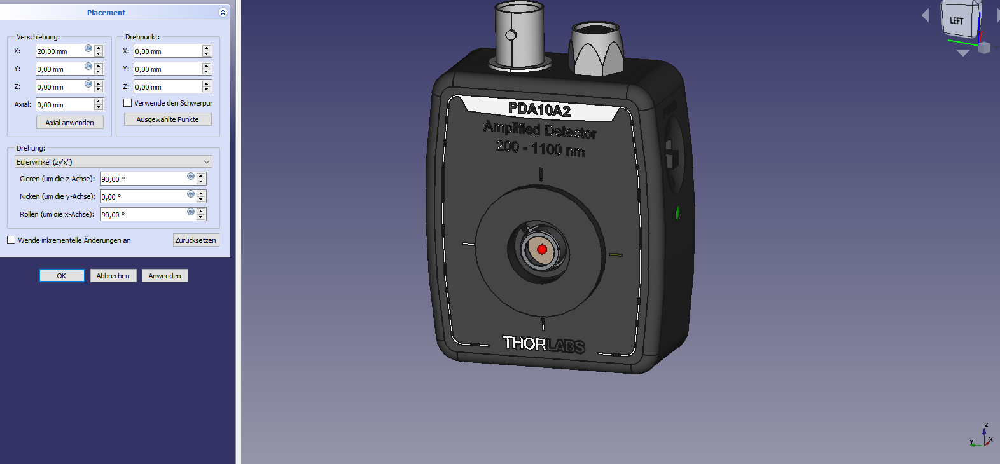

The rules for aligning are:
1. The point where the object shall get hit by the beam is (0,0,0), see the
red sphere.
2. The object shall face the -x direction.
3. Its vertical direction shall be aligned with the z-axis.

Now you can export the object from FreeCAD as step or stl file, in this case
as "Diode.stl" and save it under freecad_models/misc_meshes.
Now we have to bind our new shape to an object and for the beginning we choose
a Geom_Obj.
Here is the usual header:
```python
import sys
pfad = __file__
pfad = pfad.replace("\\","/") #folder conventions windows linux stuff
pfad = pfad.lower()
ind = pfad.rfind("lasercad")
pfad = pfad[0:ind-1]
if not pfad in sys.path:
  sys.path.append(pfad)
```
And here the actual code to bind the shape:
```python
from LaserCAD.basic_optics import Geom_Object
from LaserCAD.freecad_models.utils import freecad_da, clear_doc, setview, load_STL, thisfolder

if freecad_da:
  clear_doc()

stl_file = thisfolder+"misc_meshes/pockels_cell_easy_steal-Body.stl"

detector = Geom_Object()
detector.freecad_model = load_STL
detector.draw_dict["stl_file"]=stl_file
detector.draw()

if freecad_da:
  setview()
```
First you need to set the *freecad_model* to *load_stl*. Be aware that this line
conects a function pointer to the *freecad_model*, so don't use brackets after
the names, we really want to set the value *freecad_model* to a function, not to
its result. Afterwards we set the *draw_dict* entry for *stl_file* to the path
where we saved the stl file. You can see the result of this in the following
terminal snippet:

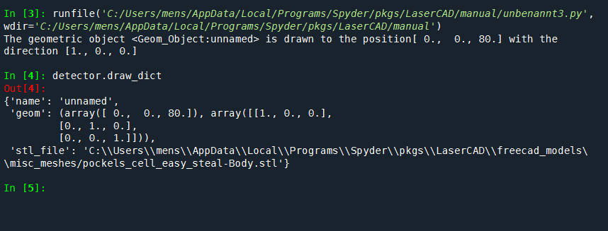

Fine, now we cn add a beam to the scenary, set the detector to its and and look
at the result in FreeCAD. Code and output looks like this:
```python
from LaserCAD.basic_optics import Geom_Object, Beam
from LaserCAD.freecad_models.utils import freecad_da, clear_doc, setview, load_STL, thisfolder

if freecad_da:
  clear_doc()

stl_file = thisfolder+"misc_meshes/Diode.stl"

detector = Geom_Object()
detector.freecad_model = load_STL
detector.draw_dict["stl_file"]=stl_file

b = Beam()
b.set_length(100)
detector.pos += (100,0,0)
b.draw()
detector.draw()

if freecad_da:
  setview()
```

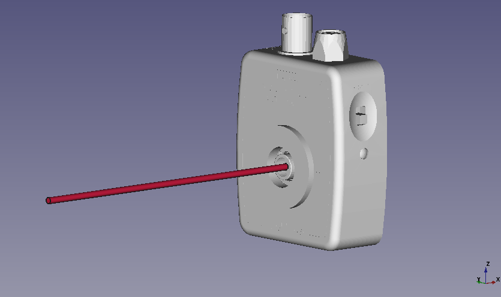

As I said hte stl format is quick, but unfortunately does not provide colours.
We can give it one by adding this line, to change the draw_dict once more:
```pyhon
detector.draw_dict["color"]=(0.1, 0.1, 0.1)
```
Like this we can give the shape a colour in RGB values going from 0.0 to 1.0.
Et voila, the black detector:

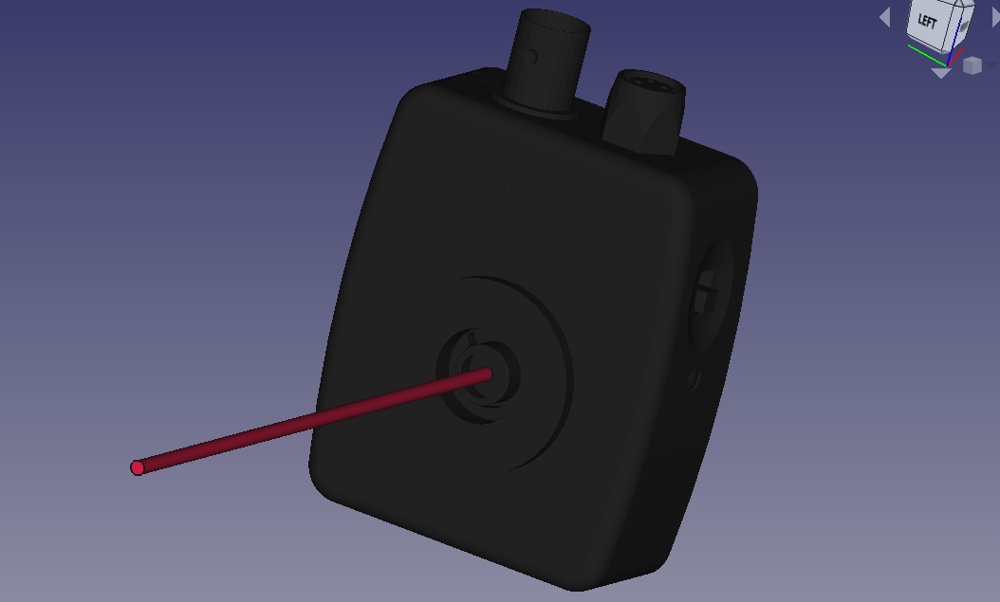

Now that we have the shape bound to an Geom_Object, we can place it where ever
we want via the *set_geom* funciton or with *pos* and *normal*.

If we need multiple detectors, we can now of course copy paste these lines over
and over, nevertheless more elegant would be to define an own class for this.
The follwoing code shows how:
```python
class Detector(Geom_Object):
  def __init__(self, name="Det_PDA10A2", **kwargs):
    super().__init__(name, **kwargs)
    stl_file = thisfolder+"misc_meshes/Diode.stl"
    self.draw_dict["stl_file"]=stl_file
    self.draw_dict["color"]=(0.1, 0.1, 0.1)
    self.freecad_model = load_STL
```
You see, that it is not really much more effort, to make it directly a class.
Now that we have it, we can start playing aaround and creating multiple instanses
like this
```python
detector = Detector()
detector.pos += (100,0,0)
detector.draw()

detector2 = Detector()
detector2.pos += (0,50,0)
detector2.normal = (-3,1,0)
detector2.draw()

b = Beam()
b.set_length(100)
b.draw()
```

Resulting in a 3D model like this:

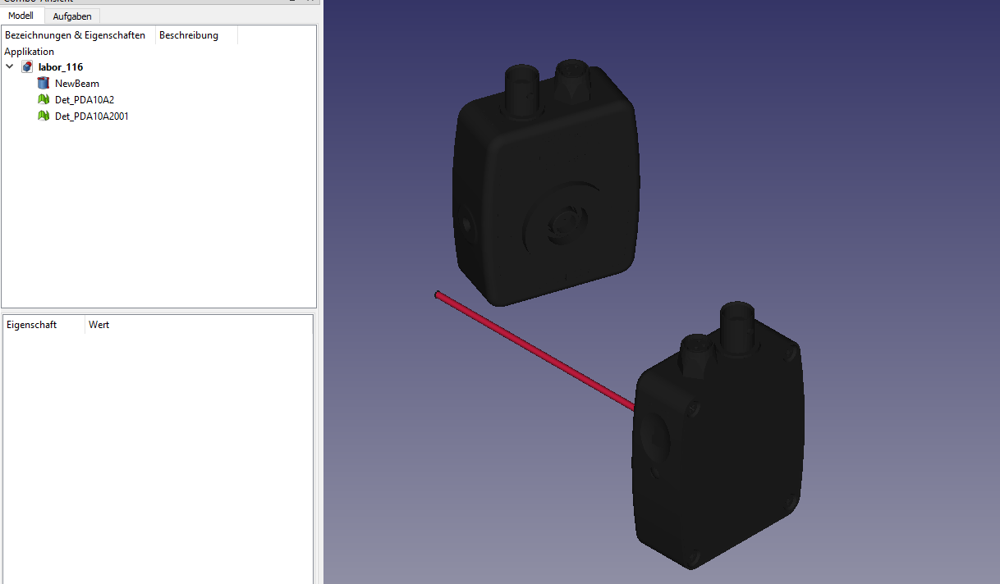

To include our new element in a real setup (= a *composition*), we ave to give
it a suitable mount and post, thus making it a *Component*. Only this would not
change much, each Component has a standard *Unit_Mount*, but those are more like
abstract templates of mounts, providing all the theoretical member variables and
functions, but no useful drawing function. For this we have to override the
*set_mount_to_default* function and define an invisble Unit_Mount to define the
docking position of the half_inch_post. For more information about mounts and
docking positions you can read the Custom Mirror Mount section. The code and
output look now like this.
```pyhton
from LaserCAD.basic_optics import Geom_Object, Beam, Component
from LaserCAD.basic_optics import Composed_Mount, Unit_Mount, Post
from LaserCAD.freecad_models.utils import freecad_da, clear_doc, setview, load_STL, thisfolder

if freecad_da:
  clear_doc()

class Detector(Component):
  def __init__(self, name="Det_PDA10A2", **kwargs):
    super().__init__(name, **kwargs)
    stl_file = thisfolder+"misc_meshes/Diode.stl"
    self.draw_dict["stl_file"]=stl_file
    self.draw_dict["color"]=(0.1, 0.1, 0.1)
    self.freecad_model = load_STL
    self.set_mount_to_default()

  def set_mount_to_default(self):
    invis_adapter = Unit_Mount()
    invis_adapter.docking_obj.pos += (10.5, 0, -25)
    comp = Composed_Mount(name=self.name + "_mount")
    comp.add(invis_adapter)
    comp.add(Post(model="0.5inch_post"))
    # comp.add(Post())
    comp.set_geom(self.get_geom())
    self.Mount = comp

detector = Detector()
detector.draw()
detector.draw_mount()
```

The magic of the post drawing algorithms will nor care, that the post will grow
according to the z-height of the detector. You can play araound with the detector
*pos* to see how it works.

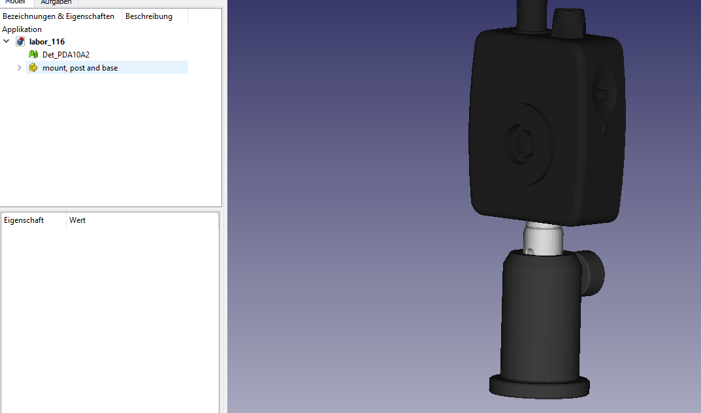


## Custom Mirror Mount - The Spartan

The goal of this section is to understand how to create a new mount and what
are its defining properties. For this we first chose a very random shape, that
we want to use as a mirror mount. In this case I looked on [Yeggi](https://www.yeggi.com)
for a stl file and dragged it into FreeCAD. Thanks to the guys there designing
these models and offer them for free!
Next we have to align them. For any Mount, not matter if Composed or not, there
are 3 important positions:
One is where the Mount should touch a mirror, the other is the docking position.
The docking object is an geometrical object, describing where and in which
direction the next Mount or post shall dock on the previous Mount.
To test and align this, we will create a mirror at (0,0,0) and drag a little
blue test sphere to the docking position. In this case the docking position
looks best, when the sphere is placed at (24, 2, -35). In the following screen
shot you can see the stl file alligned manually to an (0,0,0) mirror together
with an (0,0,0) red sphere and the blue docking sphere.

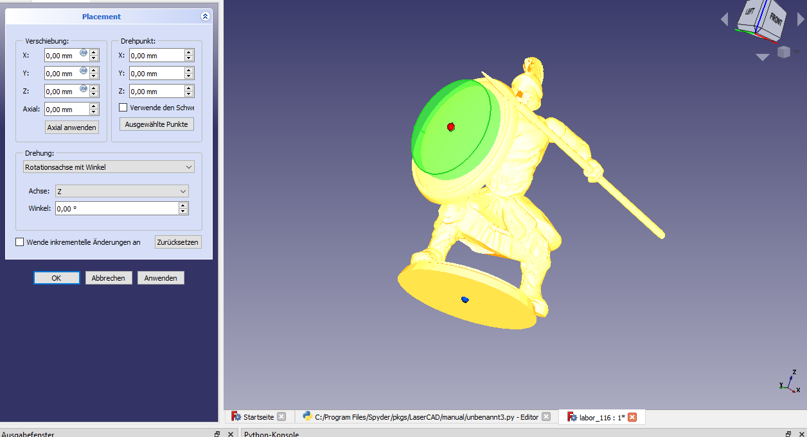

Note that the default normal of a mirror also points in (1,0,0) direction and
the mount has to be placed behind so in fact our spartan faces the (-1,0,0)
direction with his shield, as all mirror mounts do in default position.

That was the modelling part, now comes the coding. We now start directly making
our spartan an universal class. For this we will inherit from the *Unit_Mount*
class to get all the member functions and override the docking position with
our derived docking position.
```python
class Spartan_Mount(Unit_Mount):
  def __init__(self):
    super().__init__()
    self.model = "Spartan"
    self.path = thisfolder + "misc_meshes/"
    self.docking_obj.pos += (24, 2, -35) # from manual adjustments in FreeCAD
```

Let's see how this turns out with a test mirror. For this we simply bind a new
instance of our Unit_Mount to the mirror with the *set_mount* function.

```python
mir = Mirror()
mir.set_mount(Spartan_Mount())
mir.draw()
mir.draw_mount()
```

The result looks pretty similar, but be aware, that hte mount now follows the
mirror position and direction, (0,0,80) in this case.
Fine, but in a real setup we would quickly notice, that the mount is most of
the times freely floating in hte air. A proper post is needed. Posts are in its
idea also just unit mounts, but with the property to be always straight in z -
direction and having an *_lower_limit* which is 0 by default and indicates the
ground level to which the post will extend, due to He Z. functions. For some
purposes the limit could be set higher, e.g. when working with a base bread bord
plate. To bring spartan and post toegether we have to define a *Composed_Mount*,
like it is done in the following code.
```python
class Spartan_Mount(Composed_Mount):
  def __init__(self):
    super().__init__()
    um = Unit_Mount()
    um.model = "Spartan"
    um.path = thisfolder + "misc_meshes/"
    um.docking_obj.pos += (24, 2, -35) # from manual adjustments in FreeCAD
    self.add(um)
    self.add(Post())
```

As you see, in its constructor 2 unit mounts are defined: our old spartan and
than a simple default Post, which is one inch in diameter. For the half inch post
you may have a look in the previous section. The *add* function simply but both
mounts fitting together. Fitting means, that the post is set to the docking pos
of the spartan. Bulding the same mirror and binding the mount with the same code
as above we get:
```python
mir = Mirror()
mir.set_mount(Spartan_Mount())
mir.draw()
mir.draw_mount()
```


OK, you see, this was a fun example, but I hope you got an idea of how to create
arbitrary mounts for your optics. With the composed mount you could also stack
an arbitrary amount of predefined unit mounts together, useful for example for
xyz-stages. A general unit_mount secret is, that most of them have member
variables like *self.is_horizontal = True* that sets its axes always to a certain
constraint, now matter how you try to change it. In this case the inner coordinate
system axes can only change in the xy plane, the z-axis is fixed. To understand
why you can look in the Discussion and Reference in the Docs or read the code in
basic_optics/mounts.

At the end of this section let's have some fun and spice up a setup. We will
start with this rather boring 3 mirror structure:
```python
mir3 = Mirror(phi=75)
mir4 = Mirror(phi=-60)
mir5 = Mirror(phi=90)

comp = Composition(name="MirrorAssembly")
comp.pos += (-200, -300, 0)
comp.propagate(200)
comp.add_on_axis(mir3)
comp.propagate(200)
comp.add_on_axis(mir4)
comp.propagate(200)
comp.add_on_axis(mir5)
comp.propagate(200)

comp.draw()
```

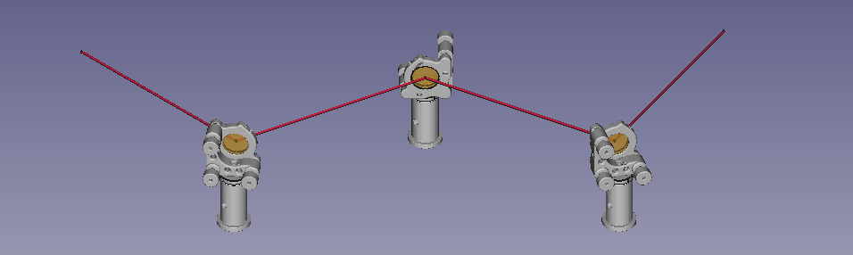

Now lets insert our new mounts to the setup and see how qucik we can alter the
look.
```python
mir3 = Mirror(phi=75)
mir3.set_mount(Spartan_Mount())
mir4 = Mirror(phi=-60)
mir4.set_mount(Spartan_Mount())
mir5 = Mirror(phi=90)
mir5.set_mount(Spartan_Mount())
```

And here is the result. An optical setup with style ;)

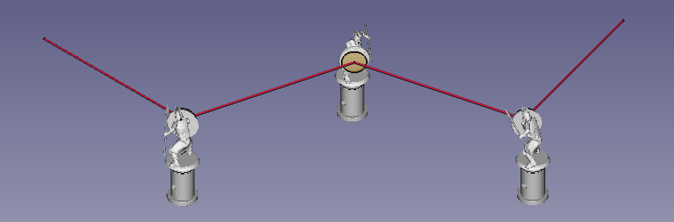


Hint: You can regulary include your mount to the availabe lists (see:
LaserCAD.basic_optics.mount MIRROR_LIST). In this case you can use it like the 
other mounts as string argument in the Composed_Mount unit_model_list. To do so
you have to drag the stl file in the freecad_model.mount_meshes.mirror folder 
and update the mirrormounts.csv file. This simply contains all the information
about name, docking position, direction and color in the follwing way:
```
name,aperture,DockingX,DockingY,DockingZ,DockNormalX,DockNormalY,DockNormalZ,color
```
So in our case, we add the 2 lines
```
,,,,,,,,
Spartan,25.4,24,2,-35,0,0,1,"0.2,0.2,0.2"
```
to the end of the csv. That means we give LaserCAD the information, that the 
mirror mount 'Spartan' exists, its docking position is (24, 2, -35), its docking
dircetion is in z direction (0,0,1) and its color is blackish "(0.2, 0.2, 0,2)".
Done that you can now use the following code to use and place your new mount:
```python
from LaserCAD.basic_optics import Mirror, Composed_Mount
from LaserCAD.freecad_models import freecad_da, clear_doc, setview

if freecad_da:
  clear_doc()
  
mir = Mirror()
mir.aperture = 25
mir.set_mount(Composed_Mount(unit_model_list=["Spartan", "1inch_post"]))

mir.draw()
mir.draw_mount()
  
if freecad_da:
  setview()
```
And again we get our nice and robust mount on the screen:
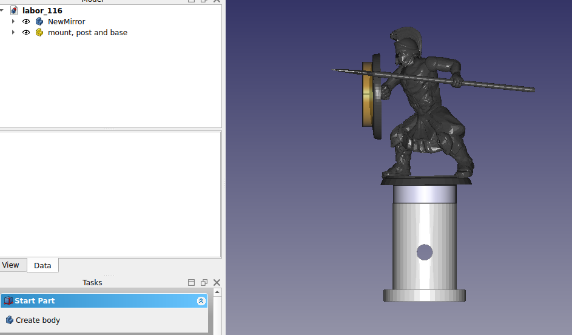


## Custom Optical Element and next ray function

Here we are going to creat a new optical element and give it a functionality
by overriding its *next_ray* funciton. As an example we will try a fake retro
reflector. Fake, because in principle you can't simulate a 3 mirror retro
reflector in sequential ray tracing, because at some point you have to detect,
which of the 3 mirrors gets hit first, what is essential to non sequential ray
tracing and collition detection, both not beeing covered by LaserCAD. But hey,
what do we really need? Some kind of nice looking black box, throwing rays
parallel back to were they came. This is definitly possible!

First we need a model for our component. You can for example use the crystal
model or creat your own FreeCAD funciton by copy past the code of the python
panell after designing. Here we will simply take the [PS975M](https://www.thorlabs.com/thorproduct.cfm?partnumber=PS975M) model
from Thorlabs and adjust it, that it looks like this:

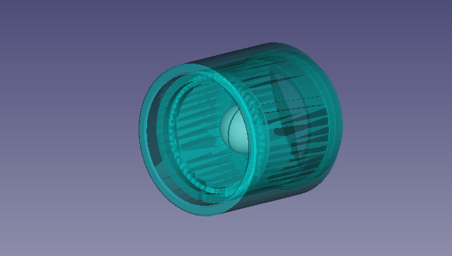

Good, now we will follow the steps of the last chapter to bind its shape to a
new optical element.

```python
from LaserCAD.basic_optics import Opt_Element
class Retro_Reflector(Opt_Element):
  def __init__(self):
    super().__init__()
    stl_file = thisfolder+"misc_meshes/PS975M.stl"
    self.draw_dict["stl_file"]=stl_file
    self.draw_dict["color"]=(0.0, 1.0, 1.0)
    self.draw_dict["transparency"]=50
    self.freecad_model = load_STL

ret = Retro_Reflector()
ret.draw()
```

The output looks now pretty much the same, we defined a new color and set the
transparency to 50% to get a glass like look, which is not really close to
reality, but at least very unique and after all it is only an example.

What is of course still missing is the mount function. As already mentioned,
the default *Unit_Mount()* has no shape. To change our mount, we have to override
the ojewgfqeikjngf function. In this case the LMR1_M mount for 1 inch lenses
could be suitable. For an equivalent example you can also see the *lambda_plate*
module in the *non_interactings* folder.

```python
  def set_mount_to_default(self):
    self.Mount = Composed_Mount(unit_model_list=["LMR1_M", "0.5inch_post"])
    self.Mount.set_geom(self.get_geom())
```

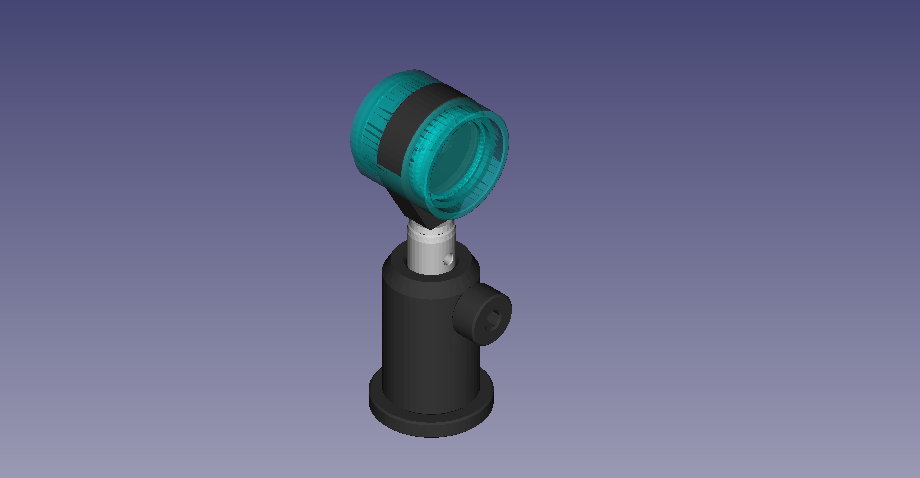

Not bad, but not ideal, we have to change the pos of the hole thing. By playing
around with the Placement in FreeCAD, we find 19 mm in -x direction to be a good
choice.

```python
  def set_mount_to_default(self):
    self.Mount = Composed_Mount(unit_model_list=["LMR1_M", "0.5inch_post"])
    mount_pos = self.pos - 19 * self.normal
    self.Mount.set_geom( (mount_pos, self.get_axes()) )
```

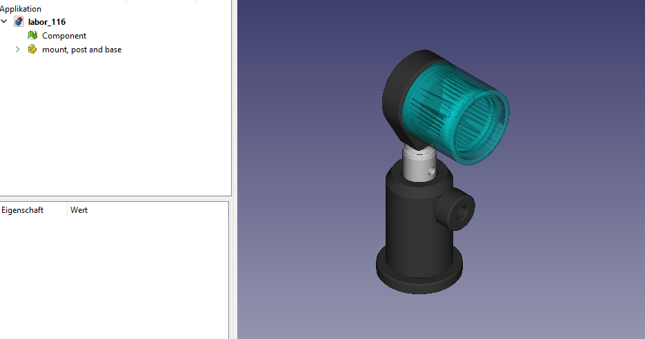

It looks correct now. The first line of the function tells you, how to quickly
set mount-post combinations: The constructor of the Composed_Mount class has
a *unit_model_list* argument, which is just a list of (mostly 2) strings
describing mount and post. The allowed names can be found in the
*basic_optics/mount* module or in the tables deep in the freecad_model/meshes
folder in the csv tables.

OK, that's it for the cosmetics, but we still have now operational retro reflector,
which can be seen by the following script:

```python
beam1 = Beam()

ret = Retro_Reflector()
ret.pos += (100,0,0)
ret.normal = (-1,0,0)

beam2 = ret.next_beam(beam1)

ret.draw()
ret.draw_mount()
beam1.draw()
beam2.draw()
```

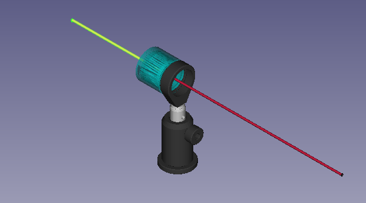

This is caused by the fundamental ray tracing function, that each optical
element posseses, the *next_ray* function. (Btw, you could get a pretty similar
result, by exchanging *Beam*, with *Ray* in the above script.) The default is
called the *just_pass_through* function, which produces a new, undeflected ray
after the first one, as if the object has no influence at all.
That is, what we want to change. A quick calculation on the paper leads to the
following algorithm:

```python
  def next_ray(self, ray):
    newray = deepcopy(ray)
    intersection_point = ray.intersect_with(self) # gives point and sets length
    difference_vec = self.pos - intersection_point
    newray.pos = self.pos + difference_vec # retro reflection
    newray.normal = - ray.normal #reflection
    return newray
```

The start is always a deepcopy from the copy module, to get a new Ray with same
color etc., than we set its point to be as far away from the center of the
relfector as the incomming ray, but on the opposite side and finally we invert
its normal. And here we go, the faked, custom made retro reflector!

```python
from copy import deepcopy
from LaserCAD.basic_optics import Beam, Ray
from LaserCAD.basic_optics import Composed_Mount
from LaserCAD.freecad_models.utils import freecad_da, clear_doc, setview, load_STL, thisfolder

from LaserCAD.basic_optics import Opt_Element
class Retro_Reflector(Opt_Element):
  def __init__(self):
    super().__init__()
    stl_file = thisfolder+"misc_meshes/PS975M.stl"
    self.draw_dict["stl_file"]=stl_file
    self.draw_dict["color"]=(0.0, 1.0, 1.0)
    self.draw_dict["transparency"]=50
    self.freecad_model = load_STL

  def set_mount_to_default(self):
    self.Mount = Composed_Mount(unit_model_list=["LMR1_M", "0.5inch_post"])
    mount_pos = self.pos - 19 * self.normal
    self.Mount.set_geom( (mount_pos, self.get_axes()) )

  def next_ray(self, ray):
    newray = deepcopy(ray)
    intersection_point = ray.intersect_with(self) # gives point and sets length
    difference_vec = self.pos - intersection_point
    newray.pos = self.pos + difference_vec # retro reflection
    newray.normal = - ray.normal #reflection
    return newray

beam1 = Beam()

ret = Retro_Reflector()
ret.pos += (100,3,0)
ret.normal = (-1,0,0)

beam2 = ret.next_beam(beam1)

ret.draw()
ret.draw_mount()
beam1.draw()
beam2.draw()
```

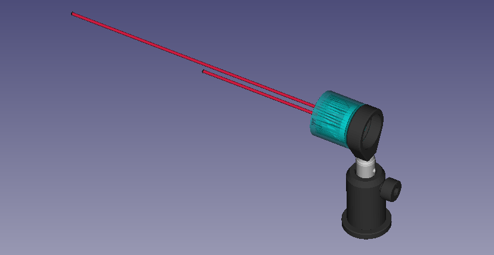


## Custom Composition

For this I would simply suggest to read the pericope and especially the
roof top mirror module and check its code and freecad_models, it should give
you a good start from where you can move on.

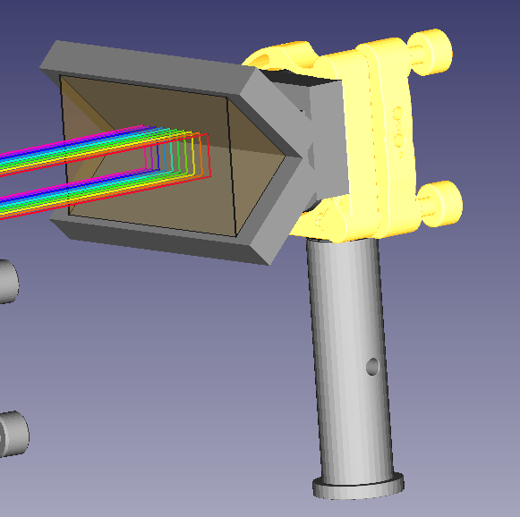

