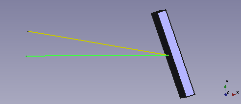
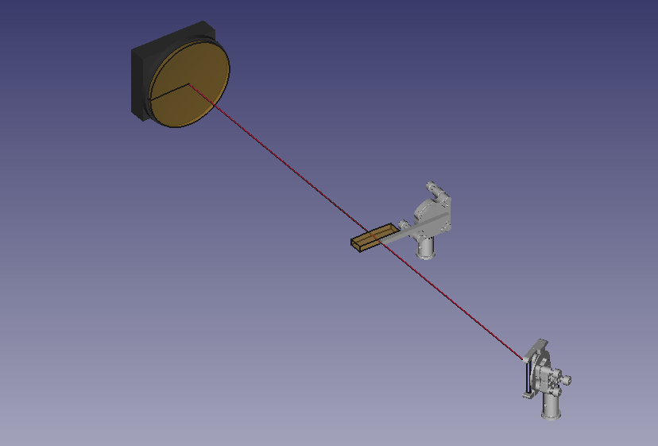
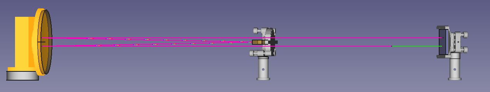

# How to build a Stretcher

So let's try to make a more complex setup like a Oeffner stretcher for chirped
pulse amplification systems. For the theory you can for example refer to
- *Träger, Frank, ed. Springer handbook of lasers and optics. Vol. 2. New York,
NY, USA:: springer, 2012. Page 1060*
- *Vyhlídka, Štěpán, et al. "Offner stretcher aberrations revisited to compensate
material dispersion." Optics Communications 414 (2018): 207-211.*

To see what the whole thing will look like, I can recommend to "spoil" you and
just jump to the end of this article to see the complete assembly.


Ok, at first we have to import some stuff as always. This time we will also
use some pre assembled moduls like the RoofTop_Mirror and Stripe_mirror.

```python
import sys
pfad = __file__
pfad = pfad.replace("\\","/") #folder conventions windows linux stuff
pfad = pfad.lower()
ind = pfad.rfind("lasercad")
pfad = pfad[0:ind-1]
if not pfad in sys.path:
  sys.path.append(pfad)

from LaserCAD.basic_optics import Beam, Composition, inch, Curved_Mirror, Ray, Grating
from LaserCAD.basic_optics.mirror import Stripe_mirror
from LaserCAD.moduls.periscope import Make_RoofTop_Mirror
import matplotlib.pyplot as plt
import numpy as np
from LaserCAD.freecad_models.utils import freecad_da, clear_doc, setview

if freecad_da:
  clear_doc()
```
After that, we need to define all physically relevant quantities for our setup.
I'm not going to drag you through all the theory, please refer to the comments
and the sources given above ifyou have questions.
```python
radius_concave = 1000 #radius of the big concave sphere
aperture_concave = 6 * inch
height_stripe_mirror = 10 #height of the stripe mirror in mm
seperation_angle = 10 /180 *np.pi # sep between in and outgoing middle ray
# incident_angle = seperation_angle + reflection_angle
grating_const = 1/1000 # in 1/mm
seperation = 50 # difference grating position und radius_concave
lambda_mid = 800e-9 * 1e3 # central wave length in mm
band_width = 100e-9*1e3 # full bandwith in mm
number_of_rays = 20
safety_to_stripe_mirror = 5 #distance first incomming ray to stripe_mirror in mm
periscope_height = 10
first_propagation = 120 # legnth of the first ray_bundle to flip mirror1 mm
distance_roof_top_grating = 600
```

The next thing is to udjust the grating normal. Maybe this step will be included
in the grating logic one day, no we have to do it manually. We want our grating
to reflect an incoming ray from (1,0,0) direction with the wavelength lambda_mid
under an angle *seperation_angle*. To do this we do some math with the grating
equation:
```python
# calculated parameters according to the grating equation and set the grating
v = lambda_mid/grating_const
s = np.sin(seperation_angle)
c = np.cos(seperation_angle)
a = v/2
b = np.sqrt(a**2 - (v**2 - s**2)/(2*(1+c)))
sinB = a - b
grating_normal = (np.sqrt(1-sinB**2), sinB, 0)
Grat = Grating(grat_const=grating_const, name="Gitter", order=-1)
Grat.normal = grating_normal
```
The result looks can be shown with the follwing script and screenshot:
```python
incident = Ray()
incident.wavelength = 800e-6
incident.pos += (-80,0,0)
outgoing = Grat.next_ray(incident)

Grat.draw()
incident.draw()
outgoing.draw()
```


After that let's define the big concave sphere like this:
```python
#set the big sphere
Concav = Curved_Mirror(radius=radius_concave,name="Concav_Mirror")
Concav.aperture = aperture_concave
Concav.set_mount_to_default()
```
Ok, to be onest we cheated a little bit here. To my knowledge there is no
standard 6 inch mirror mount, so by pure luck, the mount for a 6 inch mirror
will be shown as exactly the mount we use in our lab. In most cases you would
have to define your own mount which you can learn about in the **??????**
section (for example if the aperture exceeds 6 inch, this mount would fail).

Same is true for the convex stripe mirror.
```python
# set the convex stripe mirror and its cosmetics
StripeM = Stripe_mirror(radius= -radius_concave/2)
```
But you can define other shapes by looking into the freecad_model function
and its code.
Anyway, let's assemble a simple helper composition and show the elements in
LaserCAD:
```python
# prepare the helper Composition
helper = Composition()
helper_light_source = Beam(angle=0, wavelength=lambda_mid)
helper.set_light_source(helper_light_source)
#to adjust the wavelength of the oA and set everything on axis
helper.redefine_optical_axis(helper_light_source.inner_ray())
helper.add_fixed_elm(Grat)
helper.recompute_optical_axis()
helper.propagate(radius_concave - seperation)
helper.add_on_axis(Concav)
helper.propagate(radius_concave/2)
helper.add_on_axis(StripeM)

helper.draw()
```
Some explanation: Again we use a helper composition for the positioning of the
elements. Here we set explicitly the lightsource explicitly and redefine the
optical axis (which is a property of every composition and nothing else than a
ray) so that it has the correct wavelength of 800nm or better say 800e-6 mm.
After that, we just set the mirrors on axis to form the Oeffner triplet.
The seperation is the distance between the center of curvature of the big sphere
and the grating (100 mm in this case) and determines the stretching factor.
Here is the output:


In fact for most modern laser aplications the beams are not in the visible
spectrum. So the colour is kind of arbitrary chosen to be red in LaserCAD, but
can be changed. For the stretcher we would like to see 2 different things:
1. We do not need 3 dimensional beams, the 1D rays would be more clearly here.
2. We need many rays for many different wavelengths.
3. It would be nice to map the wavelengths to visible colours from red to blue.

So we need to define our own rainbow light soure.
```python
# setting the lightsource as an bundle of different coulered rays
lightsource = Beam(radius=0, angle=0)
wavels = np.linspace(lambda_mid-band_width/2, lambda_mid+band_width/2, number_of_rays)
rays = []
cmap = plt.cm.gist_rainbow
for wavel in wavels:
  rn = Ray()
  rn.wavelength = wavel
  x = 1-(wavel - lambda_mid + band_width/2) / band_width
  rn.draw_dict["color"] = cmap( x )
  rays.append(rn)
lightsource.override_rays(rays)
lightsource.draw_dict['model'] = "ray_group"
```
We start with a beam, since a beam is the container class for rays. Than we
create a list of rays, that cvers the whole spectral bandwith and use the
gist_rainbow colour map from matplotlib to convert the wavelength to an RGB
triplet. Finally the rays of the light source beam get overwritten and the
*model* entry in the draw_dict is set to ray group, so that the ray is shown
as a bunch of rays instead of a 3D cone.
With the following lines we can visualize our lightsoruce and the action of the
grating:
```python
lightsource.pos += (-80,0,0)
outgoing = Grat.next_beam(lightsource)

Grat.draw()
lightsource.draw()
outgoing.draw()
```


Light source and helper seem to be fine, so we can start the real stretcher:

```pyhton
# starting the real stretcher
Stretcher = Composition(name="DerStrecker")
Stretcher.set_light_source(lightsource)
Stretcher.redefine_optical_axis(helper_light_source.inner_ray())

Stretcher.propagate(first_propagation)
#adding the helper
helper.set_geom(Stretcher.last_geom())
helper.pos += (0,0, height_stripe_mirror/2 + safety_to_stripe_mirror)
Stretcher.add_supcomposition_fixed(helper)

Stretcher.set_sequence([0,1,2,1,0])
Stretcher.recompute_optical_axis()

Stretcher.draw()
```
Again we set the light source and optical axis explicitly to have the correct
wavelength. Than we propagate an arbitrary distance to not directly start with
the grating but have some space before, so that the input ray has a finite length
and is visible. The helper is adjusted to this now position and than shifted down,
so that the input ray will pass underneath the convex stripe mirror. Tricks like
this are often used in multipass systems in LaserCAD. The now shifted helper
composition is added to the stretcher and the sequence is adjusted so that the
beam will correclty run through the telescope and hit the grating again. Here
is a picture of the side view with the input ray in green:


Nice, the only thing missing is the rooftop mirror and the back propagation
to be again a collimated beam.
```python
# adding the rooftop mirror and it's cosmetics
Stretcher.propagate(distance_roof_top_grating)
RoofTopMirror = Make_RoofTop_Mirror(height=periscope_height, up=False)

Stretcher.add_supcomposition_on_axis(RoofTopMirror)
Stretcher.set_sequence([0,1,2,1,0, 3,4, 0,1,2,1,0]) # believe me :)
Stretcher.recompute_optical_axis()
Stretcher.propagate(100)

Stretcher.draw()
```
The rooftop mirror is a predefinded special kind of periscope, thats code can
be found in the moduls folder. (More correctly the folder is a python modul, so
it should be the moduls modul, ...anyway). In short it consists of 2 invisible
mirrors in 90 degree angle and a non interacting component, that carries the
shape. The periscopes height sets the difference between input and output beam
of the stretcher. The last steps are setting the sequence right and recomputing
the optical axis. A last propagation for some arbitrary distance should show us
the outgoing ray group. Et voila: the complete stretcher composition together
with the complete code:


```python
import sys
pfad = __file__
pfad = pfad.replace("\\","/") #folder conventions windows linux stuff
pfad = pfad.lower()
ind = pfad.rfind("lasercad")
pfad = pfad[0:ind-1]
if not pfad in sys.path:
  sys.path.append(pfad)

from LaserCAD.basic_optics import Beam, Composition, inch, Curved_Mirror, Ray, Grating
from LaserCAD.basic_optics.mirror import Stripe_mirror
from LaserCAD.moduls.periscope import Make_RoofTop_Mirror
import matplotlib.pyplot as plt
import numpy as np
from LaserCAD.freecad_models.utils import freecad_da, clear_doc, setview

if freecad_da:
  clear_doc()

radius_concave = 1000 #radius of the big concave sphere
aperture_concave = 6 * inch
height_stripe_mirror = 10 #height of the stripe mirror in mm
seperation_angle = 10 /180 *np.pi # sep between in and outgoing middle ray
# incident_angle = seperation_angle + reflection_angle
grating_const = 1/1000 # in 1/mm
seperation = 50 # difference grating position und radius_concave
lambda_mid = 800e-9 * 1e3 # central wave length in mm
band_width = 100e-9*1e3 # full bandwith in mm
number_of_rays = 20
safety_to_stripe_mirror = 5 #distance first incomming ray to stripe_mirror in mm
periscope_height = 10
first_propagation = 120 # legnth of the first ray_bundle to flip mirror1 mm
distance_roof_top_grating = 600

# calculated parameters according to the grating equation and set the grating
v = lambda_mid/grating_const
s = np.sin(seperation_angle)
c = np.cos(seperation_angle)
a = v/2
b = np.sqrt(a**2 - (v**2 - s**2)/(2*(1+c)))
sinB = a - b
grating_normal = (np.sqrt(1-sinB**2), sinB, 0)
Grat = Grating(grat_const=grating_const, name="Gitter", order=-1)
Grat.normal = grating_normal

# incident = Ray()
# incident.wavelength = 800e-6
# incident.pos += (-80,0,0)
# outgoing = Grat.next_ray(incident)

# Grat.draw()
# incident.draw()
# outgoing.draw()

#set the big sphere
Concav = Curved_Mirror(radius=radius_concave,name="Concav_Mirror")
Concav.aperture = aperture_concave
Concav.set_mount_to_default()

# set the convex stripe mirror and its cosmetics
StripeM = Stripe_mirror(radius= -radius_concave/2)

# prepare the helper Composition
helper = Composition()
helper_light_source = Beam(angle=0, wavelength=lambda_mid)
helper.set_light_source(helper_light_source)
#to adjust the wavelength of the oA and set everything on axis
helper.redefine_optical_axis(helper_light_source.inner_ray())
helper.add_fixed_elm(Grat)
helper.recompute_optical_axis()
helper.propagate(radius_concave - seperation)
helper.add_on_axis(Concav)
helper.propagate(radius_concave/2)
helper.add_on_axis(StripeM)

# helper.draw()

# setting the lightsource as an bundle of different coulered rays
lightsource = Beam(radius=0, angle=0)
wavels = np.linspace(lambda_mid-band_width/2, lambda_mid+band_width/2, number_of_rays)
rays = []
cmap = plt.cm.gist_rainbow
for wavel in wavels:
  rn = Ray()
  rn.wavelength = wavel
  x = 1-(wavel - lambda_mid + band_width/2) / band_width
  rn.draw_dict["color"] = cmap( x )
  rays.append(rn)
lightsource.override_rays(rays)
lightsource.draw_dict['model'] = "ray_group"

# lightsource.pos += (-80,0,0)
# outgoing = Grat.next_beam(lightsource)

# Grat.draw()
# lightsource.draw()
# outgoing.draw()

# starting the real stretcher
Stretcher = Composition(name="DerStrecker")
Stretcher.set_light_source(lightsource)
Stretcher.redefine_optical_axis(helper_light_source.inner_ray())

Stretcher.propagate(first_propagation)
#adding the helper
helper.set_geom(Stretcher.last_geom())
helper.pos += (0,0, height_stripe_mirror/2 + safety_to_stripe_mirror)
Stretcher.add_supcomposition_fixed(helper)

Stretcher.set_sequence([0,1,2,1,0])
Stretcher.recompute_optical_axis()
# Stretcher.draw()

# adding the rooftop mirror and it's cosmetics
Stretcher.propagate(distance_roof_top_grating)
RoofTopMirror = Make_RoofTop_Mirror(height=periscope_height, up=False)

Stretcher.add_supcomposition_on_axis(RoofTopMirror)
Stretcher.set_sequence([0,1,2,1,0, 3,4, 0,1,2,1,0]) # believe me :)
Stretcher.recompute_optical_axis()
Stretcher.propagate(100)

Stretcher.draw()

if freecad_da:
  setview()
```