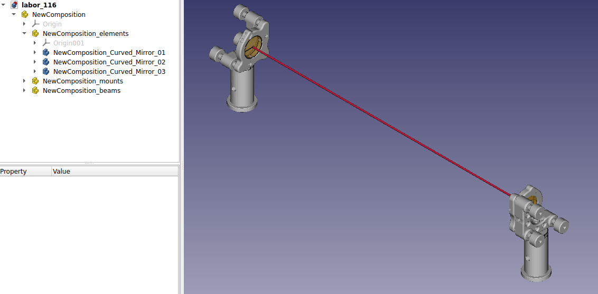
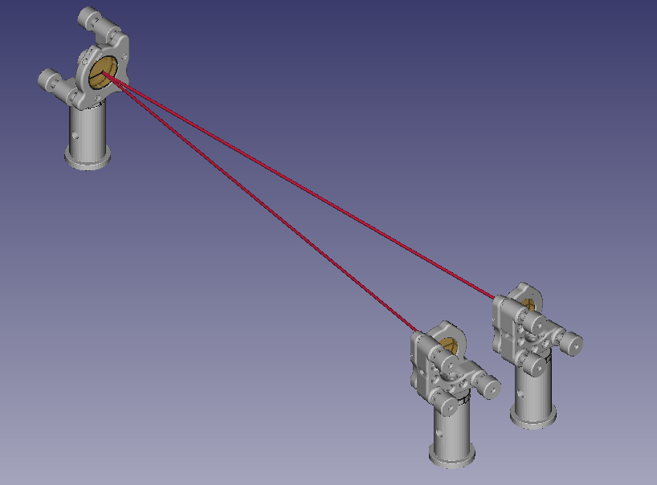
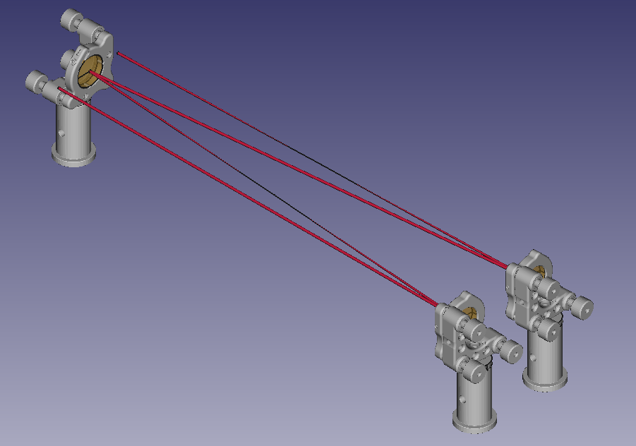

# How to build a Multi-Pass White Cell

The following example shows how to build multipass setups in LasrCAD. Spoiler:
You do it with the set_sequence() function. As an example, we will build a White
Cell as you can find for example under www....
At the beginning we have to do our homework as optics professional and ask:
Ok, how is the beam line set, and what are the distances again? Lukely we
prepared something:
A White Cell consist of 3 curved mirrors, All with the same radius of curvature
and the same distance equal to the radius, as you can see in the follwing sketch.
When you start in the focal plane of one of them, you can see that each mirror
propagates from on focal plane to an other and thus performs a fourier
transformation on the beam, meaning that after 4 refletions the intensity
dirtribution is again as in the beginning. An other effect, that on each mirror
the beam is collimated and all foci are in the middle which is advategoues for
high power applications.

Ok, enough theory, lets build a helper Composition, containing all the things
mentioned above:

```python
from LaserCAD.basic_optics import Curved_Mirror, Composition

Radius = 400 # arbitrary

cm1 = Curved_Mirror(radius=Radius)
cm2 = Curved_Mirror(radius=Radius)
cm3 = Curved_Mirror(radius=Radius)

helper = Composition()
helper.propagate(Radius)
helper.add_on_axis(cm1)
helper.propagate(Radius)
helper.add_on_axis(cm2)
helper.propagate(Radius)
helper.add_on_axis(cm3)
helper.propagate(Radius)

helper.draw()
```

So let's see the output in LaserCAD:



OK, clearly we have to change the angle on the second sphere, to avoid that the
ohter ones are overlapping. The proper way to do this is by changing the phi
of the second one to somthing more than 180°. Here is code and output:
```python
from LaserCAD.basic_optics import Curved_Mirror, Composition

Radius = 400 # arbitrary

cm1 = Curved_Mirror(radius=Radius)
cm2 = Curved_Mirror(radius=Radius, phi=190)
cm3 = Curved_Mirror(radius=Radius)

helper = Composition()
helper.propagate(Radius)
helper.add_on_axis(cm1)
helper.propagate(Radius)
helper.add_on_axis(cm2)
helper.propagate(Radius)
helper.add_on_axis(cm3)
helper.propagate(Radius)

helper.draw()
```


Nice, now we have to say a closed White Cell. To come in and out, we have to
do the same trick with the 2 other mirrors. Let's quickly do the math: from the
sketch here:

you can see that we can calculate the angle of incidence AOI from the desired
separation between two beams (a good number two start could be twice the input
beam diameter) by:

FORMULA

So the phi = 180 - 2*AOI for the first and plus for the last mirror. If you are
not sure about this, just see the Tutorial about mirrors or play around with
the phi.

And like this, I present you the one-pass cell:
```python
import numpy as np
from LaserCAD.basic_optics import Curved_Mirror, Composition

Radius = 400 # arbitrary
beam_seperation = 30
deflection = 2 * np.arctan(beam_seperation / 2 / Radius) * 180/np.pi

cm1 = Curved_Mirror(radius=Radius, phi=180-deflection)
cm2 = Curved_Mirror(radius=Radius, phi=190)
cm3 = Curved_Mirror(radius=Radius, phi=180-deflection)

helper = Composition()
helper.propagate(Radius)
helper.add_on_axis(cm1)
helper.propagate(Radius)
helper.add_on_axis(cm2)
helper.propagate(Radius)
helper.add_on_axis(cm3)
helper.propagate(Radius)

helper.draw()
```


Ok, this is not really a multi-pass cell, but it explains the principle of the
geometry. To build the real one, we will do the trick: We will integrate the helper
in a shifted composition without changing the position. The shifting is again
just one separation down. Also, we have to adjust the normal of the Composition
and the aperture of the second sphere.
Here, we used the add_supcomposition_fixed() function. The result looks like this:
```python
import numpy as np
from LaserCAD.basic_optics import Curved_Mirror, Composition

Radius = 400 # arbitrary
beam_seperation = 20
deflection = 2 * np.arctan(beam_seperation / 2 / Radius) * 180/np.pi

cm1 = Curved_Mirror(radius=Radius, phi=180-deflection)
cm2 = Curved_Mirror(radius=Radius, phi=190)
cm2.aperture = 50
cm2.set_mount_to_default()
cm3 = Curved_Mirror(radius=Radius, phi=180-deflection)

helper = Composition()
helper.propagate(Radius)
helper.add_on_axis(cm1)
helper.propagate(Radius)
helper.add_on_axis(cm2)
helper.propagate(Radius)
helper.add_on_axis(cm3)
helper.propagate(Radius)

white_cell = Composition(name="MyWhiteCell")
white_cell.pos = helper.pos - (0, beam_seperation, 0)
white_cell.normal = cm1.pos - white_cell.pos
white_cell.add_supcomposition_fixed(helper)
white_cell.propagate(Radius)

white_cell.draw()
```


Not bad, we can estimate how the whole thing goes on, but until now every optic
is just touched ones. To change this we have to play with the sequence of the
composition, which is nothing else than a list of the indices of the elements
in the order they are hit. So let's see: We start with 0, then 1, then 2 than
back to 1 and 0, than again 1 and 2 and than out. Ok, type this in, and we get:
```python
import numpy as np
from LaserCAD.basic_optics import Curved_Mirror, Composition

Radius = 400 # arbitrary
beam_seperation = 20
deflection = 2 * np.arctan(beam_seperation / 2 / Radius) * 180/np.pi

cm1 = Curved_Mirror(radius=Radius, phi=180-deflection)
cm2 = Curved_Mirror(radius=Radius, phi=190)
cm2.aperture = 50
cm2.set_mount_to_default()
cm3 = Curved_Mirror(radius=Radius, phi=180-deflection)

helper = Composition()
helper.propagate(Radius)
helper.add_on_axis(cm1)
helper.propagate(Radius)
helper.add_on_axis(cm2)
helper.propagate(Radius)
helper.add_on_axis(cm3)
helper.propagate(Radius)

white_cell = Composition(name="MyWhiteCell")
white_cell.pos = helper.pos - (0, beam_seperation, 0)
white_cell.normal = cm1.pos - white_cell.pos
white_cell.add_supcomposition_fixed(helper)

white_cell.set_sequence([0,1,2,1,0,1,2])

white_cell.propagate(Radius)

white_cell.draw()
```


And like this, we got our white cell. Congratulations!

If you would like to see more examples of multipass cells, you can look in the
amplifier modules.
